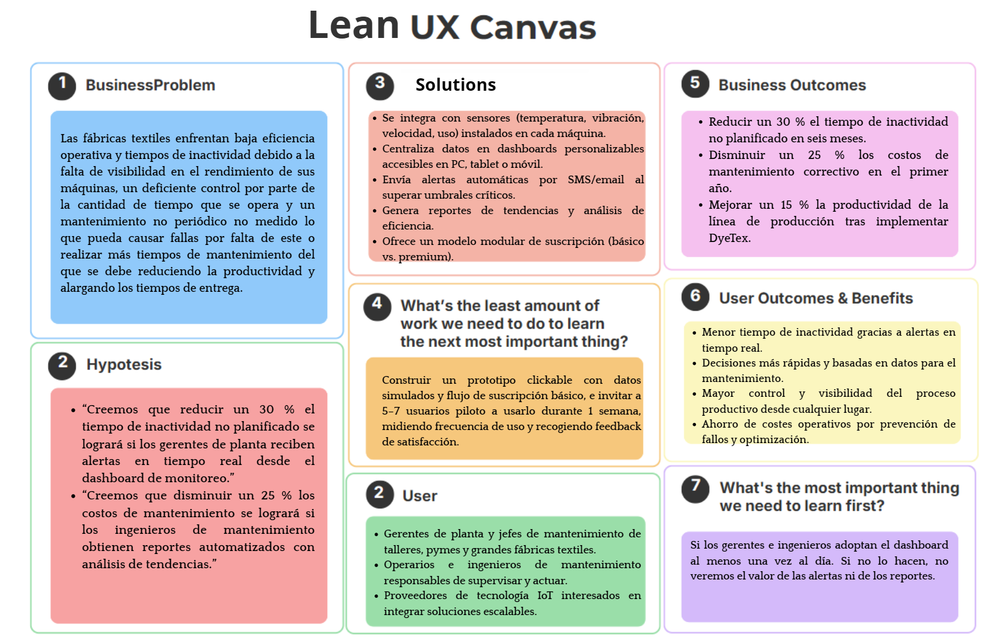

    

<h1 align="center">
    Universidad Peruana de Ciencias Aplicadas
</h1>

<h3 align="center">
    Carrera: Ingeniería de Software
       
    Curso: SI730 - Aplicaciones Web
       
    Sección: 4378
       
    Profesor: Angel Augusto Velasquez Nuñez
       
    Ciclo: 2025-01 
       
    Informe de Trabajo Final
       
    Startup: TinteX
       
    Producto: DyeTex  
</h3>

| 
Alumno
 | 
Código
 |
|:-------------------------------------------:|:-------------------------------------------:|
|       Becerra Tejeda, Alessandra Nicole     |              u202318947                     |
|         Contreras López, Leandro Saul       |              u20231e215                     |
|       Gordon Salas, Gabriel Fernando        |              u20221e229                     |
|  Prieto Mantari, Leonardo Fabrizzio Junior  |              u202319949                     |
|         Rios Pacheco, Hector Javier         |              u20231c540                     |

 Abril 2025 

## Registro de Versiones del Informe

## Project Report Collaboration Insights  

## Tabla de Contenidos

    
Capítulo I: Introducción 
    
        <ul>
            <li><a href="#11-Startup-Profile">1.1. Startup Profile</a></li>
            <li><a href="#111-Descripción-de-la-Startup">1.1.1. Descripción de la Startup</a></li>
            <li><a href="#112-Perfiles-de-Integrantes-del-Equipo">1.1.2. Perfiles de Integrantes del Equipo</a></li>
            <li><a href="#12-Solution-Profile">1.2. Solution Profile</a></li>
            <li><a href="#121-Antecedentes-y-Problemática">1.2.1. Antecedentes y Problemática</a></li>
            <li><a href="#122-Lean-UX-Process">1.2.2. Lean UX Process</a></li>
            <li><a href="#1221-Lean-UX-Problem-Statements">1.2.2.1. Lean UX Problem Statements</a></li>
            <li><a href="#1222-Lean-UX-Assumptions">1.2.2.2. Lean UX Assumptions</a></li>
            <li><a href="#1223-Lean-UX-Hypothesis-Statements">1.2.2.3. Lean UX Hypothesis Statements</a></li>
            <li><a href="#1224-Lean-UX-Canvas">1.2.2.4. Lean UX Canvas</a></li>
            <li><a href="#13-Segmentos-Objetivos">1.3. Segmentos Objetivos</a></li>
        </ul>    

    
Capítulo II: Requirements Elicitation & Analysis

        <ul>
            <li><a href="#21-competidores">2.1. Competidores</a></li>
            <li><a href="#211-Análisis-competitivo">2.1.1. Análisis competitivo</a></li>
            <li><a href="#212-Estrategias-y-tácticas-frente-a-competidores">2.1.2. Estrategias y tácticas frente a competidores</a></li>
            <li><a href="#22-Entrevistas">2.2. Entrevistas</a></li>
            <li><a href="#221-Diseño-de-entrevistas">2.2.1. Diseño de entrevistas</a></li>
            <li><a href="#222-Registro-de-entrevistas">2.2.2. Registro de entrevistas</a></li>
            <li><a href="#223-Análisis-de-entrevistas">2.2.3. Análisis de entrevistas</a></li>
            <li><a href="#23-Needfinding">2.3. Needfinding</a></li>
            <li><a href="#231-User-Personas">2.3.1. User Personas</a></li>
            <li><a href="#232-User-Task-Matrix">2.3.2. User Task Matrix</a></li>
            <li><a href="#233-User-Journey-Mapping">2.3.3. User Journey Mapping</a></li>
            <li><a href="#234-Empathy-Mapping">2.3.4. Empathy Mapping</a></li>
            <li><a href="#235-As-is-Scenario-Mapping">2.3.5. As-is Scenario Mapping</a></li>
            <li><a href="#24-Ubiquitous-Language">2.4. Ubiquitous Language</a></li>
        </ul>   

    
Capítulo III: Requirements Specification 

        <ul>
            <li><a href="#31-To-Be-Scenario-Mapping">3.1. To-Be Scenario Mapping</a></li>
            <li><a href="#32-User-Stories">3.2. User Stories</a></li>
            <li><a href="#33-Impact-Mapping">3.3. Impact Mapping</a></li>
            <li><a href="#34-Product-Backlog">3.4. Product Backlog</a></li>
        </ul>    

    
Capítulo IV: Product Design 

        <ul>
            <li><a href="#41-Style-Guidelines">4.1. Style Guidelines</a></li>
            <li><a href="#411-General-Style-Guidelines">4.1.1. General Style Guidelines</a></li>
            <li><a href="#412-Web-Style-Guidelines">4.1.2. Web Style Guidelines</a></li>
            <li><a href="#42-Information-Architecture">4.2. Information Architecture</a></li>
            <li><a href="#421-Organization-Systems">4.2.1. Organization Systems</a></li>
            <li><a href="#422-Labeling-Systems">4.2.2. Labeling Systems</a></li>
            <li><a href="#423-SEO-Tags-and-Meta-Tags">4.2.3. SEO Tags and Meta Tags</a></li>
            <li><a href="#424-Searching-Systems">4.2.4. Searching Systems</a></li>
            <li><a href="#425-Navigation-Systems">4.2.5. Navigation Systems</a></li>
            <li><a href="#43-Landing-Page-UI-Design">4.3. Landing Page UI Design</a></li>
            <li><a href="#431-Landing-Page-Wireframe">4.3.1. Landing Page Wireframe</a></li>
            <li><a href="#432-Landing-Page-Mock-up">4.3.2. Landing Page Mock-up</a></li>
            <li><a href="#44-Web-Applications-UXUI-Design">4.4. Web Applications UX/UI Design</a></li>
            <li><a href="#441-Web-Applications-Wireframes">4.4.1. Web Applications Wireframes</a></li>
            <li><a href="#442-Web-Applications-Wireflow-Diagrams">4.4.2. Web Applications Wireflow Diagrams</a></li>
            <li><a href="#443-Web-Applications-Mock-ups">4.4.3. Web Applications Mock-ups</a></li>
            <li><a href="#444-Web-Applications-User-Flow-Diagrams">4.4.4. Web Applications User Flow Diagrams</a></li>
            <li><a href="#45-Web-Applications-Prototyping">4.5. Web Applications Prototyping</a></li>
            <li><a href="#46-Domain-Driven-Software-Architecture">4.6. Domain-Driven Software Architecture</a></li>
            <li><a href="#461-Software-Architecture-Context-Diagrams">4.6.1. Software Architecture Context Diagrams</a></li>
            <li><a href="#462-Software-Architecture-Container-Diagrams">4.6.2. Software Architecture Container Diagrams</a></li>
            <li><a href="#463-Software-Architecture-Components-Diagrams">4.6.3. Software Architecture Components Diagrams</a></li>
            <li><a href="#47-Software-Object-Oriented-Design">4.7. Software Object-Oriented Design</a></li>
            <li><a href="#471-Class-Diagrams">4.7.1. Class Diagrams</a></li>
            <li><a href="#472-Class-Dictionary">4.7.2. Class Dictionary</a></li>
            <li><a href="#48-Database-Design">4.8. Database Design</a></li>
            <li><a href="#481-Database-Diagram">4.8.1. Database Diagram</a></li>
        </ul>    

    
Capítulo V: Product Implementation, Validation & Deployment 

        <ul>
            <li><a href="#51-software-configuration-management">5.1. Software Configuration Management</a></li>
            <li><a href="#511-software-development-environment-configuration">5.1.1. Software Development Environment Configuration</a></li>
            <li><a href="#512-source-code-management">5.1.2. Source Code Management</a></li>
            <li><a href="#513-source-code-style-guide-conventions">5.1.3. Source Code Style Guide & Conventions</a></li>
            <li><a href="#514-software-deployment-configuration">5.1.4. Software Deployment Configuration</a></li>
            <li><a href="#52-landing-page-services-applications-implementation">5.2. Landing Page, Services & Applications Implementation</a></li>
            <li><a href="#521-sprint-1">5.2.1. Sprint 1</a></li>
            <li><a href="#5211-sprint-planning-1">5.2.1.1. Sprint Planning 1</a></li>
            <li><a href="#5212-aspect-leaders-and-collaborators">5.2.1.2. Aspect Leaders and Collaborators</a></li>
            <li><a href="#5213-sprint-backlog-1">5.2.1.3. Sprint Backlog 1</a></li>
            <li><a href="#5214-development-evidence-for-sprint-review">5.2.1.4. Development Evidence for Sprint Review</a></li>
            <li><a href="#5215-execution-evidence-for-sprint-review">5.2.1.5. Execution Evidence for Sprint Review</a></li>
            <li><a href="#5216-services-documentation-evidence-for-sprint-review">5.2.1.6. Services Documentation Evidence for Sprint Review</a></li>
            <li><a href="#5217-software-deployment-evidence-for-sprint-review">5.2.1.7. Software Deployment Evidence for Sprint Review</a></li>
            <li><a href="#5218-team-collaboration-insights-during-sprint">5.2.1.8. Team Collaboration Insights during Sprint</a></li>
        </ul>        

## Student Outcome

## Capítulo I: Introducción 

### 1.1. Startup Profile
Somos un equipo de estudiantes de la Universidad Peruana de Ciencias Aplicadas (UPC) comprometidos en desarrollar una solución diferente cuyo objetivo principal sea ayudar a las empresas textiles a mejorar la eficacidad y productividad de sus máquinas, así como también a proveedores de soluciones tecnológicas para la industria textil. 

#### 1.1.1. Descripción de la Startup
Nuestra aplicación web, DyeTex, está diseñada para optimizar la productividad y eficiencia de las máquinas textiles mediante el control inteligente con dispositivos IoT. DyeTex ofrece una solución innovadora que permite a las empresas textiles monitorear y gestionar el rendimiento de sus máquinas en tiempo real, obteniendo los datos necesarios que permitirán tomar mejores decisiones, mejorar los procesos de producción y llevar un mejor control del mantenimiento. La plataforma, basada en un modelo de suscripción, proporciona una interfaz intuitiva y herramientas precisas para facilitar el manejo de la maquinaria, asegurando un aumento en la eficiencia operativa y una reducción en los tiempos de inactividad.
Misión: Proporcionar a las empresas textiles una solución eficiente que permita optimizar el rendimiento de sus máquinas mediante un monitoreo en tiempo real, incrementando así su productividad y reduciendo tiempos de inactividad mediante un aviso de mantenimiento oportuno.
Visión: Convertirnos en la plataforma líder para la industria textil, ofreciendo una solución adecuada que transforme la gestión de la maquinaria y el proceso de producción, contribuyendo al crecimiento industrial y la competitividad de las empresas textiles.

#### 1.1.2. Perfiles de Integrantes del Equipo

#### 1.2. Solution Profile
DyeTex es una plataforma web que permite a las empresas textiles optimizar el rendimiento de sus máquinas mediante un monitoreo en tiempo real a través de dispositivos IoT. La aplicación ofrece una solución inteligente que permite a los usuarios gestionar el desempeño de sus máquinas, identificar posibles fallos y recibir notificaciones de mantenimiento oportuno, lo que contribuye a una mayor productividad y menor tiempo de inactividad. DyeTex adapta sus funcionalidades a las necesidades específicas de cada empresa, proporcionando herramientas de análisis que permiten tomar decisiones informadas para mejorar la eficiencia operativa y el control de los procesos de producción.
Con un modelo de suscripción, DyeTex ofrece distintas opciones que se ajustan a las necesidades de las empresas textiles, brindando una versión básica con funcionalidades clave de monitoreo y una versión premium que incluye análisis avanzados, reportes detallados. DyeTex se posiciona como la solución ideal para aquellas empresas que buscan integrar tecnología de vanguardia en la gestión de su maquinaria y mejorar la competitividad en la industria textil.

#### 1.2.1. Antecedentes y problemática
En un escenario en el que la eficiencia y el control sobre los procesos manufactureros se convierten en un factor crucial para mantener la competitividad, en especial en la industria textil, la maquinaria necesita sistemas más sofisticados. La mayoría de las fábricas textiles todavía trabajan con maquinarias no conectadas o procesos manuales poco no muy rentables, lo que deriva en grandes pérdidas económicas por tiempo no utilizado, mantenimiento no considerado y escasa capacidad de producción. La transformación digital en este sector aún es limitada, lo que abre una gran oportunidad para soluciones como DyeTex.

**Who:**
DyeTex se encuentra dirigido a empresas textiles con la necesidad de incrementar el rendimiento de su maquinaria mediante una tecnología IoT, a proveedores de solución tecnológica con interés de proveer herramientas de monitoreo y gestión de datos para el sector textil. Asimismo, el usuario objetivo incluye operarios y personal técnico con la necesidad de tener una visión sobre el estado y funcionamiento de las máquinas. 

**What:**
El problema radica primordialmente en la ausencia de una solución especializada y accesible para supervisar el funcionamiento de maquinaria textil en tiempo real debido a que no permite optimizar los procesos, predecir fallas y tomar decisiones en base a datos. En esas circunstancias, muchas fábricas tienen muy poca visibilidad sobre cuán eficiente es su máquina y no tienen una alerta para evitar el tiempo de inactividad.

**Where:**
Este problema se presenta tanto en pequeñas como grandes empresas textiles, sobre todo en las área en las cuales la automatización es aún baja, siendo los procesos manuales o no tan conectados. DyeTex busca ser una solución que puede ser adaptado en varios tipos de proceso, que van desde los talleres pequeños hasta las empresas más grande.

**When:**
La necesidad de soluciones como DyeTex es especialmente crítica en el contexto actual de competitividad global, inflación de costos y exigencia de entregas más rápidas y eficientes. Además, con el avance del Internet de las Cosas (IoT), el momento es ideal para introducir soluciones de monitoreo industrial inteligente.

**Why:**
La razón más importante por la que DyeTex es necesario para la industria textil es que el sector necesita optimizar sus operaciones ahora mismo a través de datos en tiempo real, mantenimiento predictivo y dispositivos de control remoto. No solo hace que sus operaciones sean más eficientes sino que también reduce los costos y mejora la calidad de su producto final. 

**How:** 
La solución propuesta es abordada por DyeTex, una aplicación web que se integra con los sensores IoT, instalados directamente a la maquinaria. Estos dispositivos recopilarán datos sobre el estado, rendimiento, alertas y mantenimiento requerido, mostrados al operador en una interfaz concisa y fácil de entender, de modo que las decisiones técnicas y operacionales puedan ser tomadas rápidamente.

**How much:** 
En esta solución, el costo inicial es fácilmente implementable, ya que la instalación y la adquisición tiene un costo inicial bajo. Los periodos de inactividad son disminuidos, los plazos de entrega se acortan y aumenta la productividad. Su modelo de suscripción permite escalar la solución según las necesidades del cliente, haciendo viable su adopción tanto por empresas pequeñas como grandes.
#### 1.2.2. Lean UX Process

#### 1.2.2.1. Lean UX Problem Statements
Actualmente, muchas empresas textiles no logran mantener un control constante ni efectivo del rendimiento de sus máquinas, lo cual afecta directamente su productividad y eficiencia. Esto genera tiempos de inactividad, procesos poco optimizados, mantenimiento reactivo y una baja visibilidad del funcionamiento real de su maquinaria, ocasionando pérdidas económicas y falta de competitividad.

¿Cómo podemos ayudar a que las empresas textiles mantengan un monitoreo constante y efectivo del rendimiento de sus máquinas, alineado a sus procesos de producción, mediante el uso de DyeTex?

**Domain:**
El dominio de TinteX se centra en la optimización del rendimiento de la maquinaria textil a través de la integración de tecnologías IoT y análisis de datos mediante una aplicación web. DyeTex será una herramienta tecnológica integral que permitirá a este tipo de empresas mantener una visualización, analizar y gestionar el desempeño de sus equipos.

**Customer Segments:**
El producto está dirigido a empresas textiles de distintos tamaños que desean mejorar la productividad de su maquinaria, prevenir fallos mediante mantenimientos predictivos y optimizar su proceso de producción. También incluye a proveedores de soluciones industriales tecnológicas que buscan integrar herramientas IoT en el sector textil, así como a personal técnico y operarios que necesitan visibilidad sobre el estado de los equipos para una mejor toma de decisiones.

**Pain Points:**
- Falta de monitoreo cosntante del estado de las máquinas.
- Pérdidas económicas por mantenimiento no planificado o tiempos muertos.
- Problemas para optimizar procesos de producción sin datos confiables.
- Falta de herramientas intuitivas y accesibles para interpretar el rendimiento de la maquinaria.

**Gap:**
Existe una brecha en el mercado de soluciones tecnológicas para la industria textil: la mayoría de sistemas disponibles no están adaptados específicamente a este sector o pueden llegar a ser costosos o no tan fáciles de implementar.

**Visión/Strategy:**
La visión de TinteX es convertirse en una solución de monitoreo de maquinaria textil imediante el uso de tecnología IoT, ayudando a las empresas a aumentar su eficiencia operativa y reducir pérdidas. Nuestra estrategia se basa en construir una plataforma intuitiva, accesible y adaptable a distintos niveles de operación.

**Initial Segment:**
El segmento inicial de clientes estará compuesto por pequeñas empresas textiles que tienen dificultades para monitorear sus procesos en tiempo, así como aquellas que buscan soluciones de mantenimiento predictivo y eficiencia operativa sin recurrir a sistemas costosos o complejos. También se considera a proveedores tecnológicos que buscan integrar soluciones IoT en la industria.

#### 1.2.2.2. Lean UX Assumptions
**¿Quién es el usuario?**
- Los usuarios de DyeTex son los gerentes de planta, operadores técnicos y personal responsable del mantenimiento de maquinaria el sector textil industrial que buscan mejorar el rendimiento de máquinas mediante el uso de tecnología que les ayude a llevar un control. Asimismo, se incluye a proveedores de soluciones tecnológicas que desean integrar herramientas para un monitoreo y control de maquinaria.

**¿Qué problemas tiene nuestro producto? ¿Resolver?**
- DyeTex enfrenta desafíos en la integración con maquinaria antigua, posibles resistencias al uso de tecnología por parte de algunos usuarios y dependencia de una buena conexión a internet. Estos problemas pueden resolverse con soporte técnico, capacitación, pruebas piloto y mejoras en la estabilidad y precisión del sistema.

**¿Qué características son importantes?**
- Entre las características clave de DyeTex están el monitoreo en tiempo real del estado de las máquinas, las alertas automáticas de fallas o necesidad de mantenimiento, los reportes de productividad, el historial de rendimiento y la interfaz con información detallada y relevante. También es esencial la compatibilidad con múltiples tipos de maquinaria y la posibilidad de acceder a los datos desde cualquier dispositivo conectado a internet.

**¿Dónde encaja nuestro producto en su trabajo o vida?**
- DyeTex se integra de forma natural en la rutina laboral de los técnicos y gestores de maquinarias textiles. Es usado durante la jornada de trabajo para supervisar el estado de las máquinas, programar mantenimientos y tomar decisiones basadas en datos. Permite a los usuarios optimizar la producción sin interrumpir el flujo de trabajo.

**¿Cuándo y cómo es usado nuestro producto?**
- DyeTex es utilizado diariamente, principalmente durante los turnos de producción. Se accede mediante navegadores web desde computadoras de oficina, laptops o dispositivos móviles. También puede utilizarse al finalizar el día o la semana para generar reportes de rendimiento y programar acciones correctivas en caso fuese necesario.

**¿Cómo debe verse nuestro producto y cómo comportarse?**
- DyeTex debe tener una interfaz moderna, profesional e industrial, con un diseño claro y práctico, que facilite la lectura de datos y gráficos. La interfaz debe ser responsiva, con navegación rápida y una experiencia de usuario simplificada pero de buen rendimiento, permitiendo monitorear múltiples máquinas sin complicaciones.

---

**¿Qué creen que necesitan nuestros clientes?**
- "Mis clientes necesitan...
Una forma práctica y tecnológica de monitorear y optimizar el rendimiento de sus máquinas textiles en tiempo real."

**¿Cómo podemos resolver estas necesidades?**
- "Estas necesidades se pueden resolver con...
Una plataforma IoT que recoja datos en tiempo real y brinde recomendaciones para mejorar la eficiencia y reducir tiempos muertos."

**¿Quiénes son nuestros clientes iniciales?**
- "Mis clientes iniciales son (o serán)...
Empresas textiles que buscan digitalizar sus procesos de producción y proveedores de soluciones tecnológicas para la industria textil."

**¿Qué valor buscan los clientes?**
- "El valor #1 que un cliente quiere de mi servicio es...
El aumento de productividad y reducción de ineficiencias a través del monitoreo constante de sus máquinas."

**¿Qué beneficios adicionales pueden obtener los clientes?**
- "El cliente también puede obtener estos beneficios adicionales...
Alertas de mantenimiento, reportes automatizados, y una mejor toma de decisiones basada en datos."

**¿Cómo vamos a adquirir clientes?**
- "Voy a adquirir la mayoría de mis clientes a través de...
Redes sociales, demostraciones en ferias industriales, alianzas con distribuidores de maquinaria textil y campañas de marketing B2B."

**¿Cómo generamos ingresos?**
- "Haré dinero a través de...
Modelos de suscripción mensual y paquetes premium con funcionalidades avanzadas de análisis y soporte."

**¿Quiénes son nuestros competidores?**
- "Mi competencia principal en el mercado será...
Empresas que ofrecen soluciones de monitoreo industrial o softwares de mantenimiento predictivo en la industria textil."

**¿Por qué vamos a vencer a la competencia?**
- "Los venceremos debido a...
Nuestro enfoque especializado en la industria textil, facilidad de integración con maquinaria existente y nuestra interfaz intuitiva."

**¿Cuál es el mayor riesgo de producto?**
- "Mi mayor riesgo de producto es...
Que las empresas no confíen en el valor del sistema o enfrenten dificultades técnicas en la integración."

**¿Cómo resolveremos el riesgo?**
- "Resolveremos esto a través de...
Pruebas piloto, soporte técnico personalizado y mejoras constantes basadas en el feedback del usuario."

**¿Qué otras suposiciones tenemos?**
- "¿Suponemos que los usuarios están dispuestos a pagar por una solución IoT de productividad?
Sí, ya que el retorno sobre inversión es tangible al reducir pérdidas operativas y aumentar la eficiencia."

#### 1.2.2.3. Lean UX Hypothesis Statements
**Creemos que** permitir a las empresas textiles monitorear de manera constante el rendimiento de sus máquinas mediante dispositivos IoT y una plataforma web aumentará la eficiencia y reducirá los tiempos de inactividad.  
**Sabremos que** esto es cierto  
**Cuando veamos** que las empresas reduzcan en al menos un 10% el tiempo promedio de inactividad de sus máquinas, y nos proporcionan comentarios positivos sobre la mejora en la planificación de mantenimiento.

**Creemos que** ofrecer una plataforma como DyeTex para monitoreo y control de maquinaria atraerá a pequeñas y medianas empresas textiles interesadas en digitalizar sus procesos productivos.  
**Sabremos que** estamos en el camino correcto  
**Cuando veamos** interés en forma de registros para demos, solicitudes de información o preórdenes por parte de al menos 5 empresas textiles dentro del primer mes de lanzamiento.

#### 1.2.2.4. Lean UX Canvas

    

[Visualizar Lean UX Canvas](https://www.canva.com/design/DAGlJa5hM50/r6zjjmIBlYsMarSUoKuRaQ/edit?utm_content=DAGlJa5hM50&utm_campaign=designshare&utm_medium=link2&utm_source=sharebutton)

### 1.3. Segmentos Objetivos

# Segmentos Objetivo - DyeTex

### Segmento Objetivo 1: Empresas Textiles

#### Aspectos Demográficos
- **Tamaño de Empresa:** Micro, pequeñas y medianas empresas (MIPYMES) y grandes empresas
- **Tipo de Empresa:** Fabricantes de productos textiles como ropa, accesorios, telas, uniformes, decoración, etc.
- **Nivel Socioeconómico Empresarial:** Empresas con ingresos medianos a altos
- **Capacidad de Inversión:** Limitada a moderada (en busca de soluciones costo-efectivas)

#### Aspectos Geográficos
- **Nacionalidad:** Nacional e internacional (con enfoque inicial en Perú y expansión a países con industria textil activa)
- **Ubicación Actual:** 
  - Parques industriales
  - Polos textiles
  - Zonas urbanas con actividad manufacturera (ej.: Lima, Gamarra, Arequipa, Trujillo, Piura, Huancayo)
- **Acceso a Tecnología:** Medio a alto (acceso a internet, PCs, y disposición a modernizar procesos)

#### Aspectos Psicográficos
- **Motivaciones:**
  - Incrementar productividad
  - Reducir tiempo de inactividad
  - Mejorar la eficiencia operativa sin grandes inversiones en nueva maquinaria
- **Estilo de operación:** Enfocados en la producción, con interés creciente en adoptar tecnologías de control de procesos
- **Preocupaciones:**
  - Falta de visibilidad sobre el estado de las máquinas
  - Pérdidas por mantenimiento reactivo
  - Presión por entregar productos a tiempo y con calidad
- **Adaptación a la tecnología:** Moderada, con interés creciente en herramientas digitales de fácil integración
- **Interés por la personalización:** Valoran soluciones adaptables a sus máquinas y procesos específicos

---

### Segmento Objetivo 2: Proveedores Tecnológicos para la Industria Textil

#### Aspectos Demográficos
- **Tipo de Empresa:** 
  - Empresas tecnológicas
  - Desarrolladores de software industrial
  - Fabricantes de maquinaria con componentes electrónicos o automatizados
- **Tamaño:** Startups, medianas y grandes empresas del sector tecnológico
- **Nivel Socioeconómico Empresarial:** Medio a alto
- **Capacidad de Inversión:** Alta (en desarrollo e integración de nuevas tecnologías)

#### Aspectos Geográficos
- **Nacionalidad:** Nacional e internacional
- **Ubicación Actual:**
  - Zonas urbanas tecnológicas o industriales con ecosistemas de innovación (ej.: Lima, Arequipa, Monterrey, Medellín, São Paulo)
- **Acceso a Tecnología:** Muy alto (infraestructura sólida para el desarrollo de software y hardware)

#### Aspectos Psicográficos
- **Motivaciones:**
  - Diferenciarse en el mercado integrando IoT en sus productos
  - Expandir su portafolio hacia el sector textil
  - Crear alianzas estratégicas
- **Estilo de operación:** Innovadores, buscando constantemente nuevas oportunidades y tecnologías
- **Preocupaciones:**
  - Soluciones escalables
  - Interoperabilidad
  - Facilidad de integración con otras plataformas
- **Adaptación a la tecnología:** Alta, con infraestructura y equipos técnicos capacitados
- **Interés por la personalización:** Interesados en SDKs, APIs y plataformas adaptables y escalables

## Capítulo II: Requirements Elicitation & Analysis

### 2.1. Competidores

A partir de un estudio de mercado al cuál nos enfocamos, hemos podido identificar a ciertos competidores.
Estos tratan a la problemática desde diferentes puntos de vista, los 3 competidores que se seleccionaron son:

- Doeet : Empresa tecnológica que ofrece un software MES (Manufacturing Execution System) enfocado en la industria manufacturera. Permite monitorear en tiempo real el rendimiento de las máquinas y procesos productivos, ayudando a mejorar la eficiencia, reducir tiempos de inactividad y optimizar la toma de decisiones mediante IoT y análisis de datos.
- Textil Caiman : Empresa textil especializada en la fabricación de tejidos técnicos y sostenibles. Produce telas de alta calidad para diferentes industrias, incluyendo moda, seguridad industrial y ropa deportiva, con un fuerte enfoque en innovación, sostenibilidad y economía circular.
- Delta Máquinas Textiles : Empresa encargada de desarrollar soluciones automatizadas como relajadoras, revisadoras y sistemas de inspección, con tecnología avanzada para mejorar la eficiencia en la preparación, acabado y control de calidad de tejidos.

#### 2.1.1. Análisis competitivo

<table>
    <tr>
        <th colspan="6">
            Competitive Analysis Landscape
        </th>
    </tr>
    <tr>
        <td>¿Por qué llevar a cabo este análisis?</td>
        <td colspan="5">
             Un análisis a nuestros competiores nos ayuda a tener una vista más amplía acerca de lo que debemos fortalecer en nuestra aplicación para un mayor alcance a los usuario, de forma que esta se fortalece
            <colgroup >
                <col span = "1">
            </colgroup>
        </td>
    </tr>
    <tr>
        <td colspan="2">Nombre de la StartUp</td>
        <td>DyeText</td>
        <td>Doeet</td>
        <td>Textil Caiman</td>
        <td>Delta Máquinas Textiles</td>
    </tr>
    

        <tr>
            <td rowspan="2" STYLE="transform: rotate(-90deg)" align="center">Perfil</td>
            <td>Overview</td>
            <td>Sistema diseñado a optimizar la productividad de las máquinas textiles, mejorando los procesos de producción y llevar un mejor control en el mantenimiento.  </td>
            <td>Plataforma de Industria 4.0 centrada en el control de producción, mejora de la productiviad y reducción de costes.</td>
            <td>Empresa con tecnología 4.0. automazada, logrando optimizar sus resultados en procesos de producción.</td>
            <td>Empresa centrada en el desarrollo de maquinaria y automatización para textiles,  cuyo procedimiento genera datos precisos e información sobre la capacidad de producción.</td>
        </tr>
        <tr>
            <td>Ventaja Competitiva ¿Qué valor ofrece a los clientes?</td>
            <td>Proporcionar herramientas para identificar fallos en las maquinas y recibir notificaciones de sobre el estado de estás, de forma que mejoren los textiles.</td>
            <td>Es amigable para todos los dispositivos, escalable al tamaño de la empresa y personalizable según las necesidades de esta.</td>
            <td>Implementación de un proceso de fabricación con toma de decisiones basadas en datos automáticos.</td>
            <td>Presenta soluciones para el aumento de productividad, mejorando los procesos y generando resultados en la producción textil.</td>
        </tr>
    

    

        <tr>
            <td rowspan="2" STYLE="transform: rotate(-90deg)" align="center">Perfil de Marketing</td>
            <td>Mercado objetivo</td>
            <td>Empresas textiles y Proovedores de soluciones tecnológicas para la industria textil</td>
            <td>Empresas de manufacturas, y Responsables de planta y producción</td>
            <td>Empresas industriales y Exportadores de soluciones textiles</td>
            <td>Empresas textiles orientadas a la automatización y eficiencia, y Fábricas que integran procesos de preparación, confección y acabado</td>
        </tr>
        <tr>
            <td>Estrategias de marketing</td>
            <td>Participación en ferias sobre textileria y publicidad por distintas redes sociales</td>
            <td>Marketing de contenidos técnicos, Participación en ferias industriales y Alianzas estratégicas</td>
            <td>Alianzas sectoriales, Presencia en ferias y Marketing digital</td>
            <td>Marketing de soluciones y Participación en ferias</td>
        </tr>
    

    

        <tr>
            <td rowspan="3" STYLE="transform: rotate(-90deg)" align="center">Perfil del Producto</td>
            <td>Productos & Servicios</td>
            <td>Sistema MES, OEE, Control de calidad, Integración de sensores IoT</td>
            <td>Sistema MES, OEE, Gestióon de paradas y tiempos improductivos, Control de calidad, Integración con ERP y sensores IoT</td>
            <td>Tejidos técnicos, Tejidos para EPI, Soluciones personalizadas</td>
            <td>Revisadoras de tejidos, Relajadora de tejido, Sistemas iConcept</td>
        </tr>
        <tr>
            <td>Precios & Costos</td>
            <td>Servicio de paga</td>
            <td>Servicio de paga</td>
            <td>Servicio de paga</td>
            <td>Servicio de paga</td>
        </tr>
        <tr>
            <td>Canales de distribución (Web y/o Móvil)</td>
            <td>Venta directa, Sitio Web, Ferias</td>
            <td>Venta directa, Sitio Web, Ferias</td>
            <td>E-commerce, Venta directa</td>
            <td>Venta directa, Sitio Web, Ferias</td>
        </tr>
    

    

        <tr>
            <td rowspan="4" STYLE="transform: rotate(-90deg)" align="center">Análisis SWOT</td>
            <td>Fortalezas</td>
            <td>Enfoque especializado en productividad textil con una plataforma fácil de escalar. Además, posee uso de IoT para el mantenimiento predictivo</td>
            <td>Especialización en control OEE y digitalización industrial, Integración con IoT y ERP, además de poseer una plataforma modular y escalable </td>
            <td>Amplia gama de textiles técnicos certificados con un fuerte enfoque en sostenibilidad</td>
            <td>Equipos de alta tecnología e innovación, personalización y soporte técnico, y Presencia en más de 20 países</td>
        </tr>
        <tr>
            <td>Debilidades</td>
            <td>Startup emergente con poca presencia en el mercado, Dependencia tecnológica, Poco conocimiento en la industria textil</td>
            <td>Alto costo inicial para las pequeñas y medianas empresas</td>
            <td>Alta dependencia del mercao textil brasileño, Poca visibilidad internacional</td>
            <td>Alto costo unitario de las máquinas, Ciclos de venta prolongados</td>
        </tr>
        <tr>
            <td>Oportunidades</td>
            <td>Gran oportunidad en textiles que no están digitalizadas y la posibilidad ante la creación de alianzas con fabricantes textiles</td>
            <td>Mayor demanda de autmatización en la industria 4.0, Expansión hacia nuevos sectores industriales y incentivos para transformación digital</td>
            <td>Tendencia global hacia productos ecoamigables</td>
            <td>Crecimiento de la industria textil automatizada</td>
        </tr>
        <tr>
            <td>Amenazas</td>
            <td>Dificultad para competir con plataformas consolidadas, Desconfianza al cambio en empresas tradicionales</td>
            <td>Competencia creciente en el sector MES, Riesgos de ciberseguridad en entornos conectados</td>
            <td>Competencia de importaciones asiáticas más económicas</td>
            <td>Alta inversión inicial y nuevos competidores entrando al mercado</td>
        </tr>
    

</table>

#### 2.1.2. Estrategias y tácticas frente a competidores

- Estrategias de crecimiento y expansión:
    - Expansión Geográfica: Identificar mercao emergentes y regiones donde la tecnología IoT puee tener gran impacto.
    - Alianzas: Formar alianzas estratégicas con empresas complementarias.
    - Ferias industriales: Asistencia a distintas ferias las cuales permitan dar a conocer el producto. 
- Estrategias de innovación y diferenciación:
    - Desarrollo Continuo de Tecnología: Mantener una ventaja tecnológica a través de innovación y mejora del sistema.
    - Adaptación: Ofrecer soluciones que se adapten a las necesidades especíicas de diferentes tipos de clientes.
    - Inverción en desarrollo para mejorar continuamente la precisión y funcionalidad de la plataforam, de manera que se pueda implementar nuevas funciones.
- Tácticas:
    - Marketing Digital: Utilizar estrategias de Marketing como campañas en diversas reder sociales de manera que la visibilidad del sistema que ofrecemos incremente en el mercado
    
### 2.2. Entrevistas

#### 2.2.1. Diseño de entrevistas
**Entrevista a Empresas Textiles**

1. **¿Cuál es su cargo y principal responsabilidad dentro de la empresa textil?**

2. **¿Actualmente cómo monitorean el rendimiento de sus máquinas?**  
   (Manual, software, etc.)

3. **¿Con qué frecuencia enfrentan fallas o paradas inesperadas en la maquinaria?**

4. **¿Cómo gestionan el mantenimiento de sus máquinas?**  
   ¿Es preventivo y/o predictivo?

5. **¿Qué impacto tienen los tiempos de inactividad en su producción y entregas?**

6. **¿Han considerado implementar soluciones tecnológicas como IoT para optimizar su producción?**

7. **¿Qué tipo de información les sería más útil ver en tiempo real sobre sus máquinas?**

8. **¿Qué funcionalidades esperaría de una plataforma como DyeTex para que realmente le sea útil?**

9. **¿Qué nivel de facilidad de uso considera importante para una herramienta de monitoreo?**

10. **¿Estaría dispuesto a invertir en una solución si demuestra reducir pérdidas y aumentar la eficiencia?**

11. **¿Cuáles son los principales indicadores que utilizan para medir la eficiencia de su producción?**

**Entrevista a Proveedores de Soluciones Tecnológicas para la Industria Textil**

1. **¿Cuál es su rol en la empresa y qué soluciones tecnológicas ofrecen actualmente?**

2. **¿Tienen experiencia previa integrando tecnologías IoT o sistemas de monitoreo en tiempo real?**

3. **¿Qué desafíos suelen enfrentar al implementar sus soluciones en la industria textil?**

4. **¿Creen que sus clientes textiles necesitan mejorar el control y rendimiento de sus máquinas?**

5. **¿Cómo ven el potencial de una plataforma como DyeTex en su portafolio de soluciones?**

6. **¿Qué funcionalidades considerarían imprescindibles para una integración exitosa con sus productos?**

7. **¿Qué tipo de alianzas prefieren: integración, white-label, co-branding, etc.?**

8. **¿Qué barreras técnicas o comerciales podrían dificultar una colaboración con una plataforma nueva?**

9. **¿Qué tan relevante consideran el monitoreo predictivo y en tiempo real para sus clientes actuales?**

10. **¿Estarían interesados en probar o co-desarrollar una solución como DyeTex con casos piloto?**

#### 2.2.2. Registro de entrevistas

Segmento 1: Entrevista #1 - Datos del Entrevistado

| Dato               | Información     |
|--------------------|-----------------|
| Nombre             | Enrique Rios    |
| Edad               | 68 años         |
| Distrito           | Comas           |
| Tiempo de duración | 18:55 minutos   |
| Momento de inicio  | 00:00           |

**Detalles de la entrevista:**  
 
</a>
 
[URL de la entrevista](https://upcedupe-my.sharepoint.com/:v:/g/personal/u202318947_upc_edu_pe/EVFpcS23HvlDsP1GoyQ9-BEBUQBy8sOGp8gD0ohzLI_utA?e=RfkRuZ)

**Resumen de la entrevista:** 

Enrique es gerente de la planta de teñido textil **El Artesano** ubicada en **Huachipa**, indicó que actualmente la mayoría de monitoreos de producción así como el control de variables involucradas se hacen mediante un panel controlado por un software, sin embargo, en el aspecto de insumos y preparación se hace de manera manual.

En pocos casos enfrentan paradas debido a este tipo de sistemas, pero cuando suceden es por error humano en los sectores de trabajo como **inventario** o **agregación de insumos**. Además, señala que en algunos casos pueden surgir paradas por un error en **mantenimiento**, pues los sistemas, si bien pueden llegar a avisar, si la alerta no tiene quien la recepcione, puede omitirse.

Además, considera que la implementación de dispositivos **IoT avanzados** por lo general se reservan a plantas mucho más automatizadas, pero que en segmentos relacionados al ambiente se podrían comenzar a implementar, como lo que es un **sensor de pH del agua**.

Para finalizar, menciona que el principal aporte sería en **mejorar los procesos productivos** aún relacionados con la intervención humana señalada.

**Entrevista #2 - Datos del Entrevistado** 

| **Dato**            | **Información**   |
|---------------------|-------------------|
| Nombre              | Mery Ojeda        |
| Edad                | 37 años           |
| Distrito            | San Miguel        |
| Tiempo de duración  | 04:04 minutos     |
| Momento de inicio   | 00:57             |

**Detalles de la entrevista:**  
 
</a>
 

[URL de la entrevista](https://upcedupe-my.sharepoint.com/:v:/g/personal/u202318947_upc_edu_pe/EeWbZk1-SRNAj2BxpYH44DMBi9Z4AygGmlm78jzZOQNrqg?e=4pvfDP)

**Resumen de la entrevista:**  
Mery, una trabajadora la cual es responsable de producción de la empresa textil Fibras del Sur, indicó que actualmente el monitoreo del rendimiento de sus máquinas se realiza de forma manual, mediante hojas de Excel y supervisión directa. Enfrentan paradas frecuentes debido a errores humanos y la falta de alertas tempranas. Consideran que implementar una solución IoT sería clave para comenzar con la automatización, sobre todo si permite llevar el control desde el momento en que se realiza el pedido de insumos, ya que esa etapa aún es manual y propensa a errores. Esperan que la herramienta ayude a reducir los tiempos muertos y mejorar la eficiencia operativa.

**Entrevista #3 - Datos del Entrevistado** 

| **Dato**            | **Información**   |
|---------------------|-------------------|
| Nombre              | Jorge Linares     |
| Edad                | 30 años           |
| Distrito            | San Miguel        |
| Tiempo de duración  | 05:09 minutos     |
| Momento de inicio   | 00:55             |

**Detalles de la entrevista:**  
 
</a>
 

[URL de la entrevista](https://upcedupe-my.sharepoint.com/:v:/g/personal/u202318947_upc_edu_pe/EabKpNkSUmdDslvBx2ceqGABHoNko2f4oRQc_H1S7fLOFw?e=Z8BGup)

**Resumen de la entrevista:**  
Jorge, jefe de planta, indica que actualmente el monitoreo del rendimiento de las máquinas es manual, mediante reportes en hojas de cálculo llenados por operarios. Las fallas ocurren una o dos veces por semana y afectan directamente la producción, sobre todo en pedidos grandes. El mantenimiento es preventivo, pero depende de que los operarios detecten señales anómalas, lo cual no siempre es confiable. Considera que una solución como DyeTex sería muy útil, especialmente si puede implementarse en fábricas que están comenzando a automatizar. Valora especialmente que la plataforma permita registrar el pedido de insumos de forma digital, ya que esa etapa sigue siendo manual y propensa a errores. También espera que sea fácil de usar y esté orientada a reducir pérdidas y mejorar la eficiencia operativa.

**Segmento 2:**

**Entrevista #4 - Datos del Entrevistado** 

| **Dato**            | **Información**   |
|---------------------|-------------------|
| Nombre              | Gonzalo Carhuaconte |
| Edad                | 30 años           |
| Distrito            | Los Olivos        |
| Tiempo de duración  | 04:00 minutos     |
| Momento de inicio   | 00:50             |

**Detalles de la entrevista:**  
 
</a>
 

[URL de la entrevista](https://upcedupe-my.sharepoint.com/:v:/g/personal/u202318947_upc_edu_pe/EWjXOKXdyHdFg4-WYOHokY4BS_a-dFbtfjp9RBeNOCwx1Q?e=jaHKdk)

**Resumen de la entrevista:**  
Gonzalo, director técnico, indica que su empresa ofrece soluciones como tableros SCADA y sensores IoT, y que ya han trabajado con monitoreo en tiempo real y mantenimiento predictivo. Señala que muchas fábricas textiles aún están en etapas tempranas de automatización, por lo que es clave ofrecer soluciones escalables. Destaca que procesos como el pedido de insumos siguen siendo manuales y generan errores. Ve a DyeTex como una oportunidad valiosa, siempre que sea integrable y fácil de usar desde etapas tempranas del flujo productivo. Están abiertos a co-desarrollar o integrar bajo modelo white-label y muestran interés en participar en pilotos con fábricas que inician su transformación digital.

**Entrevista #5 - Datos del Entrevistado** 

| **Dato**            | **Información**   |
|---------------------|-------------------|
| Nombre              | Agustín Ventura   |
| Edad                | 27 años           |
| Distrito            | Lince             |
| Tiempo de duración  | 03:34 minutos     |
| Momento de inicio   | 00:55             |

**Detalles de la entrevista:**  
 
</a>
 

[URL de la entrevista](https://upcedupe-my.sharepoint.com/:v:/g/personal/u202318947_upc_edu_pe/EQS1hpXokxRIidntEDa515AB9jqflMhLgI0XDz6yfdzraw?e=ZBE84H)

**Resumen de la entrevista:**  
Afonso, CTO (Director de Tecnología) de una startup que digitaliza procesos en pymes industriales, comenta que su plataforma se basa en IoT y monitoreo en tiempo real, con experiencia en sectores como textil, alimentos y manufactura. Señala que en el rubro textil aún se depende de medios manuales como papel o WhatsApp para tareas clave como el pedido de insumos, lo que genera ineficiencias. Considera que muchos clientes no detectan fallas en sus máquinas hasta que ya es muy tarde. Cree que DyeTex tendría gran potencial si abarca desde el pedido de materiales hasta el monitoreo de eficiencia por máquina. Ve esenciales funcionalidades como trazabilidad, reportes visuales y conexión con ERP. Prefiere alianzas tipo co-branding o integraciones ágiles, y advierte barreras como la falta de personal capacitado y la desconfianza inicial. Está interesado en co-desarrollar la solución y ofrecer fábricas aliadas para pruebas piloto.

**Entrevista #6 - Datos del Entrevistado** 

| **Dato**            | **Información**   |
|---------------------|-------------------|
| Nombre              | Alfonso Rodríguez |
| Edad                | 28 años           |
| Distrito            | No especificado   |
| Tiempo de duración  | 03:44 minutos     |
| Momento de inicio   | 00:50             |

**Detalles de la entrevista:**  
 
</a>
 

[URL de la entrevista](https://upcedupe-my.sharepoint.com/:v:/g/personal/u202318947_upc_edu_pe/ESJQX2mAoK9Fl5tkSSed_mcBjKYaL7Bk28Yjh8fJRtyZCA)

**Resumen de la entrevista:**  
Agustín, especialista en automatización industrial, menciona que han implementado soluciones IoT en plantas textiles, aunque enfrentan barreras como la resistencia al cambio y la falta de infraestructura. Señala que procesos clave como el pedido de insumos siguen siendo manuales, generando cuellos de botella. Considera que una plataforma como DyeTex tiene alto potencial si es escalable y se adapta a fábricas en etapas tempranas de automatización. Resalta la importancia de funcionalidades como alertas, trazabilidad, visualización simple y compatibilidad con hardware básico. Prefieren alianzas flexibles como el co-desarrollo y están interesados en participar en pilotos con clientes que buscan iniciarse en la digitalización industria.

#### 2.2.3. Análisis de entrevistas
Al revisar las entrevistas, logramos identificar tanto las expectativas como las necesidades que los usuarios expresan, además de obtener retroalimentación valiosa sobre cómo imaginan su solución ideal. Esta información nos servirá como base para tomar decisiones clave en el desarrollo del producto.

**Segmento 1: Empresas Textiles**  
 
</a>
 
</a>
 
</a>
 
</a>

**Segmento 2: Proveedores**  
 
</a>
 
</a>
 
</a>
 
</a>

### 2.3. Needfinding

#### 2.3.1. User Personas

Se realiza un análisis de las respuestas brindadas por nuestros entrevistados, dividiéndose en los 2 segmentos definidos anteriormente por el equipo de trabajo.

*Segmento 1: Empresas textiles*

    

*Segmento 2: Proovedores Tecnológicos para la Industria textil*

    

#### 2.3.2. User Task Matrix

Nuestro User Task Matrix describe las principales tareas realizadas por nuestros dos perfiles claves que son Luis (Gerente de Operaciones) y Carla (Representante Técnica). Este refleja la frecuencia e importancia de cada actividad en la gestión y soporte de maquinaria textil inteligente, ayudando a identificar prioridades funcionales según las necesidades reales de cada usuario.

| **Tareas** | **Luis (Gerente de Operaciones)** | **Carla (Representante Técnica)** |
|-------------------------------|------------------------------|-----------------------------|
| Monitoreo del estado de las máquinas | Frecuente / Crítica | Ocasional / Importante |
| Análisis de reportes de eficiencia | Frecuente / Crítica | Ocasional / Importante |
| Planificación de mantenimiento preventivo | Frecuente / Crítica | A veces / Importante |
| Supervisión de productividad diaria | Frecuente / Crítica | Nunca / Menor |
| Coordinación con el área técnica o proveedores | Ocasional / Importante | Frecuente / Crítica |
| Presentación de resultados a gerencia | Ocasional / Importante | Nunca / Menor |
| Evaluación de nuevas tecnologías para optimización | A veces / Importante | Frecuente / Crítica |
| Instalación y configuración de sensores IoT | Nunca / Menor | Frecuente / Crítica |
| Capacitación del personal en nuevas tecnologías | A veces / Importante | Ocasional / Importante |
| Recolección de feedback del cliente | Nunca / Menor | Frecuente / Crítica |
| Soporte técnico post-venta | Nunca / Menor | Frecuente / Crítica |
| Comparación de costos operativos antes y después de la implementación | Ocasional / Importante | A veces / Importante |
| Acceso remoto al monitoreo de planta | Frecuente / Importante | Ocasional / Importante |
| Coordinación de pilotos y demos | A veces / Moderada | Frecuente / Crítica |
| Generación de informes automáticos | Ocasional / Importante | A veces / Importante |

Explicando las tareas:

#### Monitoreo del estado de las máquinas
Permite visualizar el funcionamiento en tiempo real de cada máquina, detectar anomalías y tomar decisiones inmediatas. Es crítico para Luis y útil para Carla cuando requiere intervención técnica puntual.

#### Análisis de reportes de eficiencia
Proporciona datos sobre producción, consumo energético y desempeño. Es una tarea frecuente para Luis que le permite evaluar objetivos, mientras Carla lo consulta para ajustes técnicos.

#### Planificación de mantenimiento preventivo
Ayuda a evitar fallos imprevistos mediante tareas programadas. Luis la realiza constantemente para optimizar recursos; Carla participa ocasionalmente para alinear acciones técnicas.

#### Supervisión de productividad diaria
Involucra el seguimiento del rendimiento por turnos, líneas o máquinas. Es responsabilidad principal de Luis, pero no se encuentra en el foco de Carla.

#### Coordinación con el área técnica o proveedores
Requiere interacción fluida entre los roles operativos y técnicos para resolver problemas o implementar mejoras. Carla tiene una participación crítica y Luis la realiza cuando se requieren decisiones de alto nivel.

#### Presentación de resultados a gerencia
Luis prepara informes ejecutivos para justificar inversiones o mostrar avances. Carla no realiza esta tarea directamente.

#### Evaluación de nuevas tecnologías para optimización
Implica la exploración de soluciones innovadoras como sensores IoT o software analítico. Carla está directamente involucrada en pruebas y demos, mientras Luis da el visto bueno estratégico.

#### Instalación y configuración de sensores IoT
Tarea exclusivamente técnica, esencial para Carla durante la puesta en marcha o ampliación del sistema. No es parte de las funciones de Luis.

#### Capacitación del personal en nuevas tecnologías
Se refiere a entrenar operadores o equipos en el uso correcto del sistema DyeTex. Luis la promueve, y Carla puede dictar sesiones o resolver dudas.

#### Recolección de feedback del cliente
Incluye recibir opiniones del personal que usa las máquinas o la plataforma. Carla lo hace frecuentemente para identificar mejoras; Luis rara vez participa directamente.

#### Soporte técnico post-venta
Implica brindar asistencia tras la implementación del sistema. Es parte fundamental del rol de Carla, mientras que Luis se enfoca más en la gestión general.

#### Comparación de costos operativos antes y después de la implementación
Permite medir el impacto económico del sistema. Es relevante para Luis en reportes estratégicos y ocasional para Carla en evaluaciones técnicas.

#### Acceso remoto al monitoreo de planta
Función que ofrece supervisión desde cualquier lugar. Luis la usa para tomar decisiones en tiempo real y Carla para seguimiento técnico puntual.

#### Coordinación de pilotos y demos
Actividad donde Carla lidera pruebas en planta y Luis colabora validando resultados con stakeholders.

#### Generación de informes automáticos
Automatiza la creación de reportes operativos o técnicos. Luis los usa como soporte en reuniones y Carla como base para análisis de campo.

#### 2.3.3. User Journey Mapping

    

    

#### 2.3.4. Empathy Mapping

    

    

#### 2.3.5. As-is Scenario Mapping

    

    

[Visualizar As-Is Scenario Mapping](https://miro.com/app/board/uXjVIA_tHso=/?share_link_id=181490354561)

### 2.4. Ubiquitous Language

## Capítulo III: Requirements Specification

### 3.1. To-Be Scenario Mapping

  

  

[Clic aquí para visualizar el miro](https://miro.com/app/board/uXjVIDIzvnI=/?share_link_id=444107656511)

### 3.2. User Stories

## Epics

| ID  | Título                                       | Descripción |
|-----|----------------------------------------------|-------------|
| 01  | Monitoreo en tiempo real de las máquinas     | Como usuario responsable de operaciones, quiero visualizar en tiempo real el estado y rendimiento de cada máquina, para detectar anomalías de forma inmediata y optimizar la producción. |
| 02  | Gestión de alertas y notificaciones          | Como técnico de mantenimiento, quiero recibir alertas automáticas cuando una máquina tenga un fallo o comportamiento anómalo, para poder actuar rápidamente y reducir el tiempo de inactividad. |
| 03  | Historial y análisis de desempeño            | Como gerente o analista de planta, quiero acceder al historial de rendimiento y fallas de las máquinas, para tomar decisiones basadas en datos y mejorar la eficiencia operativa. |
| 04  | Optimización del mantenimiento preventivo    | Como supervisor de mantenimiento, quiero recibir recomendaciones inteligentes sobre cuándo realizar mantenimientos, para evitar fallas imprevistas y alargar la vida útil de la maquinaria. |
| 05  | Gestión estratégica de producción            | Como gerente de planta, quiero disponer de reportes y métricas que reflejen el desempeño general de la producción, para planificar mejor los recursos y tomar decisiones estratégicas. |
| 06  | Operación diaria de maquinaria               | Como operador técnico, quiero acceder fácilmente a la información y estado de las máquinas que manejo, para realizar mis tareas con mayor precisión y seguridad. |
| 07  | Integración de soluciones tecnológicas       | Como proveedor tecnológico, quiero integrar mis sensores o software con DyeTex mediante APIs y herramientas compatibles, para ofrecer una solución más robusta y adaptada a mis clientes industriales. |
| 08  | Gestión de Acceso y Permisos Basada en Roles | Como administrador del sistema, quiero implementar un sistema de gestión de acceso y permisos basado en roles, para controlar qué acciones y datos puede ver o modificar cada usuario, mejorando la seguridad y la eficiencia en la administración. |
| 09  | Gestión de la Experiencia del Usuario (UX) y Formación | Como usuario de la plataforma, quiero tener una interfaz intuitiva y acceso a tutoriales interactivos, para aprender a utilizar la plataforma fácilmente y trabajar de manera eficiente. |
| 10  | Gestión de Calidad                           | Como responsable de calidad, quiero registrar y validar los resultados del control de calidad, para asegurar el cumplimiento de los estándares, mantener la trazabilidad y mejorar el proceso de producción. |

 

## User Stories

| Story ID | Título | Descripción | Criterios de Aceptación | Relacionado con (Epic ID) |
|---|---|---|---|---|
| US01 | Visualización en tiempo real de métricas operativas por máquina | Como técnico de mantenimiento, quiero visualizar en tiempo real las métricas de operación de cada máquina para detectar anomalías sin necesidad de inspección física. | Given que soy un técnico de mantenimiento logueado en la plataforma When selecciono una máquina en el panel de monitoreo Then puedo ver sus métricas en tiempo real sin refrescar la página | 01 |
| US02 | Panel de control general para monitoreo de máquinas | Como jefa de planta, quiero tener una vista general del estado de todas las máquinas desde un panel principal para tener el control total de la planta. | Given que soy la jefa de planta y accedo al panel de monitoreo When se carga la vista general Then puedo ver el estado actual de todas las máquinas en tiempo real. | 01 |
| US03 | Alertas automáticas ante incidentes en maquinaria | Como operador, quiero recibir notificaciones automáticas cuando se detecten incidentes en las máquinas para tomar acción rápidamente. | Scenario: Recibir notificación automática por falla Given que una máquina ha superado un umbral crítico de temperatura When se detecta la falla Then el sistema debe enviar una notificación automática al técnico de mantenimiento Scenario: Incidente crítico detectado Given que la plataforma está monitoreando el estado de las máquinas. When se detecta una falla crítica. Then el sistema envía una notificación inmediata al operador. Scenario: Múltiples operadores asignados Given que varias personas están asignadas al monitoreo. When se detecta un incidente. Then todos los operadores asignados reciben la alerta en tiempo real. | 02 |
| US04 | Consulta del historial de fallas y mantenimientos | Como técnico de mantenimiento, quiero consultar el historial de fallas y mantenimientos de cada máquina para entender su comportamiento y prevenir futuras averías. | Given que selecciono una máquina desde el módulo de historial When ingreso al historial de mantenimiento Then veo una lista detallada de eventos pasados ordenados por fecha | 03 |
| US05 | Reportes periódicos para evaluación del rendimiento | Como jefa de planta, quiero acceder a reportes diarios y semanales del rendimiento de las máquinas para tomar decisiones basadas en datos reales. | Scenario: Acceder al reporte semanal Given que selecciono el rango de fechas deseado When genero el reporte de rendimiento Then obtengo un archivo descargable con los indicadores de las máquinas Scenario: Generación manual del reporte Given que tengo acceso a la sección de reportes. When solicito un reporte de eficiencia semanal. Then el sistema genera un archivo con métricas detalladas. Scenario: Programación automática Given que configuro la generación automática de reportes. When llega la fecha programada. Then el sistema genera y envía el reporte automáticamente al correo del gerente. | 03 |
| US06 | Recomendaciones para mantenimiento preventivo | Como técnico de mantenimiento, quiero recibir recomendaciones sobre cuándo realizar mantenimientos preventivos para asegurar el buen funcionamiento de las máquinas. | Given que una máquina ha tenido caídas de rendimiento constantes When se realiza el análisis de uso Then el sistema sugiere programar mantenimiento preventivo con una explicación | 04 |
| US07 | Detección de paradas de máquinas y sus causas | Como jefa de planta, quiero saber cuándo una máquina está detenida y por qué para actuar rápidamente y evitar retrasos en la producción. | Given que una máquina ha dejado de operar When pasan más de 2 minutos sin actividad Then el sistema registra la parada y alerta a la jefa de planta | 04 |
| US08 | Dashboard en tiempo real de eficiencia por máquina | Como Gerente de Planta quiero visualizar un dashboard con la eficiencia de cada máquina en tiempo real para tomar decisiones estratégicas de mejora en la producción. | Escenario 1: Consulta desde dashboard Given que soy supervisor y tengo acceso al dashboard. When accedo al dashboard durante una jornada de producción. Then veo los datos actualizados de producción y estado de máquinas. Escenario 2: Cambio de turno Given que estoy en la plataforma al inicio de un nuevo turno. When reviso el estado de producción del turno anterior. Then el sistema me muestra los indicadores clave del turno pasado. | 05 |
| US09 | Alertas sobre cuellos de botella en producción | Como Gerente de Planta, Quiero recibir alertas sobre cuellos de botella en producción, Para tomar decisiones correctivas con rapidez. | Las alertas deben enviarse por correo o SMS si así lo configuro El sistema debe detectar caídas de productividad por debajo del 70% Debo poder ver un historial de las alertas generadas | 05 |
| US10 | Visualización del estado funcional de máquinas a cargo | Como Operador Técnico, Quiero ver el estado de funcionamiento de las máquinas a mi cargo, Para poder monitorearlas y actuar ante fallas o anomalías. | El panel debe mostrar colores de estado (verde, amarillo, rojo) Debe ser posible hacer clic para ver más detalles El panel debe actualizarse en tiempo real | 06 |
| US11 | Reporte de anomalías observadas en máquinas | Como Operador Técnico, Quiero reportar anomalías observadas en la máquina, Para que el equipo técnico pueda dar seguimiento y solucionarlas. | El sistema debe permitir registrar tipo de falla, observación y fotos El reporte debe generar una notificación al área correspondiente Debe quedar registrado en el historial de la máquina | 06 |
| US12 | Acceso a API documentada para integración tecnológica | Como proveedor tecnológico, Quiero acceder a una API documentada de DyeTex, Para poder integrar nuestras soluciones de análisis y monitoreo. | La API debe incluir endpoints de lectura para datos de sensores La documentación debe estar disponible en Swagger o similar Debe haber control de acceso por token o API Key | 07 |
| US13 | Configuración de Webhooks para eventos críticos | Como proveedor tecnológico, Quiero configurar Webhooks para recibir eventos importantes, Para sincronizar acciones con nuestros sistemas externos. | El sistema debe permitir registrar una URL para Webhooks El payload debe incluir tipo de evento, timestamp y datos relevantes Debe haber un log de envíos exitosos o fallidos | 07 |
| US14 | Gestión de accesos basada en roles | Como administrador del sistema, quiero que los usuarios tengan acceso según su rol para gestionar los permisos de manera eficiente. | Escenario 1: Asignación de roles a un nuevo usuario Given que soy un administrador registrado en la plataforma. When ingreso a la sección de gestión de usuarios y selecciono un usuario nuevo. Then puedo asignarle un rol específico y definir sus permisos. Escenario 2: Modificación de permisos de un usuario existente Given que soy un administrador y tengo acceso a los usuarios existentes. When cambio el rol de un usuario ya registrado. Then el sistema actualiza automáticamente los permisos de ese usuario. | 08 |
| US15 | Almacenamiento histórico de controles de calidad | Como inspector de calidad, quiero almacenar los resultados de los controles realizados en cada lote de producción para mantener un registro histórico. | Escenario 1: Registro exitoso Given que tengo acceso al módulo de control de calidad. When registro los datos de un lote inspeccionado. Then el sistema guarda los datos correctamente con su respectiva clasificación. Escenario 2: Consulta de controles anteriores Given que necesito revisar un lote específico. When busco por número de lote o fecha. Then el sistema muestra el historial de controles realizados. | 03 |
| US16 | Recordatorios automatizados para mantenimiento | Como jefe de mantenimiento, quiero automatizar los recordatorios para el mantenimiento preventivo de las máquinas, para garantizar que no se pasen por alto. | Escenario 1: Recordatorio automático antes de la fecha Given que tengo configurado el calendario de mantenimiento. When se aproxima la fecha de mantenimiento de una máquina. Then el sistema envía un recordatorio al equipo de mantenimiento. Escenario 2: Reprogramación automática por feriado Given que una fecha de mantenimiento coincide con un día no laborable. When el sistema identifica el conflicto. Then el mantenimiento se reprograma automáticamente al siguiente día hábil. | 02 |
| US17 | Ajuste de turnos según demanda de producción | Como supervisor, quiero poder ajustar los turnos de trabajo según la demanda de producción, para optimizar los recursos humanos. | Escenario 1: Aumento de demanda Given que reviso el análisis de producción. When identifico que la demanda ha aumentado para la semana siguiente. Then ajusto los turnos y el sistema actualiza la programación. Escenario 2: Reducción de turnos por baja demanda Given que detecto un descenso en la producción necesaria. When disminuyo el número de operarios por turno. Then el sistema comunica automáticamente los cambios al personal afectado. | 05 |
| US18 | Integración de la plataforma con el ERP | Como responsable de IT, quiero integrar la plataforma con nuestro sistema ERP, para centralizar la información y evitar duplicación de datos. | Escenario 1: Envío de datos de producción al ERP Given que la integración está habilitada. When se actualizan los datos de producción en la plataforma. Then la información se sincroniza automáticamente con el ERP. Escenario 2: Recepción de órdenes desde el ERP Given que el ERP genera una nueva orden de producción. When la orden se emite. Then el sistema de producción recibe e incorpora automáticamente la nueva orden. | 07 |
| US19 | Análisis predictivo para anticipar fallas | Como ingeniero de mantenimiento, quiero que el sistema utilice análisis predictivo para predecir fallas de maquinaria, para programar intervenciones antes de que ocurran. | Escenario 1: Predicción basada en datos históricos Given que el sistema tiene acceso a datos históricos de fallas. When analiza patrones de comportamiento anómalos. Then genera una predicción de falla y sugiere una intervención preventiva. Escenario 2: Predicción con datos en tiempo real Given que el sistema está recibiendo datos en tiempo real de sensores. When detecta una tendencia similar a fallas pasadas. Then el sistema alerta al equipo con una predicción y grado de riesgo. | 04 |
| US20 | Accesibilidad multiplataforma de la plataforma | Como supervisor de planta, quiero que la plataforma sea accesible desde diferentes dispositivos, para monitorear la producción desde cualquier lugar. | Escenario 1: Acceso desde un dispositivo móvil Given que tengo la aplicación instalada en mi celular. When inicio sesión desde mi móvil. Then el sistema me muestra la misma información que en la versión de escritorio, adaptada al formato móvil. Escenario 2: Cambio de dispositivo en medio de operación Given que estoy utilizando la plataforma desde una computadora. When cambio a una tablet para continuar. Then el sistema mantiene mi sesión activa y sincronizada, mostrando la información sin interrupciones. | 01 |
| US21 | Dashboard unificado con KPIs clave | Como director de operaciones, quiero ver los KPIs clave de la planta en un solo dashboard, para tener una visión clara del desempeño general. | Escenario 1: Consulta de KPIs generales Given que accedo al dashboard de indicadores. When selecciono el periodo mensual. Then el sistema muestra los KPIs clave como eficiencia, disponibilidad, y calidad de forma gráfica. Escenario 2: Filtro por área de producción Given que estoy revisando los KPIs. When filtro por un área específica de la planta. Then el sistema actualiza los KPIs mostrando solo los datos del área seleccionada. | 05 |
| US22 | Gestión eficiente de repuestos críticos | Como responsable de almacén, quiero gestionar los repuestos críticos de manera eficiente, para garantizar que siempre estén disponibles cuando se necesiten. | Escenario 1: Alerta por bajo stock de un repuesto crítico Given que el inventario tiene niveles mínimos configurados. When un repuesto crítico baja del nivel mínimo. Then el sistema emite una alerta y sugiere realizar un pedido. Escenario 2: Asignación de repuesto a una orden de mantenimiento Given que tengo una orden de mantenimiento activa. When selecciono el repuesto necesario. Then el sistema actualiza el inventario y vincula el repuesto a la orden. | 04 |
| US23 | Auditoría de accesos a la plataforma | Como administrador de seguridad, quiero auditar los accesos a la plataforma, para garantizar que solo los usuarios autorizados puedan acceder a la información sensible. | Escenario 1: Revisión de accesos por fecha Given que tengo acceso al panel de auditoría. When filtrado los registros por fecha específica. Then el sistema muestra todos los accesos realizados ese día con hora, usuario y actividad. Escenario 2: Detección de acceso fuera de horario habitual Given que el sistema tiene reglas de horario configuradas. When un usuario accede fuera del horario permitido. Then el sistema lo marca como evento inusual y lo notifica al administrador. | 10 |
| US24 | Tutoriales interactivos para nuevos usuarios | Como encargado de formación, quiero que la plataforma ofrezca tutoriales interactivos para los nuevos usuarios, para que puedan aprender rápidamente a utilizarla. | Escenario 1: Activación automática del tutorial al ingreso Given que un nuevo usuario ha sido registrado. When inicia sesión por primera vez. Then el sistema le ofrece automáticamente un tutorial interactivo. Escenario 2: Acceso al tutorial desde la ayuda Given que un usuario desea reforzar el aprendizaje. When entra a la sección de ayuda. Then puede acceder al tutorial interactivo en cualquier momento. | 09 |
| US25 | Comparación de eficiencia en producción por periodos | Como gerente de producción, quiero acceder al historial completo de producción, para poder comparar la eficiencia en diferentes periodos. | Escenario 1: Consulta del historial mensual Given que tengo acceso a la plataforma de análisis de producción. When selecciono el historial de producción del mes anterior. Then el sistema muestra los datos correspondientes, incluyendo tiempos, cantidades y eficiencia. Escenario 2: Comparación entre dos periodos Given que quiero comparar dos rangos de fechas. When selecciono dos periodos distintos. Then el sistema genera una vista comparativa de los indicadores de producción entre ambos periodos. | 03 |
| US26 | Automatización del mantenimiento ante detección de retrasos | Como técnico de mantenimiento, quiero que el sistema reprograme automáticamente las tareas de mantenimiento cuando se detectan retrasos, para asegurar que no se pasen por alto. | Escenario 1: Tarea retrasada detectada por el sistema Given que una tarea de mantenimiento no se completó en la fecha prevista. When el sistema detecta el retraso. Then la tarea es reprogramada automáticamente a la siguiente fecha disponible. Escenario 2: Notificación al equipo de mantenimiento Given que el sistema ha reprogramado una tarea. When se actualiza la nueva fecha de ejecución. Then el sistema notifica al equipo sobre la nueva programación. | 05 |
| US27 | Análisis histórico comparativo de datos de planta | Como analista de producción, quiero acceder a los datos históricos de cada planta para hacer un análisis comparativo entre ellas. | Escenario 1: Comparación entre dos plantas Given que tengo acceso al sistema con permisos de análisis global. When selecciono dos plantas para comparar. Then el sistema muestra métricas comparativas como producción total, eficiencia y tiempo de actividad. Escenario 2: Exportación de informe comparativo Given que he realizado una comparación de plantas. When hago clic en "Exportar informe". Then el sistema genera un archivo descargable con los datos comparados. | 03 |
| US28 | Gestión de fallas en tiempo real para minimizar inactividad | Como técnico de soporte, quiero gestionar las fallas de los equipos en tiempo real para minimizar el tiempo de inactividad de la planta. | Escenario 1: Registro automático de una falla Given que una máquina reporta un error de funcionamiento. When el sistema detecta la falla. Then se crea automáticamente un ticket de soporte asignado al técnico correspondiente. Escenario 2: Asignación de recursos para reparación Given que estoy viendo una falla registrada. When selecciono un recurso disponible para la reparación. Then el sistema actualiza el estado del ticket y notifica al personal asignado. | 01 |
| US29 | Comparación de rendimiento entre turnos | Como supervisor de planta, quiero comparar el rendimiento entre turnos, para identificar cuál es más productivo y analizar posibles mejoras. | Escenario 1: Comparación directa de turnos Given que estoy en la sección de análisis del dashboard. When selecciono dos turnos para comparar su rendimiento. Then el sistema muestra un gráfico comparativo con métricas como producción, eficiencia y tiempos muertos. Escenario 2: Análisis por fecha específica Given que quiero ver el rendimiento por turno de una fecha pasada. When selecciono una fecha específica y un área de producción. Then el sistema muestra los datos desglosados por turno para esa fecha. | 05 |
| TS30 | Recuperar Datos de Máquina vía API | Como desarrollador, quiero recuperar los datos de una máquina específica mediante una solicitud GET, para poder mostrar su estado en la interfaz de usuario. | Escenario 1: Solicitud Exitosa Given que el desarrollador proporciona un ID de máquina válido, When el desarrollador realiza una solicitud GET a la API con el ID de la máquina, Then el desarrollador recibe una respuesta con código de estado 200 y los datos de la máquina (estado, rendimiento, etc.) en formato JSON. Escenario 2: Máquina No Encontrada Given que el desarrollador proporciona un ID de máquina inválido, When el desarrollador realiza una solicitud GET a la API con el ID de la máquina, Then el desarrollador recibe una respuesta con código de estado 404 y un mensaje de error indicando que la máquina no fue encontrada. | 01 |
| TS31 | Enviar Alerta de Fallo de Máquina | Como desarrollador, quiero implementar la lógica para enviar una alerta cuando se detecte un fallo en una máquina, para notificar al personal de mantenimiento. | Escenario 1: Alerta Enviada Given que el sistema detecta una condición de fallo en la máquina (por ejemplo, alta temperatura, vibración excesiva), When el sistema envía una alerta, Then el sistema registra la alerta en la base de datos y envía una notificación (por correo electrónico, mensaje, etc.) al técnico de mantenimiento asignado. Escenario 2: Priorización de Alertas Given que el sistema detecta múltiples fallos de diferente gravedad, When el sistema envía las alertas, Then el sistema prioriza las alertas según su gravedad (alta, media, baja) y notifica al personal correspondiente. | 02 |
| US3 2 | Registro y evaluación de paradas programadas | Como jefe de mantenimiento, quiero registrar las paradas programadas, para diferenciarlas de las no planificadas y evaluar la eficacia del cronograma. | Escenario 1: Registro anticipado de parada Given que tengo acceso a la sección de mantenimiento. When programo una parada para mantenimiento en una máquina. Then el sistema registra la parada como "programada" y la muestra en el calendario. Escenario 2: Generación de informe de paradas Given que se han registrado varias paradas en el mes. When solicito un informe de paradas por tipo. Then el sistema genera un informe con la proporción entre paradas programadas y no programadas. | 05 |
| TS33 | Almacenar Historial de Rendimiento | Como desarrollador, quiero implementar la funcionalidad para almacenar el historial de rendimiento de las máquinas en la base de datos, para su posterior análisis. | Escenario 1: Almacenamiento Exitoso Given que el sistema recibe datos de rendimiento de una máquina (por ejemplo, velocidad, producción, tiempo de actividad), When el sistema almacena los datos, Then el sistema guarda los datos en la base de datos con la marca de tiempo correspondiente. Escenario 2: Manejo de Volumen de Datos Given que el sistema recibe un gran volumen de datos de rendimiento, When el sistema almacena los datos, Then el sistema almacena los datos de manera eficiente, optimizando el rendimiento de la base de datos y evitando la pérdida de datos. | 03 |
| TS34 | Calcular Recomendaciones de Mantenimiento | Como desarrollador, quiero implementar el algoritmo para calcular las recomendaciones de mantenimiento preventivo, basándome en el historial de la máquina y otros factores. | Escenario 1: Recomendación Generada Given que el sistema tiene acceso al historial de rendimiento de una máquina y a los datos de mantenimiento, When el sistema calcula la próxima fecha de mantenimiento, Then el sistema genera una recomendación de mantenimiento con la fecha y las tareas a realizar. Escenario 2: Factores Adicionales Given que el sistema considera factores como la antigüedad de la máquina, el tipo de uso y las especificaciones del fabricante, When el sistema calcula la recomendación, Then la recomendación refleja estos factores adicionales para una mayor precisión. | 04 |
| TS35 | Generar Reporte de Producción | Como desarrollador, quiero crear la funcionalidad para generar reportes de producción que muestren métricas clave, para que los gerentes puedan analizar el desempeño. | Escenario 1: Reporte Básico Given que el sistema tiene datos de producción (por ejemplo, cantidad producida, tiempo de producción, eficiencia) para un período determinado, When el sistema genera el reporte, Then el sistema genera un reporte en formato PDF o Excel que incluye las métricas básicas de producción. Escenario 2: Filtros y Personalización Given que el usuario puede seleccionar filtros (por ejemplo, rango de fechas, máquina específica, tipo de producto), When el sistema genera el reporte, Then el reporte se genera con los filtros seleccionados, permitiendo al usuario personalizar la información mostrada. | 05 |
| TS36 | Mostrar Estado de la Máquina en Tiempo Real | Como desarrollador, quiero implementar la interfaz para mostrar el estado actual de las máquinas a los operadores. | Escenario 1: Visualización del Estado Given que el sistema recibe datos en tiempo real de las máquinas, When el operador accede a la interfaz, Then el operador ve el estado actual de cada máquina (por ejemplo, en funcionamiento, parada, en mantenimiento) con indicadores visuales claros. Escenario 2: Detalles Adicionales Given que el operador selecciona una máquina específica, When el operador solicita ver los detalles, Then el operador ve información adicional como la velocidad, la temperatura, la producción actual, etc. | 06 |
| TS37 | Integrar Sensor de Temperatura vía API | Como desarrollador, quiero | Escenario 1: Integración Exitosa Given que el sistema se conecta a la API del sensor de temperatura, When el sensor envía datos, Then el sistema recibe y almacena los datos de temperatura en la base de datos. Escenario 2: Manejo de Errores de Conexión Given que la conexión con la API del sensor falla, When el sistema intenta recibir datos, Then el sistema registra el error y notifica al administrador.  | 07 |
| TS38 | Implementar Autenticación de Usuario | Como desarrollador, quiero implementar la autenticación de usuarios en la plataforma, para asegurar que solo los usuarios autorizados puedan acceder | Escenario 1: Inicio de Sesión Exitoso Given que un usuario proporciona credenciales válidas (usuario y contraseña), When el usuario intenta iniciar sesión, Then el sistema autentica al usuarioy le permite acceder a la plataforma. Escenario 2: Inicio de Sesión Fallido Given que un usuario proporciona credenciales inválidas, When el usuario intenta iniciar sesión, Then el sistema muestra un mensaje de error y no permite el acceso.  | 08 |
| TS39 | Crear tutorial interativo | Como desarrollador, quierocrear un tutorial interactivo para guiar a los nuevos usuarios en el uso de la plataforma. | Escenario 1: Navegación del Tutorial Given que un nuevo usuario accede al tutorial, When el usuario navega por los pasos del tutorial, Then el tutorial muestra instrucciones claras y ejemplos prácticos. Escenario 2: Seguimiento del Progreso Given que el usuario completa cada paso del tutorial, When el usuario avanza, Then el tutorial registra el progreso del usuario y le permiteretomar donde lo dejó. | 09 |
| TS40 | Almacenar Resultados de Control de Calidad | Como desarrollador, quiero implementar la funcionalidad para almacenar los resultados de las inspecciones de control de calidad. | Escenario 1: Almacenamiento de Resultados Given que un inspector de calidad registra los resultados de una inspección (por ejemplo, medidas, defectos, aprobación), When el sistema almacena los datos, Then el sistema guarda los resultados en la base de datos, asociándolos al lote y al producto correspondiente. Escenario 2: Búsqueda de Resultados Given que un usuario necesita consultar los resultados de una inspección específica, When el usuario realiza una búsqueda por lote o producto, Then el sistema muestra los resultados almacenados. | 10 |

### 3.3. Impact Mapping

  

    <url src = ""/>

### 3.4. Product Backlog

### Product Backlog

| Orden | User Story ID | Título | Descripción | Prioridad | Story Points |
|-------|----------------|--------|-------------|-----------|---------------|
| 1 | US01 | Visualización en tiempo real de métricas operativas por máquina | Como técnico de mantenimiento, quiero visualizar en tiempo real las métricas de operación de cada máquina para detectar anomalías sin necesidad de inspección física. | Alta | 8 |
| 2 | US02 | Panel de control general para monitoreo de máquinas | Como jefa de planta, quiero tener una vista general del estado de todas las máquinas desde un panel principal para tener el control total de la planta. | Alta | 8 |
| 3 | US03 | Alertas automáticas ante incidentes en maquinaria | Como operador, quiero recibir notificaciones automáticas cuando se detecten incidentes en las máquinas para tomar acción rápidamente. | Alta | 8 |
| 4 | US04 | Consulta del historial de fallas y mantenimientos | Como técnico de mantenimiento, quiero consultar el historial de fallas y mantenimientos de cada máquina para entender su comportamiento y prevenir futuras averías. | Alta | 8 |
| 5 | US05 | Reportes periódicos para evaluación del rendimiento | Como jefa de planta, quiero acceder a reportes diarios y semanales del rendimiento de las máquinas para tomar decisiones basadas en datos reales. | Alta | 5 |
| 6 | US06 | Recomendaciones para mantenimiento preventivo | Como técnico de mantenimiento, quiero recibir recomendaciones sobre cuándo realizar mantenimientos preventivos para asegurar el buen funcionamiento de las máquinas. | Media | 5 |
| 7 | US07 | Detección de paradas de máquinas y sus causas | Como jefa de planta, quiero saber cuándo una máquina está detenida y por qué para actuar rápidamente y evitar retrasos en la producción. | Alta | 5 |
| 8 | US08 | Dashboard en tiempo real de eficiencia por máquina | Como Gerente de Planta quiero visualizar un dashboard con la eficiencia de cada máquina en tiempo real para tomar decisiones estratégicas de mejora en la producción. | Alta | 8 |
| 9 | US09 | Alertas sobre cuellos de botella en producción | Como Gerente de Planta, quiero recibir alertas sobre cuellos de botella en producción para tomar decisiones correctivas con rapidez. | Alta | 8 |
| 10 | US10 | Visualización del estado funcional de máquinas a cargo | Como Operador Técnico, quiero ver el estado de funcionamiento de las máquinas a mi cargo para poder monitorearlas y actuar ante fallas o anomalías. | Alta | 8 |
| 11 | US11 | Reporte de anomalías observadas en máquinas | Como Operador Técnico, quiero reportar anomalías observadas en la máquina, para que el equipo técnico pueda dar seguimiento y solucionarlas. | Alta | 8 |
| 12 | US12 | Acceso a API documentada para integración tecnológica | Como proveedor tecnológico, quiero acceder a una API documentada de DyeTex, para poder integrar nuestras soluciones de análisis y monitoreo. | Alta | 8 |
| 13 | US13 | Configuración de Webhooks para eventos críticos | Como proveedor tecnológico, quiero configurar Webhooks para recibir eventos importantes, para sincronizar acciones con nuestros sistemas externos. | Alta | 8 |
| 14 | US14 | Gestión de accesos basada en roles | Como administrador del sistema, quiero que los usuarios tengan acceso según su rol para gestionar los permisos de manera eficiente. | Media | 5 |
| 15 | US15 | Almacenamiento histórico de controles de calidad | Como inspector de calidad, quiero almacenar los resultados de los controles realizados en cada lote de producción para mantener un registro histórico. | Media | 5 |
| 16 | US16 | Recordatorios automatizados para mantenimiento | Como jefe de mantenimiento, quiero automatizar los recordatorios para el mantenimiento preventivo de las máquinas, para garantizar que no se pasen por alto. | Media | 5 |
| 17 | US17 | Ajuste de turnos según demanda de producción | Como supervisor, quiero poder ajustar los turnos de trabajo según la demanda de producción, para optimizar los recursos humanos. | Alta | 8 |
| 18 | US18 | Integración de la plataforma con el ERP | Como responsable de IT, quiero integrar la plataforma con nuestro sistema ERP, para centralizar la información y evitar duplicación de datos. | Alta | 8 |
| 19 | US19 | Análisis predictivo para anticipar fallas | Como ingeniero de mantenimiento, quiero que el sistema utilice análisis predictivo para predecir fallas de maquinaria, para programar intervenciones antes de que ocurran. | Alta | 8 |
| 20 | US20 | Accesibilidad multiplataforma de la plataforma | Como supervisor de planta, quiero que la plataforma sea accesible desde diferentes dispositivos, para monitorear la producción desde cualquier lugar. | Alta | 8 |
| 21 | US21 | Dashboard unificado con KPIs clave | Como director de operaciones, quiero ver los KPIs clave de la planta en un solo dashboard, para tener una visión clara del desempeño general. | Alta | 8 |
| 22 | US22 | Gestión eficiente de repuestos críticos | Como responsable de almacén, quiero gestionar los repuestos críticos de manera eficiente, para garantizar que siempre estén disponibles cuando se necesiten. | Media | 8 |
| 23 | US23 | Auditoría de accesos a la plataforma | Como administrador de seguridad, quiero auditar los accesos a la plataforma, para garantizar que solo los usuarios autorizados puedan acceder a la información sensible. | Media | 8 |
| 24 | US24 | Tutoriales interactivos para nuevos usuarios | Como encargado de formación, quiero que la plataforma ofrezca tutoriales interactivos para los nuevos usuarios, para que puedan aprender rápidamente a utilizarla. | Alta | 8 |
| 25 | US25 | Comparación de eficiencia en producción por periodos | Como gerente de producción, quiero acceder al historial completo de producción, para poder comparar la eficiencia en diferentes periodos. | Alta | 8 |
| 26 | US26 | Automatización del mantenimiento ante detección de retrasos | Como técnico de mantenimiento, quiero que el sistema reprograma automáticamente las tareas de mantenimiento cuando se detectan retrasos, para asegurar que no se pasen por alto. | Alta | 8 |
| 27 | US27 | Análisis histórico comparativo de datos de planta | Como analista de producción, quiero acceder a los datos históricos de cada planta para hacer un análisis comparativo entre ellas. | Alta | 8 |
| 28 | US28 | Gestión de fallas en tiempo real para minimizar inactividad | Como técnico de soporte, quiero gestionar las fallas de los equipos en tiempo real para minimizar el tiempo de inactividad de la planta. | Alta | 8 |
| 29 | US29 | Comparación de rendimiento entre turnos | Como supervisor de planta, quiero comparar el rendimiento entre turnos, para identificar cuál es más productivo y analizar posibles mejoras. | Alta | 8 |
| 30 | TS30 | Recuperar Datos de Máquina vía API | Como desarrollador, quiero recuperar los datos de una máquina específica mediante una solicitud GET, para poder mostrar su estado en la interfaz de usuario. | Alta | 5 |
| 31 | TS31 | Enviar Alerta de Fallo de Máquina | Como desarrollador, quiero implementar la lógica para enviar una alerta cuando se detecte un fallo en una máquina, para notificar al personal de mantenimiento. | Media | 5
| 32 | US32 | Registro y evaluación de paradas programadas | Como jefe de mantenimiento, quiero registrar las paradas programadas, para diferenciarlas de las no planificadas y evaluar la eficacia del cronograma. | Alta | 8
| 33 | TS33 | Almacenar Historial de Rendimiento | Como desarrollador, quiero implementar la funcionalidad para almacenar el historial de rendimiento de las máquinas en la base de datos, para su posterior análisis. | Media | 5
| 34 | TS34 | Calcular Recomendaciones de Mantenimiento | Como desarrollador, quiero implementar el algoritmo para calcular las recomendaciones de mantenimiento preventivo, basándome en el historial de la máquina y otros factores. | Alta | 8
| 35 | TS35 | Generar Reporte de Producción | Como desarrollador, quiero crear la funcionalidad para generar reportes de producción que muestren métricas clave, para que los gerentes puedan analizar el desempeño. | Media | 3
| 36 | TS36 | Mostrar Estado de la Máquina en Tiempo Real | Como desarrollador, quiero implementar la interfaz para mostrar el estado actual de las máquinas a los operadores. | Alta | 8
| 37 | TS37 | Integrar Sensor de Temperatura vía API | Como desarrollador, quiero implementar la integración con un sensor de temperatura externo mediante una API, para recibir datos de temperatura en tiempo real. | Alta | 8
| 38 | TS38 | Implementar Autenticación de Usuario | Como desarrollador, quiero implementar la autenticación de usuarios en la plataforma, para asegurar que solo los usuarios autorizados puedan acceder al sistema. | Alta | 8
| 39 | TS39 | Crear Tutorial Interactivo | Como desarrollador, quiero crear un tutorial interactivo para guiar a los nuevos usuarios en el uso de la plataforma. | Media | 5
| 40 | TS40 | Almacenar Resultados de Control de Calidad | Como desarrollador, quiero implementar la funcionalidad para almacenar los resultados de las inspecciones de control de calidad. | Media | 3

## Capítulo IV: Product Design

### 4.1. Style Guidelines

#### 4.1.1. General Style Guidelines
Las pautas generales de estilo de DyeTex están diseñadas para proyectar una identidad sólida, moderna y altamente tecnológica, en línea con su propósito de optimizar el rendimiento de maquinaria textil mediante soluciones inteligentes basadas en IoT.  

**Branding:** La paleta de colores seleccionada comunica confiabilidad, precisión y eficiencia operativa. El color principal, #003366, un azul profundo y elegante, representa estabilidad, profesionalismo y tecnología. Este color funciona como base sólida para la interfaz, asegurando un contraste claro y favoreciendo la legibilidad. Los colores neutros #b3b3b3, #e6e6e6 y #ffffff se emplean para estructuras, fondos y secciones informativas, facilitando una navegación intuitiva y limpia. Este equilibrio cromático permite que la atención del usuario se dirija a lo más relevante: el monitoreo de sus máquinas y la toma de decisiones basadas en datos.
 
**Paleta de colores primaria:**  

</a> 
 
**Paleta de colores secundaria:**  

</a>  

**Typography:** Se ha elegido la tipografía Prompt debido a su claridad, modernidad y legibilidad en todos los tamaños de pantalla. Las diferentes variaciones de peso (ExtraBold, SemiBold, Medium, Regular) permiten crear una jerarquía clara y aseguran que los usuarios puedan navegar fácilmente por la interfaz.  
 
 

</a>  

**Icons:** Se emplean íconos con un estilo lineal y simple para facilitar una comunicación clara y rápida. Su diseño distintivo permite que sean identificados fácilmente por los usuarios, manteniendo una apariencia coherente con el estilo moderno de la plataforma.  
 
 

</a>  

**Buttons:** Los botones están diseñados para ser altamente visibles y accesibles. Se utilizan colores de la paleta de colores primaria y secundaria como el azul, para las acciones principales, mientras que los bordes redondeados mejoran la usabilidad en dispositivos táctiles.  
 
 

</a>  

**Spacing and Layout:** Se emplea una estructura de espaciado coherente y equilibrada que asegura una presentación limpia del contenido y una experiencia de usuario fluida. Mantener distancias adecuadas entre los distintos elementos permite una lectura más cómoda, facilita la interacción, especialmente en dispositivos con pantallas táctiles, y guía la atención del usuario hacia las acciones más importantes.

#### 4.1.2. Web Style Guidelines
Las pautas de estilo web de DyeTex están diseñadas con un enfoque en la usabilidad y accesibilidad, considerando especialmente los entornos industriales donde el acceso rápido y eficiente a la información es clave.  

**Responsive Design:** Toda la plataforma de DyeTex está optimizada para ser completamente responsive, lo que permite que los usuarios puedan interactuar fácilmente desde cualquier dispositivo, ya sea una computadora en planta, una tablet o un smartphone, sin comprometer la experiencia de uso.
**Color Accessibility:** La selección de colores en DyeTex cumple con criterios de contraste visual adecuados, alineándose con las pautas de accesibilidad como las WCAG. Esto asegura que todos los textos sean legibles frente a sus fondos, e incluye versiones de alto contraste para operadores o usuarios con dificultades visuales.  

</a>  

**Hover and Active States:** Los botones, enlaces e iconos cuentan con estados visuales bien definidos al pasar el cursor (hover) y al hacer clic (active), lo que brinda una retroalimentación clara al usuario. Esta característica es clave para mejorar la usabilidad y minimizar posibles errores de interacción.

</a>  

**Optimización del Rendimiento:** Se prioriza el uso de diseños ligeros que aseguren tiempos de carga rápidos, empleando imágenes y recursos optimizados. Esta eficiencia es fundamental para mantener una experiencia fluida en el ritmo acelerado de un entorno gastronómico.

**Navegación e Interactividad:** La estructura de navegación es intuitiva, con accesos directos a funciones clave y un uso mínimo de submenús. Los elementos interactivos ofrecen retroalimentación visual y táctil, lo que mejora la interacción y la claridad para el usuario.

**Consistencia en los Componentes:** La interfaz utiliza componentes reutilizables y uniformes, como botones, tarjetas y formularios, para garantizar una experiencia coherente en toda la plataforma. Esto no solo mejora la usabilidad, sino que también facilita el mantenimiento y la escalabilidad del sistema.

### 4.2. Information Architecture

#### 4.2.1. Organization Systems

#### 4.2.2. Labeling Systems

#### 4.2.3. SEO Tags and Meta Tags

#### 4.2.4. Searching Systems

#### 4.2.5. Navigation Systems

### 4.3. Landing Page UI Design

#### 4.3.1. Landing Page Wireframe

#### 4.3.2. Landing Page Mock-up

### 4.4. Web Applications UX/UI Design

#### 4.4.1. Web Applications Wireframes.

#### 4.4.2. Web Applications Wireflow Diagrams

#### 4.4.3. Web Applications Mock-ups

#### 4.4.4. Web Applications User Flow Diagrams

### 4.5. Web Applications Prototyping

### 4.6. Domain-Driven Software Architecture

Domain-Drivin-Desing (DDD) es un enfoque de desarrollo de software que se centra en alinear el diseño del software con las complejidades del dominio empresarial. Implica una estrecha colaboración entre los expertos del dominio y los desarrolladores para crear una comprensión compartida del dominio, que luego se refleja en el diseño del software.

#### 4.6.1. Software Architecture Context Diagrams

> [!NOTE]  
> En este diagrama encontrarás:
> - Supplier (Proveedores): Acceden a la plataforma 
> - Administrator (Administradores): Acceden y gestionan la plataforma
> - Employees (Empleados):  Acceden a la plataforma
> - DyeTeX: Software que los usuarios utilizarán

  

#### 4.6.2. Software Architecture Container Diagrams

> [!NOTE]  
> En este diagrama encontrarás:
> - Fronted Application: Página que presenta el producto.  
> - SinglePage Application: Frontend donde los usuarios interactúan con la aplicación.  
> - API: Conexión entre el frontend y backend.  
> - Bounded Contexts: Las funcionalidades que el sistema proporciona a los usuarios.

  

#### 4.6.3. Software Architecture Components Diagrams

#### Bounded Context Management 

> [!NOTE]
> En este diagrama encontrarás:
> - Controller: Controla un conjunto de funcionalidades.
> - Service: Secciones de la aplicación que realizan una o varias tareas especifícas.
> - External Services: Servicios de terceros para complementar la funcionalidad de la applicacion.

  

#### Bounded Context Machine Deployment

> [!NOTE]
> En este diagrama encontrarás:
> - Controller: Controla un conjunto de funcionalidades.
> - Service: Secciones de la aplicación que realizan una o varias tareas especifícas.
> - Repository: Permite el acceso a una base de datos.

  

### 4.7. Software Object-Oriented Design

#### 4.7.1. Class Diagrams

#### 4.7.2. Class Dictionary

### 4.8. Database Design

#### 4.8.1. Database Diagram

## Capítulo V: Product Implementation, Validation & Deployment

### 5.1. Software Configuration Management.

#### 5.1.1. Software Development Environment Configuration.

#### 5.1.2. Source Code Management

#### 5.1.3. Source Code Style Guide & Conventions

#### 5.1.4. Software Deployment Configuration

### 5.2. Landing Page, Services & Applications Implementation

#### 5.2.1. Sprint 1

##### 5.2.1.1. Sprint Planning 1

##### 5.2.1.2. Aspect Leaders and Collaborators

##### 5.2.1.3. Sprint Backlog 1

##### 5.2.1.4. Development Evidence for Sprint Review

##### 5.2.1.5. Execution Evidence for Sprint Review

##### 5.2.1.6. Services Documentation Evidence for Sprint Review

##### 5.2.1.7. Software Deployment Evidence for Sprint Review

##### 5.2.1.8. Team Collaboration Insights during Sprint

## Conclusiones

## Bibliografía

## Anexos

