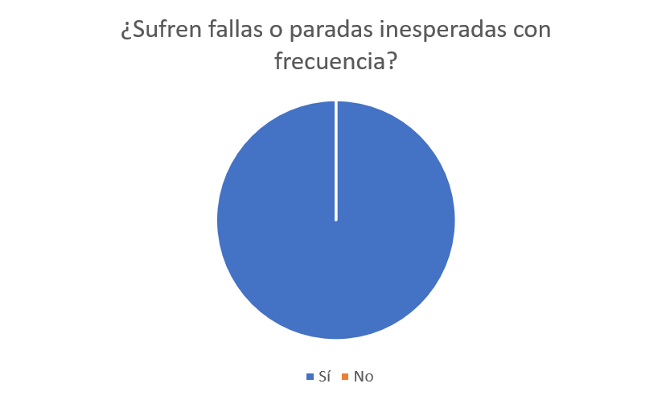
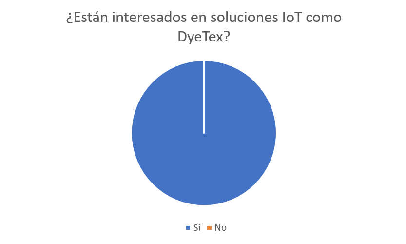
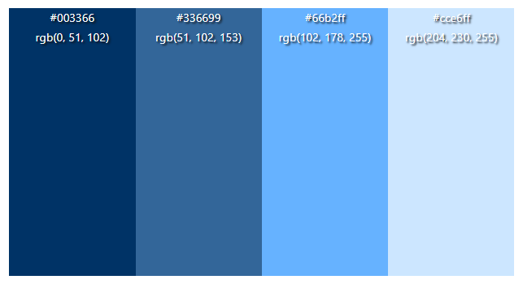
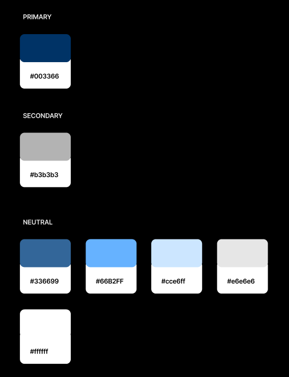
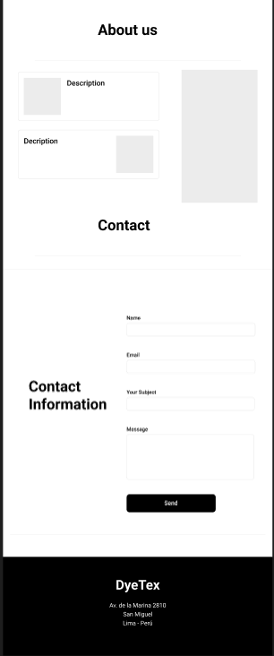
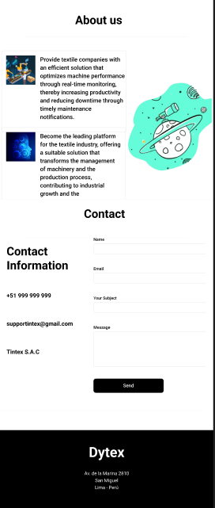
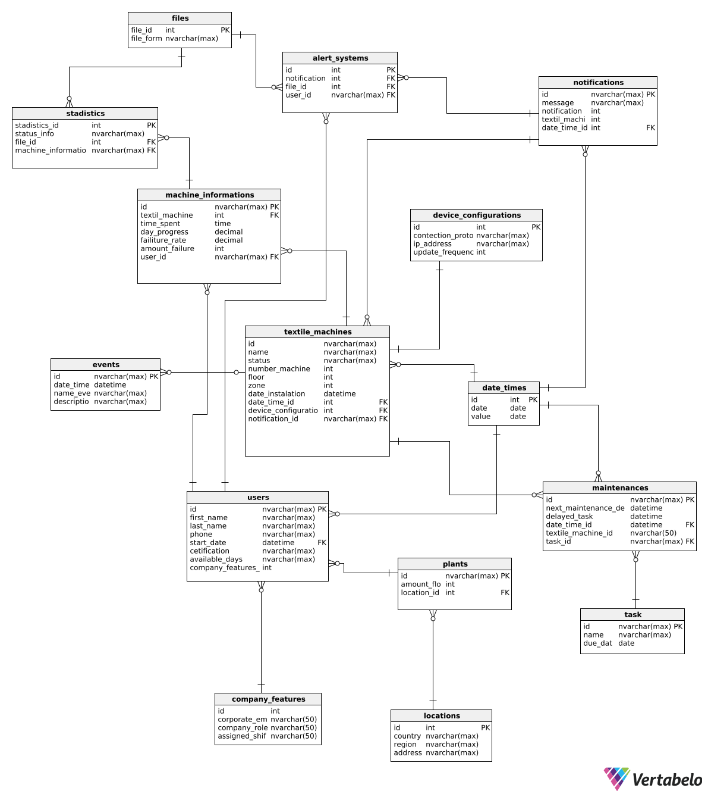

    

<h1 align="center">
    Universidad Peruana de Ciencias Aplicadas
</h1>

<h3 align="center">
    Carrera: Ingeniería de Software
       
    Curso:  1ASI0730 - Aplicaciones Web
       
    Sección: 4378
       
    Profesor: Ángel Augusto Velásquez Nuñez
       
    Ciclo: 2025-10 
       
    Informe de Trabajo Final
       
    Startup: TinteX
       
    Producto: DyeTex  
</h3>

| 
Alumno
 | 
Código
 |
|:-------------------------------------------:|:-------------------------------------------:|
|       Becerra Tejeda, Alessandra Nicole     |              u202318947                     |
|         Contreras López, Leandro Saul       |              u20231e215                     |
|       Gordon Salas, Gabriel Fernando        |              u20221e229                     |
|  Prieto Mantari, Leonardo Fabrizzio Junior  |              u202319949                     |
|         Rios Pacheco, Hector Javier         |              u20231c540                     |

 Abril 2025 

## Registro de Versiones del Informe

| Versión | Fecha       | Autor(es)                                                                                                     | Descripción de modificación                                                                                                                                                                                                                                                          |
|---------|-------------|---------------------------------------------------------------------------------------------------------------|--------------------------------------------------------------------------------------------------------------------------------------------------------------------------------------------------------------------------------------------------------------------------------------|
| 0.1     | 11/04/2025  | Hector Ríos                                                                                                   | Primer commit                                                                                                                                                                                                                                                                        |
| 0.2     | 12/04/2025  | Hector Ríos                                                                                                   | Culminación de Hypothesis Statements; avance de los puntos 1.1 y 1.2                                                                                                                                                                                                                  |
| 0.3     | 13/04/2025  | Gabriel Gordon                                                                                                | Completion of point 2.1.1 – Competitive Analysis; búsqueda y descripción de 3 competidores; estrategias contra competidores                                                                                                                                                         |
| 0.4     | 18/04/2025  | Gabriel Gordon                                                                                                | Merge PR #2: actualización de secciones 2.1.1 y 2.1.2 (Competitive Analysis)                                                                                                                                                                                                         |
| 0.5     | 19/04/2025  | Alessandra Becerra, Leandro Contreras, Leonardo Prieto                                                        | Agregados segmentos objetivo y user personas; finalización de entrevistas (punto 2.2.1) y mejoras de diseño; añadido Impact Mapping                                                                                                                                               |
| 0.6     | 20/04/2025  | Alessandra Becerra, Hector Ríos                                                                               | Añadido título principal; incorporación de Lean UX Canvas y corrección de archivo                                                                                                                                                                                                   |
| 0.7     | 21/04/2025  | Alessandra Becerra, Leandro Contreras                                                                         | Añadidas paletas de color primaria y secundaria; títulos y mejoras de análisis de entrevistas; registros e imágenes de entrevistas; añadido Scenario Mapping                                                                                                                           |
| 0.8     | 22/04/2025  | Hector Ríos, Leandro Contreras                                                                                | Añadido segmento 4 de entrevistas; épicas y user stories; product backlog; diagramas de contexto y componente (DDD)                                                                                                                                                                   |
| 0.9     | 23/04/2025  | Alessandra Becerra, Leonardo Prieto, Hector Ríos                                                              | Integración de Web Style Guidelines (texto e imágenes); añadido sistemas de búsqueda y etiquetado; mapeo de escenarios (as-is); wireframes y wireflows; mejoras puntuales de formato y espaciado                                                                                      |
| 0.10    | 24/04/2025  | Alessandra Becerra, Leonardo Prieto, Leandro Contreras, Hector Ríos, Gabriel Gordon                           | Correcciones de nombres de imágenes; añadido ubiquitous language; sistemas de navegación; diagramas de componentes; perfil de equipo; diagrama de clases de la app                                                                                                                      |
| 0.11    | 25/04/2025  | Gabriel Gordon, Leonardo Prieto, Leandro Contreras                                                            | Actualización de descripciones y versiones de diagramas de clases; mockups y pantallas de landing page; perfiles y outcomes de estudiantes; actualización de diagramas de base de datos; info personal en perfiles                                                                   |
| 0.12    | 26/04/2025  | Alessandra Becerra, Leandro Contreras, Hector Ríos, Gabriel Gordon                                            | Múltiples “feat” y “fix”: imágenes y perfiles (startup y GitHub); actualización de product backlog y user stories; gráficos y charts de sprint 1 (planning, leaders & collaborators); conclusiones; evidencias de despliegue; insights de colaboración; mejoras en entrevistas; pantallas y guía de estilo; configuración de entorno |
| 0.13    | 13/05/2025  | Héctor Ríos, Alessandra Becerra, Leandro Contreras                                                            | Fix: corrección de imágenes; añadido texto al resumen de entrevistas; actualización de la sección 3.2 User Stories                                                                                                                                                                     |
| 0.14    | 14/05/2025  | Leonardo Prieto, Héctor Ríos, Leandro Contreras, Gabriel Gordon                                               | Fix: corrección de user persona, matriz de tareas y flujos de usuario; añadido planificación de sprint; actualización de assets (logos y diagramas); reorganización de carpeta de archivos                                                                                           |
| 0.15    | 15/05/2025  | Héctor Ríos, Leandro Contreras, Alessandra Becerra, Gabriel Gordon                                            | Feat: adición de conclusiones y resultados; incorporación de student outcomes; información de Sprint 2; mejoras en Software Project Management; corrección y mejora de modelos C4; ajustes de ubiquitous language; enlaces sobre competidores                                        |

## Project Report Collaboration Insights  

Todas las actividades asignadas para la entrega de la TB1 han sido completadas y se encuentran documentadas en el repositorio de GitHub de la organización del equipo, accesible en: https://github.com/upc-pre-202510-1asi0730-4378-TinteX . En cuanto al informe, cada miembro del equipo participó redactando y elaborando gráficos en formato Markdown de acuerdo con los temas asignados, registrando su progreso mediante commits en el repositorio correspondiente, encontrándose en el siguiente enlace: https://github.com/upc-pre-202510-1asi0730-4378-TinteX/TinteX . Aqui se pueden aprecion todos los commits hechos en la TB1 evidenciando el trabajo colaborativo.

  

  

  

## Tabla de Contenidos

    
Capítulo I: Introducción 
    
        <ul>
            <li><a href="#11-Startup-Profile">1.1. Startup Profile</a></li>
            <li><a href="#111-Descripción-de-la-Startup">1.1.1. Descripción de la Startup</a></li>
            <li><a href="#112-Perfiles-de-Integrantes-del-Equipo">1.1.2. Perfiles de Integrantes del Equipo</a></li>
            <li><a href="#12-Solution-Profile">1.2. Solution Profile</a></li>
            <li><a href="#121-Antecedentes-y-Problemática">1.2.1. Antecedentes y Problemática</a></li>
            <li><a href="#122-Lean-UX-Process">1.2.2. Lean UX Process</a></li>
            <li><a href="#1221-Lean-UX-Problem-Statements">1.2.2.1. Lean UX Problem Statements</a></li>
            <li><a href="#1222-Lean-UX-Assumptions">1.2.2.2. Lean UX Assumptions</a></li>
            <li><a href="#1223-Lean-UX-Hypothesis-Statements">1.2.2.3. Lean UX Hypothesis Statements</a></li>
            <li><a href="#1224-Lean-UX-Canvas">1.2.2.4. Lean UX Canvas</a></li>
            <li><a href="#13-Segmentos-Objetivos">1.3. Segmentos Objetivos</a></li>
        </ul>    

    
Capítulo II: Requirements Elicitation & Analysis

        <ul>
            <li><a href="#21-competidores">2.1. Competidores</a></li>
            <li><a href="#211-Análisis-competitivo">2.1.1. Análisis competitivo</a></li>
            <li><a href="#212-Estrategias-y-tácticas-frente-a-competidores">2.1.2. Estrategias y tácticas frente a competidores</a></li>
            <li><a href="#22-Entrevistas">2.2. Entrevistas</a></li>
            <li><a href="#221-Diseño-de-entrevistas">2.2.1. Diseño de entrevistas</a></li>
            <li><a href="#222-Registro-de-entrevistas">2.2.2. Registro de entrevistas</a></li>
            <li><a href="#223-Análisis-de-entrevistas">2.2.3. Análisis de entrevistas</a></li>
            <li><a href="#23-Needfinding">2.3. Needfinding</a></li>
            <li><a href="#231-User-Personas">2.3.1. User Personas</a></li>
            <li><a href="#232-User-Task-Matrix">2.3.2. User Task Matrix</a></li>
            <li><a href="#233-User-Journey-Mapping">2.3.3. User Journey Mapping</a></li>
            <li><a href="#234-Empathy-Mapping">2.3.4. Empathy Mapping</a></li>
            <li><a href="#235-As-is-Scenario-Mapping">2.3.5. As-is Scenario Mapping</a></li>
            <li><a href="#24-Ubiquitous-Language">2.4. Ubiquitous Language</a></li>
        </ul>   

    
Capítulo III: Requirements Specification 

        <ul>
            <li><a href="#31-To-Be-Scenario-Mapping">3.1. To-Be Scenario Mapping</a></li>
            <li><a href="#32-User-Stories">3.2. User Stories</a></li>
            <li><a href="#33-Impact-Mapping">3.3. Impact Mapping</a></li>
            <li><a href="#34-Product-Backlog">3.4. Product Backlog</a></li>
        </ul>    

    
Capítulo IV: Product Design 

        <ul>
            <li><a href="#41-Style-Guidelines">4.1. Style Guidelines</a></li>
            <li><a href="#411-General-Style-Guidelines">4.1.1. General Style Guidelines</a></li>
            <li><a href="#412-Web-Style-Guidelines">4.1.2. Web Style Guidelines</a></li>
            <li><a href="#42-Information-Architecture">4.2. Information Architecture</a></li>
            <li><a href="#421-Organization-Systems">4.2.1. Organization Systems</a></li>
            <li><a href="#422-Labeling-Systems">4.2.2. Labeling Systems</a></li>
            <li><a href="#423-SEO-Tags-and-Meta-Tags">4.2.3. SEO Tags and Meta Tags</a></li>
            <li><a href="#424-Searching-Systems">4.2.4. Searching Systems</a></li>
            <li><a href="#425-Navigation-Systems">4.2.5. Navigation Systems</a></li>
            <li><a href="#43-Landing-Page-UI-Design">4.3. Landing Page UI Design</a></li>
            <li><a href="#431-Landing-Page-Wireframe">4.3.1. Landing Page Wireframe</a></li>
            <li><a href="#432-Landing-Page-Mock-up">4.3.2. Landing Page Mock-up</a></li>
            <li><a href="#44-Web-Applications-UXUI-Design">4.4. Web Applications UX/UI Design</a></li>
            <li><a href="#441-Web-Applications-Wireframes">4.4.1. Web Applications Wireframes</a></li>
            <li><a href="#442-Web-Applications-Wireflow-Diagrams">4.4.2. Web Applications Wireflow Diagrams</a></li>
            <li><a href="#443-Web-Applications-Mock-ups">4.4.3. Web Applications Mock-ups</a></li>
            <li><a href="#444-Web-Applications-User-Flow-Diagrams">4.4.4. Web Applications User Flow Diagrams</a></li>
            <li><a href="#45-Web-Applications-Prototyping">4.5. Web Applications Prototyping</a></li>
            <li><a href="#46-Domain-Driven-Software-Architecture">4.6. Domain-Driven Software Architecture</a></li>
            <li><a href="#461-Software-Architecture-Context-Diagrams">4.6.1. Software Architecture Context Diagrams</a></li>
            <li><a href="#462-Software-Architecture-Container-Diagrams">4.6.2. Software Architecture Container Diagrams</a></li>
            <li><a href="#463-Software-Architecture-Components-Diagrams">4.6.3. Software Architecture Components Diagrams</a></li>
            <li><a href="#47-Software-Object-Oriented-Design">4.7. Software Object-Oriented Design</a></li>
            <li><a href="#471-Class-Diagrams">4.7.1. Class Diagrams</a></li>
            <li><a href="#472-Class-Dictionary">4.7.2. Class Dictionary</a></li>
            <li><a href="#48-Database-Design">4.8. Database Design</a></li>
            <li><a href="#481-Database-Diagram">4.8.1. Database Diagram</a></li>
        </ul>    

    
Capítulo V: Product Implementation, Validation & Deployment 

        <ul>
            <li><a href="#51-software-configuration-management">5.1. Software Configuration Management</a></li>
            <li><a href="#511-software-development-environment-configuration">5.1.1. Software Development Environment Configuration</a></li>
            <li><a href="#512-source-code-management">5.1.2. Source Code Management</a></li>
            <li><a href="#513-source-code-style-guide-conventions">5.1.3. Source Code Style Guide & Conventions</a></li>
            <li><a href="#514-software-deployment-configuration">5.1.4. Software Deployment Configuration</a></li>
            <li><a href="#52-landing-page-services-applications-implementation">5.2. Landing Page, Services & Applications Implementation</a></li>
            <li><a href="#521-sprint-1">5.2.1. Sprint 1</a></li>
            <li><a href="#5211-sprint-planning-1">5.2.1.1. Sprint Planning 1</a></li>
            <li><a href="#5212-aspect-leaders-and-collaborators">5.2.1.2. Aspect Leaders and Collaborators</a></li>
            <li><a href="#5213-sprint-backlog-1">5.2.1.3. Sprint Backlog 1</a></li>
            <li><a href="#5214-development-evidence-for-sprint-review">5.2.1.4. Development Evidence for Sprint Review</a></li>
            <li><a href="#5215-execution-evidence-for-sprint-review">5.2.1.5. Execution Evidence for Sprint Review</a></li>
            <li><a href="#5216-services-documentation-evidence-for-sprint-review">5.2.1.6. Services Documentation Evidence for Sprint Review</a></li>
            <li><a href="#5217-software-deployment-evidence-for-sprint-review">5.2.1.7. Software Deployment Evidence for Sprint Review</a></li>
            <li><a href="#5218-team-collaboration-insights-during-sprint">5.2.1.8. Team Collaboration Insights during Sprint</a></li>
        </ul>        

## Student Outcome

El curso contribuye al cumplimiento del Student Outcome ABET:

**ABET – EAC - Student Outcome 5**

Criterio: : La capacidad de funcionar efectivamente en un
equipo cuyos miembros juntos proporcionan liderazgo, crean un entorno de
colaboración e inclusivo, establecen objetivos, planifican tareas y cumplen objetivos.

| Criterio específico | Acciones realizadas    | Conclusiones    |
|---------------------|  ----------------------|-----------------|
| Trabaja en equipo para proporcionar liderazgo en forma conjunta                | **Héctor Ríos** **TB1:** Durante el desarrollo colaboré de manera asertiva y coordinada con el equipo para ejercer un liderazgo compartido, junto a mis compañeros planificamos las reuniones para que pudiera realizar el Startup Profile y Solution Profile, acordando los objetivos. Participé en la entrevista dentro del primer segmento y contribuí al diseño colectivo creando y revisando el Information Architecture, los wireframes y mos mockups previos al prototipo, integrando las sugerencias y especificación mencionadas por lo miembros.   **Leonardo Prieto** **TB1:** En esta entrega del proyecto colaboré de manera organizada, manteniendo así un correcta elaboración del trabajo, pues apliqué una correcta comunicación para el trabajo en equipo y coordinar la elaboración de mi sección asigna (needfinding y los userflows). **Gabriel Gordon TB1:** En esta etapa inicial del proyecto, ejercí liderazgo de la mano con mis compañeros en la elaboración de la StartUp y contribuí activamente. Participé en la elaboración de la página web, proporcionando opiniones sobre como puede ir un diseño llamativo, también aporté ideas para escoger a nuestro competidores.        **Alessandra Becerra TB1:** Durante el desarrollo de esta entrega, colaboré de manera coordinada con mi equipo, manteniendo una buena comunicación y liderando puntos como los son la sección de entrevistas, las cuales diseñé, elaboré y analicé. Además de elaborar el Ubiquitous Language.  **Leandro Contreras TB1:** Durante el desarrollo de esta entrega, asumí el rol de lider en el equipo, brindando liderazgo colaborativo al encargarme de elementos clave para la definición y planificación del proyecto. Elaboré el To-Be Scenario Mapping, las User Stories, el Impact Mapping y el Product Backlog, herramientas esenciales para alinear al equipo en torno a una visión compartida del producto. Mi participación no solo se centró en la ejecución, sino también en asegurar que el equipo mantuviera una dirección clara, cohesionada y orientada a objetivos.  **Alessandra Becerra TP:** Durante el desarrollo de esta entrega, colaboré de manera coordinada con mi equipo para avanzar y culminar la primera versión de nuestro Frontend, además corrigiendo las observaciones realizadas en nuestra entrega previa. **Héctor Ríos** **TP:** Durante la elaboración de esta entrega realicé las correciones de las secciones señaladas en constante coordinación con mis compañeros, manteniendo una buen liderazgo como equipo.  **Gabriel Gordon TP:** Asumí un rol activo en la coordinación del equipo durante el desarrollo, todos pudieron aportar ideas y apoyarnos entre nosotros. Participé en el arregló de los diagrams, además pude mejorar nuestra landing page en base a ideas que compartimos entre equipo.**Leonardo Prieto** **TP:** Para la presentación de esta fecha realicé las correcciones adecuadas observadas por el docente, realizando reuniones con mis compañeros para revisar en conjunto y conversando activamente.   **Leandro Contreras TP:** Durante el desarrollo de esta entrega, trabajé en equipo aportando liderazgo colaborativo al brindar correcciones clave en la documentación del proyecto, lo cual permitió mejorar la claridad y coherencia de nuestras propuestas. Asimismo, contribuí con ideas para el diseño y estructura del Frontend de “DyeTex”, apoyando activamente al equipo en la toma de decisiones visuales y funcionales para esta primera versión de la aplicación. |A lo largo de TB1 y TP, el equipo ha fortalecido su capacidad de liderazgo compartido, consolidando un proceso de toma de decisiones coordinado y dinámico. En TB1 se establecieron las bases del liderazgo conjuntas  planificación de marcos de trabajo, diseño colaborativo y definición de roles, mientras que en TP se afianzó dicha práctica mediante la gestión eficiente de correcciones, la mejora continua de los entregables y la implicación activa de todos los miembros en el frontend de DyeTex. Esto ha resultado en un liderazgo distribuido, en el que cada integrante asume responsabilidad, alimenta la visión global y asegura un progreso armónico y alineado con los objetivos del proyecto.
| Crea un entorno colaborativo e inclusivo, establece metas, planifica tareas y cumple objetivos | **Héctor Ríos** **TB1:** Durante esta primera entrega promoví un ambiente donde puede aportar asertivamente, colaboré en la organización de sesiones de trabajo conjunto para definir el Startup Profile y el Solution Profile, anotando las ideas, contribuyendo a la construcción de esta primera entrega.     **Gabriel Gordon TB1:** En esta primera entrea fomenté la participación equitativa dentro el equipo. Establecimos cronogramas de trabajo para poder cumplir con los objetivos sobre el trabajo.          **Alessandra Becerra TB1:** Durante el desarrollo de esta entrega, planificamos nuestros tiempos para las reuniones de equipo y poder avanzar nuestro proyecto, ayudándonos mutuamente en lo necesario y avanzando colaborativamente, personalmente también establecí metas las cual logré con éxito dentro del plazo establecido.   **Leandro Contreras TB1:** Durante esta primera entrega fomenté un ambiente colaborativo e inclusivo, en el que pudimos organizarnos como equipo para establecer nuestras metas y tareas principales. Contribuí activamente a la planificación del proyecto elaborando el To-Be Scenario Mapping, las User Stories, el Impact Mapping y el Product Backlog, así como los diagramas de arquitectura de software. Estas tareas permitieron al equipo tener una visión clara del proyecto y avanzar de forma ordenada y coordinada.    **Alessandra Becerra TP:** Durante el desarrollo de esta entrega vimos la necesidad de aumentar aún más nuestra comunicación y colaboración grupal, así es como logramos un buen trabajo en equipo, avanzando equitativamente lo que abarcaba esta entrega. Es por eso que pudimos cumplir con las metas de esta entrega, manteniendo el respeto entre todos los integrantes del equipo.  **Leonardo Prieto** **TP:** Para la presentación de esta fecha dirigí mis esfuerzos en mantener una comunicación cosntante con todos mis compañeros, amnteniendo el objetivo del trajo siempre presente mientras realiza las correciones correspondientes. **Gabriel Gordon TP:** Me enfoqué en generar un entorno de trabajo basado en la comunicación abierta y el respeto por las ideas de cada integrante. Junto al equipo, definimos metas claras y nos mantuvimos organizados en la elaboración del proyecto, contribuyendo de manera colaborativa para mejorar ciertos errores.   **Leandro Contrreras TP:** Durante esta entrega fortalecimos la colaboración dentro del equipo, lo cual nos permitió organizarnos mejor para cumplir con nuestras metas. Participé proponiendo ideas para el desarrollo del Frontend y realicé correcciones en la documentación, siempre promoviendo un espacio donde todos los aportes fueran escuchados. Gracias a esta dinámica de trabajo conjunto, logramos avanzar de manera equitativa y mantenernos alineados con los objetivos establecidos. **Héctor Ríos** **TP:** Para la elaboración en esta presentación mantuve una comunicación asertiva en todo momento, bucando colaborar activamente y siguiendo la metodolo´gia de trabajo indicada para seguir lso objetivos del proyecto|Durante TB1 se cimentó un entorno inclusivo y organizado, en el que se definieron metas claras, se planificaron las tareas principales y se estableció un cronograma de trabajo compartido. En TP, esta dinámica se potenció gracias a una comunicación constante, reuniones de revisión y un reparto equitativo de responsabilidades que permitió cumplir los objetivos dentro de los plazos establecidos. Así, el equipo ha demostrado una evolución continua en la colaboración, optimizando sus procesos y asegurando que cada miembro aporte de forma significativa al cumplimiento de las metas del proyecto.

## Capítulo I: Introducción 

### 1.1. Startup Profile
Somos un equipo de estudiantes de la Universidad Peruana de Ciencias Aplicadas (UPC) comprometidos en desarrollar una solución diferente cuyo objetivo principal sea ayudar a las empresas textiles a mejorar la eficacidad y productividad de sus máquinas, así como también a proveedores de soluciones tecnológicas para la industria textil. 

#### 1.1.1. Descripción de la Startup
Nuestra aplicación web, DyeTex, está diseñada para optimizar la productividad y eficiencia de las máquinas textiles mediante el control inteligente con dispositivos IoT. DyeTex ofrece una solución innovadora que permite a las empresas textiles monitorear y gestionar el rendimiento de sus máquinas en tiempo real, obteniendo los datos necesarios que permitirán tomar mejores decisiones, mejorar los procesos de producción y llevar un mejor control del mantenimiento. La plataforma, basada en un modelo de suscripción, proporciona una interfaz intuitiva y herramientas precisas para facilitar el manejo de la maquinaria, asegurando un aumento en la eficiencia operativa y una reducción en los tiempos de inactividad.
Misión: Proporcionar a las empresas textiles una solución eficiente que permita optimizar el rendimiento de sus máquinas mediante un monitoreo en tiempo real, incrementando así su productividad y reduciendo tiempos de inactividad mediante un aviso de mantenimiento oportuno.
Visión: Convertirnos en la plataforma líder para la industria textil, ofreciendo una solución adecuada que transforme la gestión de la maquinaria y el proceso de producción, contribuyendo al crecimiento industrial y la competitividad de las empresas textiles.

#### 1.1.2. Perfiles de Integrantes del Equipo

| **Nombre**    | **Descripción**     | **Foto** |
|--------------|-----------------|-----------|
| Héctor Javier Ríos Pacheco |  Poseo como habilidades blandas la responsabilidad, compromiso, comunicación asertiva, manejo de tiempos y organización. Mi objetivo en este proyecto es aportar en la construcción sólida del mismo, así como verificar el avance correcto y dirección. |           |
| Leonardo Fabrizzio Junior Prieto Mantari | Me considero una persona trabajadora que coopera bien con sus compañeros de grupo y le gusta ayudar a personas que necesiten de esta. Con estas habilidades, tengo como objetivo aportar lo mejor de mí en el proyecto para una buena presentación final. |  |
| Gabriel Fernando Gordon Salas | Me considero una persona responsable, me gusta ayudar a mis compañeros en los trabajos y sé organizarme bien al momento de realizar mis cosas. Con esto mi objetivo es poder dar lo mejor en un ambiente de cooperación entre todos para que el proyecto dé una muy buena presentación |   | 
| Leandro Saul Contreras López | Estudiante de la carrera de Ingeniería de Software en la UPC, tengo 19 años y estoy cursando el quinto ciclo académico. Me considero una persona adaptativa, perseverante y comprometida con lo que me propongo. En este proyecto tengo como objetivo buscar múltiples soluciones que beneficien a todo el grupo, por experiencia propia suelo trabajar de manera colaborativa y eficaz. |  |
| Alessandra Nicole Becerra Tejeda | Tengo 18 años y estoy cursando el quinto ciclo académico de la carrera de Ingeniería de Software en la UPC. Me considero una persona bastante dispuesta al trabajo en equipo y comprometida con la buena organización en los trabajos. Para este proyecto me comprometo a apoyar a mi equipo para lograr un buen trabajo. | 

#### 1.2. Solution Profile
DyeTex es una plataforma web que permite a las empresas textiles optimizar el rendimiento de sus máquinas mediante un monitoreo en tiempo real a través de dispositivos IoT. La aplicación ofrece una solución inteligente que permite a los usuarios gestionar el desempeño de sus máquinas, identificar posibles fallos y recibir notificaciones de mantenimiento oportuno, lo que contribuye a una mayor productividad y menor tiempo de inactividad. DyeTex adapta sus funcionalidades a las necesidades específicas de cada empresa, proporcionando herramientas de análisis que permiten tomar decisiones informadas para mejorar la eficiencia operativa y el control de los procesos de producción.
Con un modelo de suscripción, DyeTex ofrece distintas opciones que se ajustan a las necesidades de las empresas textiles, brindando una versión básica con funcionalidades clave de monitoreo y una versión premium que incluye análisis avanzados, reportes detallados. DyeTex se posiciona como la solución ideal para aquellas empresas que buscan integrar tecnología de vanguardia en la gestión de su maquinaria y mejorar la competitividad en la industria textil.

#### 1.2.1. Antecedentes y problemática
**What**  
La mayoría de las empresas textiles carecen de visibilidad y control en tiempo real sobre el estado y rendimiento de su maquinaria, lo que provoca paradas inesperadas, bajo aprovechamiento de capacidad y elevados costos de mantenimiento. DyeTex resuelve esto mediante una plataforma web IoT que monitorea continuamente las máquinas, detecta posibles fallos y envía alertas de mantenimiento oportuno, mejorando la productividad y reduciendo el tiempo de inactividad.

**Who**  
- Empresas textiles (talleres, pymes y grandes fábricas) que buscan optimizar su rendimiento productivo.  
- Operarios, ingenieros de mantenimiento y gerentes de planta que necesitan una visión clara y en tiempo real del estado de sus equipos.  
- Proveedores de soluciones tecnológicas interesados en herramientas de monitoreo y análisis de datos para el sector textil.

**Cuando**  
El problema ocurre de forma continua en cada turno y lote de producción, agravándose en picos de demanda y con renovaciones tecnológicas lentas, justo cuando la competitividad global y los plazos de entrega son más exigentes.

**Where**  
Los usuarios acceden a DyeTex desde estaciones de control en planta, oficinas de mantenimiento o de forma remota (PC, tablet o smartphone). El problema se origina en el piso de producción: líneas de tejeduría, tintorería y acabado, donde la f de datos en tiempo real impide una gestión proactiva de la maquinaria.

**Why**  
- F de digitalización, con registros manuales y controles aislados.  
- Ausencia de sistemas predictivos que anticipen desgastes o averías.  
- Mantenimiento reactivo, que aumenta tiempos de paro y costos imprevistos.

**How**  
DyeTex se integra con sensores IoT en cada máquina (temperatura, vibración, velocidad y uso). La plataforma centraliza datos en dashboards personalizables, envía notificaciones al superar umbrales críticos y genera reportes de tendencia. Permite configurar alertas (SMS/email) para mantenimientos preventivos y ajustes operativos en tiempo real.

**How Much**  
- 800 horas de inactividad promedio al año por fallos imprevistos (≈ 9 % de disponibilidad perdida).  
- 40 % del tiempo de los técnicos dedicado a reparaciones de emergencia.  
- 25 % más de defectos y retrabajos por ausencia de alertas tempranas.

#### 1.2.2. Lean UX Process

#### 1.2.2.1. Lean UX Problem Statements

El estado actual de la gestión de maquinaria textil se ha centrado principalmente en inspecciones manuales, registros aislados y sistemas locales poco conectados que obligan a reaccionar a fallos luego de producirse y generando largos tiempos de inactividad y disminución general de producción.
Lo que los servicios existentes no abordan es la f de soluciones adaptadas a la variabilidad de las máquinas textiles, con integraciones sencillas para control de parámetros y notificaciones inmediatas pues no son desarrollos a medida.
Nuestro servicio abordará esta brecha al ofrecer DyeTex, una solución que permite el monitoreo completo de cada activo y control de recursos, unido a un dashboard preconfigurado con alertas automáticas y que a su vez permite mejorar los tiempos de inactividad por prevención de riesgos.
Nuestro enfoque inicial será pequeñas y medianas empresas textiles con equipos de mantenimiento interno, sin experiencia en soluciones predictivas y con presupuestos limitados.
Nosotros sabremos que tenemos éxito cuando vemos que al menos 20 pymes implementan la solución con más de un 50% % de activación de alertas en el primer mes, reducen un 30 % las paradas no planificadas en seis meses y obtienen una  visibilidad y control de maquinaria.

#### 1.2.2.2. Lean UX Assumptions
**¿Quién es el usuario?**
- Los usuarios de DyeTex son los gerentes de planta, operadores técnicos y personal responsable del mantenimiento de maquinaria el sector textil industrial que buscan mejorar el rendimiento de máquinas mediante el uso de tecnología que les ayude a llevar un control. Asimismo, se incluye a proveedores de soluciones tecnológicas que desean integrar herramientas para un monitoreo y control de maquinaria.

**¿Qué problemas tiene nuestro producto? ¿Resolver?**
- DyeTex enfrenta desafíos en la integración con maquinaria antigua, posibles resistencias al uso de tecnología por parte de algunos usuarios y dependencia de una buena conexión a internet. Estos problemas pueden resolverse con soporte técnico, capacitación, pruebas piloto y mejoras en la estabilidad y precisión del sistema.

**¿Qué características son importantes?**
- Entre las características clave de DyeTex están el monitoreo en tiempo real del estado de las máquinas, las alertas automáticas de fallas o necesidad de mantenimiento, los reportes de productividad, el historial de rendimiento y la interfaz con información detallada y relevante. También es esencial la compatibilidad con múltiples tipos de maquinaria y la posibilidad de acceder a los datos desde cualquier dispositivo conectado a internet.

**¿Dónde encaja nuestro producto en su trabajo o vida?**
- DyeTex se integra de forma natural en la rutina laboral de los técnicos y gestores de maquinarias textiles. Es usado durante la jornada de trabajo para supervisar el estado de las máquinas, programar mantenimientos y tomar decisiones basadas en datos. Permite a los usuarios optimizar la producción sin interrumpir el flujo de trabajo.

**¿Cuándo y cómo es usado nuestro producto?**
- DyeTex es utilizado diariamente, principalmente durante los turnos de producción. Se accede mediante navegadores web desde computadoras de oficina, laptops o dispositivos móviles. También puede utilizarse al finalizar el día o la semana para generar reportes de rendimiento y programar acciones correctivas en caso fuese necesario.

**¿Cómo debe verse nuestro producto y cómo comportarse?**
- DyeTex debe tener una interfaz moderna, profesional e industrial, con un diseño claro y práctico, que facilite la lectura de datos y gráficos. La interfaz debe ser responsiva, con navegación rápida y una experiencia de usuario simplificada pero de buen rendimiento, permitiendo monitorear múltiples máquinas sin complicaciones.

---

**¿Qué creen que necesitan nuestros clientes?**
- "Mis clientes necesitan...
Una forma práctica y tecnológica de monitorear y optimizar el rendimiento de sus máquinas textiles en tiempo real."

**¿Cómo podemos resolver estas necesidades?**
- "Estas necesidades se pueden resolver con...
Una plataforma IoT que recoja datos en tiempo real y brinde recomendaciones para mejorar la eficiencia y reducir tiempos muertos."

**¿Quiénes son nuestros clientes iniciales?**
- "Mis clientes iniciales son (o serán)...
Empresas textiles que buscan digitalizar sus procesos de producción y proveedores de soluciones tecnológicas para la industria textil."

**¿Qué valor buscan los clientes?**
- "El valor #1 que un cliente quiere de mi servicio es...
El aumento de productividad y reducción de ineficiencias a través del monitoreo constante de sus máquinas."

**¿Qué beneficios adicionales pueden obtener los clientes?**
- "El cliente también puede obtener estos beneficios adicionales...
Alertas de mantenimiento, reportes automatizados, y una mejor toma de decisiones basada en datos."

**¿Cómo vamos a adquirir clientes?**
- "Voy a adquirir la mayoría de mis clientes a través de...
Redes sociales, demostraciones en ferias industriales, alianzas con distribuidores de maquinaria textil y campañas de marketing B2B."

**¿Cómo generamos ingresos?**
- "Haré dinero a través de...
Modelos de suscripción mensual y paquetes premium con funcionalidades avanzadas de análisis y soporte."

**¿Quiénes son nuestros competidores?**
- "Mi competencia principal en el mercado será...
Empresas que ofrecen soluciones de monitoreo industrial o softwares de mantenimiento predictivo en la industria textil."

**¿Por qué vamos a vencer a la competencia?**
- "Los venceremos debido a...
Nuestro enfoque especializado en la industria textil, facilidad de integración con maquinaria existente y nuestra interfaz intuitiva."

**¿Cuál es el mayor riesgo de producto?**
- "Mi mayor riesgo de producto es...
Que las empresas no confíen en el valor del sistema o enfrenten dificultades técnicas en la integración."

**¿Cómo resolveremos el riesgo?**
- "Resolveremos esto a través de...
Pruebas piloto, soporte técnico personalizado y mejoras constantes basadas en el feedback del usuario."

**¿Qué otras suposiciones tenemos?**
- "¿Suponemos que los usuarios están dispuestos a pagar por una solución IoT de productividad?
Sí, ya que el retorno sobre inversión es tangible al reducir pérdidas operativas y aumentar la eficiencia."

#### 1.2.2.3. Lean UX Hypothesis Statements
**Creemos que** permitir a las empresas textiles monitorear de manera constante el rendimiento de sus máquinas mediante dispositivos IoT y una plataforma web aumentará la eficiencia y reducirá los tiempos de inactividad.  
**Sabremos que** esto es cierto  
**Cuando veamos** que las empresas reduzcan en al menos un 10% el tiempo promedio de inactividad de sus máquinas, y nos proporcionan comentarios positivos sobre la mejora en la planificación de mantenimiento.

**Creemos que** ofrecer una plataforma como DyeTex para monitoreo y control de maquinaria atraerá a pequeñas y medianas empresas textiles interesadas en digitalizar sus procesos productivos.  
**Sabremos que** estamos en el camino correcto  
**Cuando veamos** interés en forma de registros para demos, solicitudes de información o preórdenes por parte de al menos 5 empresas textiles dentro del primer mes de lanzamiento.

#### 1.2.2.4. Lean UX Canvas

    

https://www.canva.com/design/DAGlJa5hM50/r6zjjmIBlYsMarSUoKuRaQ/edit

### 1.3. Segmentos Objetivos

# Segmentos Objetivo - DyeTex

### Segmento Objetivo 1: Empresas Textiles

#### Aspectos Demográficos
- **Tamaño de Empresa:** Micro, pequeñas y medianas empresas (MIPYMES) y grandes empresas
- **Tipo de Empresa:** Fabricantes de productos textiles como ropa, accesorios, telas, uniformes, decoración, etc.
- **Nivel Socioeconómico Empresarial:** Empresas con ingresos medianos a altos
- **Capacidad de Inversión:** Limitada a moderada (en busca de soluciones costo-efectivas)

#### Aspectos Geográficos
- **Nacionalidad:** Nacional e internacional (con enfoque inicial en Perú y expansión a países con industria textil activa)
- **Ubicación Actual:** 
  - Parques industriales
  - Polos textiles
  - Zonas urbanas con actividad manufacturera (ej.: Lima, Gamarra, Arequipa, Trujillo, Piura, Huancayo)
- **Acceso a Tecnología:** Medio a alto (acceso a internet, PCs, y disposición a modernizar procesos)

#### Aspectos Psicográficos
- **Motivaciones:**
  - Incrementar productividad
  - Reducir tiempo de inactividad
  - Mejorar la eficiencia operativa sin grandes inversiones en nueva maquinaria
- **Estilo de operación:** Enfocados en la producción, con interés creciente en adoptar tecnologías de control de procesos
- **Preocupaciones:**
  - F de visibilidad sobre el estado de las máquinas
  - Pérdidas por mantenimiento reactivo
  - Presión por entregar productos a tiempo y con calidad
- **Adaptación a la tecnología:** Moderada, con interés creciente en herramientas digitales de fácil integración
- **Interés por la personalización:** Valoran soluciones adaptables a sus máquinas y procesos específicos

---

### Segmento Objetivo 2: Proveedores Tecnológicos para la Industria Textil

#### Aspectos Demográficos
- **Tipo de Empresa:** 
  - Empresas tecnológicas
  - Desarrolladores de software industrial
  - Fabricantes de maquinaria con componentes electrónicos o automatizados
- **Tamaño:** Startups, medianas y grandes empresas del sector tecnológico
- **Nivel Socioeconómico Empresarial:** Medio a alto
- **Capacidad de Inversión:**  (en desarrollo e integración de nuevas tecnologías)

#### Aspectos Geográficos
- **Nacionalidad:** Nacional e internacional
- **Ubicación Actual:**
  - Zonas urbanas tecnológicas o industriales con ecosistemas de innovación (ej.: Lima, Arequipa, Monterrey, Medellín, São Paulo)
- **Acceso a Tecnología:** Muy alto (infraestructura sólida para el desarrollo de software y hardware)

#### Aspectos Psicográficos
- **Motivaciones:**
  - Diferenciarse en el mercado integrando IoT en sus productos
  - Expandir su portafolio hacia el sector textil
  - Crear alianzas estratégicas
- **Estilo de operación:** Innovadores, buscando constantemente nuevas oportunidades y tecnologías
- **Preocupaciones:**
  - Soluciones escalables
  - Interoperabilidad
  - Facilidad de integración con otras plataformas
- **Adaptación a la tecnología:** , con infraestructura y equipos técnicos capacitados
- **Interés por la personalización:** Interesados en SDKs, APIs y plataformas adaptables y escalables

## Capítulo II: Requirements Elicitation & Analysis

### 2.1. Competidores

A partir de un estudio de mercado al cuál nos enfocamos, hemos podido identificar a ciertos competidores.
Estos tratan a la problemática desde diferentes puntos de vista, los 3 competidores que se seleccionaron son:

- Doeet : Empresa tecnológica que ofrece un software MES (Manufacturing Execution System) enfocado en la industria manufacturera. Permite monitorear en tiempo real el rendimiento de las máquinas y procesos productivos, ayudando a mejorar la eficiencia, reducir tiempos de inactividad y optimizar la toma de decisiones mediante IoT y análisis de datos.
- Textil Caiman : Empresa textil especializada en la fabricación de tejidos técnicos y sostenibles. Produce telas de  calidad para diferentes industrias, incluyendo moda, seguridad industrial y ropa deportiva, con un fuerte enfoque en innovación, sostenibilidad y economía circular.
- Delta Máquinas Textiles : Empresa encargada de desarrollar soluciones automatizadas como relajadoras, revisadoras y sistemas de inspección, con tecnología avanzada para mejorar la eficiencia en la preparación, acabado y control de calidad de tejidos.

#### 2.1.1. Análisis competitivo

<table>
    <tr>
        <th colspan="6">
            Competitive Analysis Landscape
        </th>
    </tr>
    <tr>
        <td>¿Por qué llevar a cabo este análisis?</td>
        <td colspan="5">
             Un análisis a nuestros competiores nos ayuda a tener una vista más amplía acerca de lo que debemos fortalecer en nuestra aplicación para un mayor alcance a los usuario, de forma que esta se fortalece
            <colgroup >
                <col span = "1">
            </colgroup>
        </td>
    </tr>
    <tr>
        <td colspan="2">Nombre de la StartUp</td>
        <td>
            DyeText
            
        </td>
        <td>
            Doeet
            
        </td>
        <td>
            Textil Caiman
            
        </td>
        <td>
            Delta Máquinas Textiles
            
        </td>
    </tr>
    

        <tr>
            <td rowspan="2" STYLE="transform: rotate(-90deg)" align="center">Perfil</td>
            <td>Overview</td>
            <td>Sistema diseñado a optimizar la productividad de las máquinas textiles, mejorando los procesos de producción y llevar un mejor control en el mantenimiento.  </td>
            <td>Plataforma de Industria 4.0 centrada en el control de producción, mejora de la productiviad y reducción de costes.</td>
            <td>Empresa con tecnología 4.0. automazada, logrando optimizar sus resultados en procesos de producción.</td>
            <td>Empresa centrada en el desarrollo de maquinaria y automatización para textiles,  cuyo procedimiento genera datos precisos e información sobre la capacidad de producción.</td>
        </tr>
        <tr>
            <td>Ventaja Competitiva ¿Qué valor ofrece a los clientes?</td>
            <td>Proporcionar herramientas para identificar fallos en las maquinas y recibir notificaciones de sobre el estado de estás, de forma que mejoren los textiles.</td>
            <td>Es amigable para todos los dispositivos, escalable al tamaño de la empresa y personalizable según las necesidades de esta.</td>
            <td>Implementación de un proceso de fabricación con toma de decisiones basadas en datos automáticos.</td>
            <td>Presenta soluciones para el aumento de productividad, mejorando los procesos y generando resultados en la producción textil.</td>
        </tr>
    

    

        <tr>
            <td rowspan="2" STYLE="transform: rotate(-90deg)" align="center">Perfil de Marketing</td>
            <td>Mercado objetivo</td>
            <td>Empresas textiles y Proovedores de soluciones tecnológicas para la industria textil</td>
            <td>Empresas de manufacturas, y Responsables de planta y producción</td>
            <td>Empresas industriales y Exportadores de soluciones textiles</td>
            <td>Empresas textiles orientadas a la automatización y eficiencia, y Fábricas que integran procesos de preparación, confección y acabado</td>
        </tr>
        <tr>
            <td>Estrategias de marketing</td>
            <td>Participación en ferias sobre textileria y publicidad por distintas redes sociales</td>
            <td>Marketing de contenidos técnicos, Participación en ferias industriales y Alianzas estratégicas</td>
            <td>Alianzas sectoriales, Presencia en ferias y Marketing digital</td>
            <td>Marketing de soluciones y Participación en ferias</td>
        </tr>
    

    

        <tr>
            <td rowspan="3" STYLE="transform: rotate(-90deg)" align="center">Perfil del Producto</td>
            <td>Productos & Servicios</td>
            <td>Sistema MES, OEE, Control de calidad, Integración de sensores IoT</td>
            <td>Sistema MES, OEE, Gestióon de paradas y tiempos improductivos, Control de calidad, Integración con ERP y sensores IoT</td>
            <td>Tejidos técnicos, Tejidos para EPI, Soluciones personalizadas</td>
            <td>Revisadoras de tejidos, Relajadora de tejido, Sistemas iConcept</td>
        </tr>
        <tr>
            <td>Precios & Costos</td>
            <td>Servicio de paga</td>
            <td>Servicio de paga</td>
            <td>Servicio de paga</td>
            <td>Servicio de paga</td>
        </tr>
        <tr>
            <td>Canales de distribución (Web y/o Móvil)</td>
            <td>Venta directa, Sitio Web, Ferias</td>
            <td>Venta directa, Sitio Web, Ferias</td>
            <td>E-commerce, Venta directa</td>
            <td>Venta directa, Sitio Web, Ferias</td>
        </tr>
    

    

        <tr>
            <td rowspan="4" STYLE="transform: rotate(-90deg)" align="center">Análisis SWOT</td>
            <td>Fortalezas</td>
            <td>Enfoque especializado en productividad textil con una plataforma fácil de escalar. Además, posee uso de IoT para el mantenimiento predictivo</td>
            <td>Especialización en control OEE y digitalización industrial, Integración con IoT y ERP, además de poseer una plataforma modular y escalable </td>
            <td>Amplia gama de textiles técnicos certificados con un fuerte enfoque en sostenibilidad</td>
            <td>Equipos de  tecnología e innovación, personalización y soporte técnico, y Presencia en más de 20 países</td>
        </tr>
        <tr>
            <td>Debilidades</td>
            <td>Startup emergente con poca presencia en el mercado, Dependencia tecnológica, Poco conocimiento en la industria textil</td>
            <td>Alto costo inicial para las pequeñas y medianas empresas</td>
            <td> dependencia del mercao textil brasileño, Poca visibilidad internacional</td>
            <td>Alto costo unitario de las máquinas, Ciclos de venta prolongados</td>
        </tr>
        <tr>
            <td>Oportunidades</td>
            <td>Gran oportunidad en textiles que no están digitalizadas y la posibilidad ante la creación de alianzas con fabricantes textiles</td>
            <td>Mayor demanda de autmatización en la industria 4.0, Expansión hacia nuevos sectores industriales y incentivos para transformación digital</td>
            <td>Tendencia global hacia productos ecoamigables</td>
            <td>Crecimiento de la industria textil automatizada</td>
        </tr>
        <tr>
            <td>Amenazas</td>
            <td>Dificultad para competir con plataformas consolidadas, Desconfianza al cambio en empresas tradicionales</td>
            <td>Competencia creciente en el sector MES, Riesgos de ciberseguridad en entornos conectados</td>
            <td>Competencia de importaciones asiáticas más económicas</td>
            <td> inversión inicial y nuevos competidores entrando al mercado</td>
        </tr>
    

</table>

#### 2.1.2. Estrategias y tácticas frente a competidores

- Estrategias de crecimiento y expansión:
    - Expansión Geográfica: Identificar mercao emergentes y regiones donde la tecnología IoT puee tener gran impacto.
    - Alianzas: Formar alianzas estratégicas con empresas complementarias.
    - Ferias industriales: Asistencia a distintas ferias las cuales permitan dar a conocer el producto. 
- Estrategias de innovación y diferenciación:
    - Desarrollo Continuo de Tecnología: Mantener una ventaja tecnológica a través de innovación y mejora del sistema.
    - Adaptación: Ofrecer soluciones que se adapten a las necesidades especíicas de diferentes tipos de clientes.
    - Inverción en desarrollo para mejorar continuamente la precisión y funcionalidad de la plataforam, de manera que se pueda implementar nuevas funciones.
- Tácticas:
    - Marketing Digital: Utilizar estrategias de Marketing como campañas en diversas reder sociales de manera que la visibilidad del sistema que ofrecemos incremente en el mercado
    
### 2.2. Entrevistas

#### 2.2.1. Diseño de entrevistas
**Entrevista a Empresas Textiles**

1. **¿Cuál es su cargo y principal responsabilidad dentro de la empresa textil?**

2. **¿Actualmente cómo monitorean el rendimiento de sus máquinas?**  
   (Manual, software, etc.)

3. **¿Con qué frecuencia enfrentan fallas o paradas inesperadas en la maquinaria?**

4. **¿Cómo gestionan el mantenimiento de sus máquinas?**  
   ¿Es preventivo y/o predictivo?

5. **¿Qué impacto tienen los tiempos de inactividad en su producción y entregas?**

6. **¿Han considerado implementar soluciones tecnológicas como IoT para optimizar su producción?**

7. **¿Qué tipo de información les sería más útil ver en tiempo real sobre sus máquinas?**

8. **¿Qué funcionalidades esperaría de una plataforma como DyeTex para que realmente le sea útil?**

9. **¿Qué nivel de facilidad de uso considera importante para una herramienta de monitoreo?**

10. **¿Estaría dispuesto a invertir en una solución si demuestra reducir pérdidas y aumentar la eficiencia?**

11. **¿Cuáles son los principales indicadores que utilizan para medir la eficiencia de su producción?**

**Entrevista a Proveedores de Soluciones Tecnológicas para la Industria Textil**

1. **¿Cuál es su rol en la empresa y qué soluciones tecnológicas ofrecen actualmente?**

2. **¿Tienen experiencia previa integrando tecnologías IoT o sistemas de monitoreo en tiempo real?**

3. **¿Qué desafíos suelen enfrentar al implementar sus soluciones en la industria textil?**

4. **¿Creen que sus clientes textiles necesitan mejorar el control y rendimiento de sus máquinas?**

5. **¿Cómo ven el potencial de una plataforma como DyeTex en su portafolio de soluciones?**

6. **¿Qué funcionalidades considerarían imprescindibles para una integración exitosa con sus productos?**

7. **¿Qué tipo de alianzas prefieren: integración, white-label, co-branding, etc.?**

8. **¿Qué barreras técnicas o comerciales podrían dificultar una colaboración con una plataforma nueva?**

9. **¿Qué tan relevante consideran el monitoreo predictivo y en tiempo real para sus clientes actuales?**

10. **¿Estarían interesados en probar o co-desarrollar una solución como DyeTex con casos piloto?**

#### 2.2.2. Registro de entrevistas

Segmento 1: Entrevista #1 - Datos del Entrevistado

| Dato               | Información     |
|--------------------|-----------------|
| Nombre             | Enrique Rios    |
| Edad               | 68 años         |
| Distrito           | Comas           |
| Tiempo de duración | 18:55 minutos   |
| Momento de inicio  | 00:00           |

**Detalles de la entrevista:**  
 
</a>
 
[URL de la entrevista](https://upcedupe-my.sharepoint.com/:v:/g/personal/u202318947_upc_edu_pe/EVFpcS23HvlDsP1GoyQ9-BEBUQBy8sOGp8gD0ohzLI_utA?e=RfkRuZ)

**Resumen de la entrevista:** 

Enrique es gerente de la planta de teñido textil **El Artesano** ubicada en **Huachipa**, indicó que actualmente la mayoría de monitoreos de producción así como el control de variables involucradas se hacen mediante un panel controlado por un software, sin embargo, en el aspecto de insumos y preparación se hace de manera manual.

En pocos casos enfrentan paradas debido a este tipo de sistemas, pero cuando suceden es por error humano en los sectores de trabajo como **inventario** o **agregación de insumos**. Además, señala que en algunos casos pueden surgir paradas por un error en **mantenimiento**, pues los sistemas, si bien pueden llegar a avisar, si la alerta no tiene quien la recepcione, puede omitirse.

Además, considera que la implementación de dispositivos **IoT avanzados** por lo general se reservan a plantas mucho más automatizadas, pero que en segmentos relacionados al ambiente se podrían comenzar a implementar, como lo que es un **sensor de pH del agua**.

Para finalizar, menciona que el principal aporte sería en **mejorar los procesos productivos** aún relacionados con la intervención humana señalada.

**Entrevista #2 - Datos del Entrevistado** 

| **Dato**            | **Información**   |
|---------------------|-------------------|
| Nombre              | Mery Ojeda        |
| Edad                | 37 años           |
| Distrito            | San Miguel        |
| Tiempo de duración  | 04:04 minutos     |
| Momento de inicio   | 00:57             |

**Detalles de la entrevista:**  
 
</a>
 

[URL de la entrevista](https://upcedupe-my.sharepoint.com/:v:/g/personal/u202318947_upc_edu_pe/EeWbZk1-SRNAj2BxpYH44DMBi9Z4AygGmlm78jzZOQNrqg?e=4pvfDP)

**Resumen de la entrevista:**  
Mery, una trabajadora la cual es responsable de producción de la empresa textil Fibras del Sur, indicó que actualmente el monitoreo del rendimiento de sus máquinas se realiza de forma manual, mediante hojas de Excel y supervisión directa. Enfrentan paradas frecuentes debido a errores humanos y la f de alertas tempranas. Consideran que implementar una solución IoT sería clave para comenzar con la automatización, sobre todo si permite llevar el control desde el momento en que se realiza el pedido de insumos, ya que esa etapa aún es manual y propensa a errores. Esperan que la herramienta ayude a reducir los tiempos muertos y mejorar la eficiencia operativa.

**Entrevista #3 - Datos del Entrevistado** 

| **Dato**            | **Información**   |
|---------------------|-------------------|
| Nombre              | Jorge Linares     |
| Edad                | 30 años           |
| Distrito            | San Miguel        |
| Tiempo de duración  | 05:09 minutos     |
| Momento de inicio   | 00:55             |

**Detalles de la entrevista:**  
 
</a>
 

[URL de la entrevista](https://upcedupe-my.sharepoint.com/:v:/g/personal/u202318947_upc_edu_pe/EabKpNkSUmdDslvBx2ceqGABHoNko2f4oRQc_H1S7fLOFw?e=Z8BGup)

**Resumen de la entrevista:**  

Jorge, jefe de planta, comenta que el monitoreo del rendimiento de las máquinas aún es manual, utilizando reportes en hojas de cálculo llenados por operarios. Enfrentan fallas o paradas inesperadas al menos una o dos veces por semana, y aunque el mantenimiento es preventivo, dependen mucho de la percepción del personal. Los tiempos de inactividad afectan directamente la productividad y cumplimiento de entregas, especialmente en pedidos grandes. Está evaluando implementar soluciones como DyeTex, ya que le parece valioso que funcione incluso en fábricas en etapa inicial de automatización. Destaca como crítica la necesidad de digitalizar también el pedido de insumos, que hoy se hace manualmente y genera errores. Considera esencial que la plataforma sea fácil de usar para operarios y estaría dispuesto a invertir si se demuestra un impacto en la reducción de pérdidas. Los principales indicadores que utilizan son el tiempo operativo vs. detenido, defectos por lote, producción por hora y cumplimiento de entregas.

**Segmento 2:**

**Entrevista #4 - Datos del Entrevistado** 

| **Dato**            | **Información**   |
|---------------------|-------------------|
| Nombre              | Gonzalo Carhuaconte |
| Edad                | 30 años           |
| Distrito            | Los Olivos        |
| Tiempo de duración  | 04:00 minutos     |
| Momento de inicio   | 00:50             |

**Detalles de la entrevista:**  
 
</a>
 

[URL de la entrevista](https://upcedupe-my.sharepoint.com/:v:/g/personal/u202318947_upc_edu_pe/EWjXOKXdyHdFg4-WYOHokY4BS_a-dFbtfjp9RBeNOCwx1Q?e=jaHKdk)

**Resumen de la entrevista:**  

Gonzalo, director técnico de una empresa de automatización industrial, comenta que ofrecen soluciones como tableros SCADA y sensores IoT aplicables también al sector textil. Tienen experiencia previa en monitoreo de líneas de producción y mantenimiento predictivo. Identifica como principal desafío la baja madurez digital de muchas fábricas textiles, por lo que considera clave ofrecer soluciones escalables. Res que muchos procesos, como el pedido de insumos, siguen siendo manuales y propensos a errores. Ve gran potencial en una plataforma como DyeTex, especialmente si se integra bien desde el inicio del flujo productivo. Considera imprescindibles funcionalidades como APIs abiertas, compatibilidad industrial y dashboards configurables. Están abiertos a alianzas tipo white-label o co-desarrollo, y creen que la resistencia al cambio puede mitigarse si la solución es intuitiva y ataca procesos críticos. Confirmó su interés en participar en pilotos, sobre todo en fábricas que están comenzando a automatizar.

**Entrevista #5 - Datos del Entrevistado** 

| **Dato**            | **Información**   |
|---------------------|-------------------|
| Nombre              | Agustín Ventura   |
| Edad                | 27 años           |
| Distrito            | Lince             |
| Tiempo de duración  | 03:34 minutos     |
| Momento de inicio   | 00:55             |

**Detalles de la entrevista:**  
 
</a>
 

[URL de la entrevista](https://upcedupe-my.sharepoint.com/:v:/g/personal/u202318947_upc_edu_pe/EQS1hpXokxRIidntEDa515AB9jqflMhLgI0XDz6yfdzraw?e=ZBE84H)

**Resumen de la entrevista:**  

Agustín, especialista en automatización industrial, comenta que su empresa se dedica a integrar soluciones en distintas plantas, incluidas algunas textiles. Aunque han logrado implementar IoT en monitoreo energético y alarmas, identifica resistencia al cambio y carencias como la f de redes estables. Señala que tareas como el pedido de insumos siguen siendo manuales y afectan toda la cadena productiva. Cree que incluso una automatización básica puede marcar una diferencia significativa. Ve gran potencial en DyeTex si se adapta a clientes con bajo nivel de automatización y crece progresivamente con ellos. Considera esenciales funcionalidades como alertas, trazabilidad de insumos, visualización sencilla y compatibilidad con hardware básico. Prefieren alianzas flexibles como co-desarrollo o integración modular. Indica que los costos y la f de enfoque comercial podrían ser barreras, pero que con un roadmap sólido, es viable. Están interesados en probar la plataforma en pilotos con fábricas en fase inicial de madurez tecnológica.

**Entrevista #6 - Datos del Entrevistado** 

| **Dato**            | **Información**   |
|---------------------|-------------------|
| Nombre              | Alfonso Rodríguez |
| Edad                | 28 años           |
| Distrito            | No especificado   |
| Tiempo de duración  | 03:44 minutos     |
| Momento de inicio   | 00:50             |

**Detalles de la entrevista:**  
 
</a>
 

[URL de la entrevista](https://upcedupe-my.sharepoint.com/:v:/g/personal/u202318947_upc_edu_pe/ESJQX2mAoK9Fl5tkSSed_mcBjKYaL7Bk28Yjh8fJRtyZCA)

**Resumen de la entrevista:**  

Alfonso, CTO de una startup que digitaliza procesos en pymes industriales, comenta que su plataforma se basa en IoT y monitoreo en tiempo real, con experiencia en sectores como textil, alimentos y manufactura. Señala que en el rubro textil aún se depende de medios manuales como papel o WhatsApp para tareas clave como el pedido de insumos, lo que genera ineficiencias. Considera que muchos clientes no detectan fallas en sus máquinas hasta que ya es muy tarde. Cree que DyeTex tendría gran potencial si abarca desde el pedido de materiales hasta el monitoreo de eficiencia por máquina. Ve esenciales funcionalidades como trazabilidad, reportes visuales y conexión con ERP. Prefiere alianzas tipo co-branding o integraciones ágiles, y advierte barreras como la f de personal capacitado y la desconfianza inicial. Está interesado en co-desarrollar la solución y ofrecer fábricas aliadas para pruebas piloto.

#### 2.2.3. Análisis de entrevistas
Al revisar las entrevistas, logramos identificar tanto las expectativas como las necesidades que los usuarios expresan, además de obtener retroalimentación valiosa sobre cómo imaginan su solución ideal. Esta información nos servirá como base para tomar decisiones clave en el desarrollo del producto.

**Segmento 1: Empresas Textiles**  
 </a>
 

En este primer gráfico del segmento número 1, podemos observar que el 100% de los entrevistados indicó que sufren fallas o paradas inesperadas con frecuencia dentro de la empresa donde trabajan actualmente.  
 
</a>
 
</a>
 

En este segundo gráfico del segmento número 1, podemos observar que el 100% de los entrevistados indicó que no utilizan mantenimiento predictivo, es decir, actualmente realizan mantenimiento correctivo.  
 
</a>
 </a>
 
En este tercer gráfico del segmento número 1, podemos observar que el 100% de los entrevistados indicó que están realmente interesados en implementar soluciones IoT como DyeTex.  
 
</a>
 </a>
 
En este cuarto gráfico del segmento número 1, podemos observar que el 2 de 3 entrevistados indicaron que sí utilizan un software para monitorear sus máquinas, siendo 1 el que realiza este proceso manualmente.  
 
</a>
**Segmento 2: Proveedores**  
 </a>
 
En este primer gráfico del segmento número 2, podemos observar que el 100% de los entrevistados reconocen que aún existen ciertos procesos que se realizan manualmente, a pesar de que utilizan un software para monitorear sus máquinas.  
 
</a>
 </a>
 
En este segundo gráfico del segmento número 2, podemos observar que el 100% de los entrevistados consideran relevante un monitoreo predictivo o preventido para sus clientes, pues disminuyendo el mantenimiento correctivo reducirían gastos de operación.  
 
</a>
 </a>
 
En este tercer gráfico del segmento número 2, podemos observar que el 100% de los entrevistados sí han interactuado con IoT y tienen experiencia previa integrándolo en sus áreas de trabajo.  
 
</a>
 </a>
 
En este cuarto gráfico del segmento número 2, podemos observar que 2 de 3 entrevistado reconocen que sus clientes sí estarían dispuestos a invertir en este tipo de soluciones, siendo el 1 restante el que indica que puede existir cierta resistencia al cambio de parte algunos clientes.  
 
</a>
### 2.3. Needfinding

#### 2.3.1. User Personas

Se realiza un análisis de las respuestas brindadas por nuestros entrevistados, dividiéndose en los 2 segmentos definidos anteriormente por el equipo de trabajo.

*Segmento 1: Empresas textiles*

    

*Segmento 2: Proovedores Tecnológicos para la Industria textil*

    

#### 2.3.2. User Task Matrix

#### Introducción

En esta sección se presenta el **User Task Matrix**. El análisis se ha realizado considerando dos segmentos representativos:

- **Segmento 1:** Encargados de planta o responsables de producción en empresas textiles.  
- **Segmento 2:** Especialistas en automatización industrial o proveedores tecnológicos que integran soluciones para el sector textil.

El objetivo es identificar las tareas que estos usuarios realizan actualmente independientemente de la existencia de DyeTex, para así detectar oportunidades reales de intervención de la solución. Estas tareas se basan en las entrevistas anteriores.

---

| **Tarea**                                                                 | **Encargado de Planta (Textil)** Frecuencia | **Encargado de Planta (Textil)** Importancia | **Proveedor Tecnológico** Frecuencia | **Proveedor Tecnológico** Importancia |
|---------------------------------------------------------------------------|-----------------------------------------------|-----------------------------------------------|----------------------------------------|----------------------------------------|
| Monitorear manualmente el rendimiento de las máquinas                    | Alta                                          | Alta                                          | Media                                   | Alta                                   |
| Revisar físicamente las máquinas para detectar fallas                   | Alta                                          | Alta                                          | Alta                                    | Media                                  |
| Realizar paradas no planificadas por errores o mantenimiento            | Media                                         | Alta                                          | Media                                   | Alta                                   |
| Gestionar pedidos de insumos de forma manual                            | Alta                                          | Alta                                          | Baja                                    | Alta                                   |
| Coordinar mantenimiento correctivo después de una falla                 | Media                                         | Alta                                          | Media                                   | Alta                                   |
| Capacitar al personal para reaccionar ante fallas sin herramientas digitales | Media                                         | Media                                         | Baja                                    | Media                                  |
| Registrar incidencias en papel o Excel                                   | Alta                                          | Media                                         | Media                                   | Media                                  |
| Verificar consumo energético sin monitoreo automático                    | Media                                         | Media                                         | Alta                                    | Alta                                   |
| Elaborar reportes de producción o eficiencia semanalmente               | Media                                         | Alta                                          | Media                                   | Alta                                   |
| Identificar cuellos de botella en procesos sin trazabilidad             | Alta                                          | Alta                                          | Alta                                    | Alta                                   |
| Coordinar con compras sin automatización                                | Alta                                          | Media                                         | Media                                   | Media                                  |

---

#### Análisis del User Task Matrix

Las tareas con mayor frecuencia e importancia para ambos segmentos son:

- Monitoreo del rendimiento de máquinas.
- Identificación de cuellos de botella sin trazabilidad.
- Elaboración de reportes y mantenimiento reactivo.

Estas actividades revelan una necesidad urgente de mejorar la visibilidad y control de los procesos operativos.

En el caso del encargado de planta, se priorizan tareas operativas como:
- La revisión física de equipos.
- La gestión manual de insumos.
- El registro de incidencias y la coordinación directa con compras.

Por otro lado, el proveedor tecnológico se enfoca en:
- Superar limitaciones estructurales del cliente (como conectividad deficiente).
- Adaptar soluciones modulares.
- Promover la adopción de tecnologías en clientes con baja madurez digital.

#### 2.3.3. User Journey Mapping

    

    

#### 2.3.4. Empathy Mapping

    

    

#### 2.3.5. As-is Scenario Mapping

    

    

[Visualizar As-Is Scenario Mapping](https://miro.com/app/board/uXjVIA_tHso=/?share_link_id=181490354561)

### 2.4. Ubiquitous Language
En esta sección se definirá el lenguaje ubicuo de DyeTex, una herramienta esencial para construir un vocabulario compartido y específico que garantice una comunicación clara entre el equipo de desarrollo y los involucrados en el proyecto. Este lenguaje común ayuda a alinear la comprensión de todos sobre los conceptos clave, asegurando coherencia en las decisiones y evitando malentendidos a lo largo del desarrollo del producto.

Es por esto que este glosario contiene los términos fundamentales del dominio textil industrial y de la solución propuesta por DyeTex. Su propósito es unificar el lenguaje entre todos los integrantes del equipo y los stakeholders, eliminando ambigüedades y asegurando una comprensión compartida del problema y la solución. Todos los términos se presentan en inglés, con su equivalente en español.

| **Término (en inglés)**       | **Término (en español)**         | **Definición**                                                                                     |
|-------------------------------|----------------------------------|----------------------------------------------------------------------------------------------------|
| Textile Machinery             | Maquinaria textil               | Conjunto de máquinas utilizadas en procesos como teñido, lavado, secado y acabado de textiles.    |
| Production Line               | Línea de producción              | Secuencia organizada de máquinas y procesos por los que pasa una tela dentro de la fábrica.       |
| Shift                         | Turno                            | Periodo de trabajo continuo realizado por un grupo de operarios.                                  |
| Operator                      | Operario                         | Persona encargada de operar y supervisar el funcionamiento de una o varias máquinas textiles.     |
| Downtime                      | Tiempo de inactividad            | Periodo en el que una máquina no está operativa, ya sea por fallas, mantenimiento o ajustes.      |
| Preventive Maintenance        | Mantenimiento preventivo         | Intervenciones programadas para evitar fallas futuras en las máquinas.                            |
| Corrective Maintenance        | Mantenimiento correctivo         | Intervención realizada para reparar una máquina después de que ha ocurrido una falla o avería, con el fin de restaurar su funcionamiento normal. |
| Performance Report            | Informe de desempeño             | Documento o visualización con datos sobre la eficiencia y productividad de las máquinas.          |
| Machine Efficiency            | Eficiencia de máquina            | Relación entre el tiempo efectivo de producción y el tiempo total disponible de una máquina.      |
| Production Volume             | Volumen de producción            | Cantidad de textiles procesados o terminados en un periodo de tiempo determinado.                 |
| Alert                         | Alerta                           | Señal o notificación que indica una anomalía en el comportamiento de una máquina.                 |
| Incident Log                  | Registro de incidentes           | Historial de eventos no planificados como fallas o paradas en la producción.                      |
| Textile Plant                 | Planta textil                    | Fábrica donde se llevan a cabo procesos industriales para la elaboración de productos textiles.   |
| Fabric Type                   | Tipo de tela                     | Clasificación de textiles según su composición, uso o características técnicas.                   |
| Production Schedule           | Cronograma de producción         | Planificación detallada de las tareas y tiempos para cumplir con los objetivos de producción.     |
| Productivity Index            | Índice de productividad          | Métrica que evalúa el rendimiento general de la planta o de una máquina específica.               |

## Capítulo III: Requirements Specification

### 3.1. To-Be Scenario Mapping

  

  

[Clic aquí para visualizar el miro](https://miro.com/app/board/uXjVIDIzvnI=/?share_link_id=444107656511)

### 3.2. User Stories

Las historias de usuario (User Stories) constituyen descripciones concisas, centradas en el usuario, que detallan una funcionalidad específica del producto desde la perspectiva de quien lo utilizará. Estas narrativas permiten comprender con mayor claridad las necesidades, objetivos y motivaciones de los usuarios, al enfocarse en lo que desean alcanzar y el propósito que subyace a dicha acción.

Su elaboración no solo facilita la identificación del valor que una funcionalidad aporta al usuario, sino que también proporciona un marco que orienta el diseño y desarrollo de soluciones alineadas con su contexto real de uso. De esta manera, las User Stories se convierten en una herramienta fundamental para priorizar adecuadamente las características del producto, en función de su impacto y relevancia para los usuarios finales.

Dentro del proceso de desarrollo, cada User Story se encuentra vinculada a un Epic —una agrupación de funcionalidades relacionadas que representan un objetivo más amplio del sistema—. A continuación, se presentan los Epics identificados y definidos por nuestro equipo, los cuales han guiado la formulación de las historias de usuario correspondientes: 

| Epic / Story ID | Título | Descripción | Criterios de Aceptación | Relacionado con (Epic ID) |
|------------------|--------|--------------|---------------------------|----------------------------|
| EP01 | Monitoreo en Tiempo Real de Maquinaria | El personal técnico y supervisor monitorea en tiempo real el estado operativo de las máquinas para detectar anomalías sin inspecciones físicas. | Dado que el sistema recibe datos en tiempo real Cuando el usuario accede al panel de monitoreo Entonces el sistema muestra métricas de operación actualizadas.  Dado que se selecciona una máquina específica Cuando se accede a su detalle Entonces se visualiza su rendimiento sin refrescar la página. | 01 |
| US01 | Visualización en tiempo real de métricas operativas por máquina | Como técnico de mantenimiento, quiero visualizar en tiempo real las métricas operativas de cada máquina, para detectar anomalías sin realizar inspecciones físicas. | Dado que el técnico accede al sistema Cuando selecciona una máquina Entonces visualiza las métricas operativas actualizadas.  Dado que ocurre una anomalía Cuando el sistema detecta un comportamiento fuera del rango normal Entonces se indica mediante los datos en pantalla. | 01 |
| US02 | Panel de control general para monitoreo de máquinas | Como jefa de planta, quiero tener una vista general del estado de todas las máquinas desde un panel principal, para tener el control total de la planta. | Dado que la jefa de planta accede al sistema Cuando se carga el panel de monitoreo Entonces observa el estado actualizado de todas las máquinas.  Dado que ocurre un cambio en el estado de alguna máquina Cuando se actualiza la información Entonces el sistema lo refleja en el panel sin intervención del usuario. | 01 |
| US20 | Accesibilidad multiplataforma de la plataforma | Como supervisor de planta, quiero acceder a la plataforma desde diferentes dispositivos, para monitorear la producción desde cualquier lugar. | Dado que el usuario inicia sesión desde un dispositivo móvil Cuando accede al sistema Entonces visualiza la misma información que en escritorio adaptada al dispositivo.  Dado que cambia de dispositivo Cuando continúa su sesión Entonces el sistema mantiene sincronizada la vista sin pérdida de información. | 01 |
| US28 | Gestión de fallas en tiempo real para minimizar inactividad | Como técnico de soporte, quiero gestionar las fallas de las máquinas en tiempo real, para minimizar el tiempo de inactividad en la planta. | Dado que una máquina reporta un error Cuando el sistema detecta la falla Entonces se crea automáticamente un ticket de soporte.  Dado que se asigna un recurso a la falla Cuando el recurso es validado Entonces el sistema actualiza el estado y notifica al personal asignado. | 01 |
| TS30 | Recuperar Datos de Máquina vía API | Como desarrollador, quiero recuperar los datos de una máquina específica mediante una solicitud GET, para poder mostrar su estado en la interfaz de usuario. | Dado que el desarrollador envía una solicitud con ID válido Cuando consulta la API Entonces recibe los datos de la máquina en formato JSON.  Dado que el ID es inválido Cuando consulta la API Entonces el sistema responde con error 404 indicando no encontrado. | 01 |
| EP02 | Gestión de Alertas y Notificaciones | El personal operativo recibe alertas automáticas cuando las máquinas presentan fallas, permitiendo reacciones rápidas ante incidentes. | Dado que una condición crítica es detectada Cuando el sistema lo identifica Entonces se genera y envía una notificación al usuario correspondiente.  Dado que hay múltiples receptores Cuando se activa una alerta Entonces todos los operadores asignados son notificados. | 02 |
| US03 | Alertas automáticas ante incidentes en maquinaria | Como operador, quiero recibir notificaciones automáticas cuando se detecten incidentes en las máquinas, para poder actuar rápidamente. | Dado que la temperatura de una máquina supera el límite Cuando el sistema lo detecta Entonces se envía una alerta al técnico.  Dado que hay múltiples operadores monitoreando Cuando se detecta un incidente Entonces todos reciben la notificación en tiempo real. | 02 |
| US16 | Recordatorios automatizados para mantenimiento | Como jefe de mantenimiento, quiero automatizar los recordatorios de mantenimiento preventivo, para garantizar que no se pasen por alto. | Dado que el calendario de mantenimiento está configurado Cuando se acerca la fecha programada Entonces el sistema envía un recordatorio automático.  Dado que la fecha coincide con un feriado Cuando el sistema lo detecta Entonces reprograma automáticamente al siguiente día hábil. | 02 |
| TS31 | Enviar Alerta de Fallo de Máquina | Como desarrollador, quiero implementar la lógica para enviar alertas cuando se detecte un fallo en una máquina, para notificar al personal de mantenimiento. | Dado que el sistema detecta un fallo crítico Cuando se genera la alerta Entonces se registra en base de datos y se notifica al técnico.  Dado que hay múltiples fallos con diferente severidad Cuando se envían las alertas Entonces se priorizan según gravedad y destinatario. | 02 |
| EP03 | Reportes y Análisis Histórico | El personal técnico, de calidad y jefatura accede al historial de producción, mantenimiento y controles para tomar decisiones fundamentadas y planificar mejoras. | Dado que el usuario accede a la sección de historial Cuando consulta registros históricos por fecha o máquina Entonces el sistema muestra la información solicitada ordenada y detallada.  Dado que el usuario requiere un análisis específico Cuando selecciona el tipo de reporte Entonces el sistema genera los indicadores solicitados. | 03 |
| US04 | Consulta del historial de fallas y mantenimientos | Como técnico de mantenimiento, quiero consultar el historial de fallas y mantenimientos, para prevenir futuras averías. | Dado que selecciona una máquina desde el módulo historial Cuando accede al historial Entonces el sistema muestra una lista detallada y ordenada de eventos.  Dado que desea conocer tendencias Cuando revisa registros por periodos Entonces puede detectar patrones de fallas. | 03 |
| US05 | Reportes periódicos para evaluación del rendimiento | Como jefa de planta, quiero acceder a reportes periódicos del rendimiento de las máquinas, para tomar decisiones basadas en datos reales. | Dado que selecciona el rango de fechas Cuando solicita el reporte Entonces el sistema genera un archivo descargable con métricas.  Dado que configura la generación automática Cuando llega la fecha programada Entonces el reporte se envía por correo al destinatario. | 03 |
| US15 | Almacenamiento histórico de controles de calidad | Como inspector de calidad, quiero almacenar los resultados de los controles realizados en producción, para mantener un registro histórico. | Dado que registra datos de un lote inspeccionado Cuando guarda los datos Entonces el sistema almacena correctamente con su clasificación.  Dado que desea consultar un lote pasado Cuando busca por número o fecha Entonces el sistema muestra los resultados correspondientes. | 03 |
| US25 | Comparación de eficiencia en producción por periodos | Como gerente de producción, quiero acceder al historial de producción, para comparar la eficiencia entre distintos periodos. | Dado que accede al historial mensual Cuando selecciona un mes anterior Entonces el sistema muestra datos de eficiencia, tiempos y cantidades.  Dado que desea comparar periodos Cuando elige dos rangos Entonces el sistema genera una vista comparativa con indicadores clave. | 03 |
| US27 | Análisis histórico comparativo de datos de planta | Como analista de producción, quiero comparar datos históricos entre plantas, para analizar el rendimiento y proponer mejoras. | Dado que selecciona dos plantas Cuando accede al análisis comparativo Entonces el sistema muestra métricas como eficiencia y tiempo activo.  Dado que desea conservar la comparación Cuando hace clic en exportar Entonces el sistema genera un archivo descargable. | 03 |
| TS33 | Almacenar Historial de Rendimiento | Como desarrollador, quiero almacenar el historial de rendimiento de las máquinas, para facilitar su análisis posterior. | Dado que el sistema recibe datos de rendimiento Cuando los almacena Entonces los guarda con marca de tiempo.  Dado que se reciben grandes volúmenes Cuando se procesan Entonces se optimiza el rendimiento para evitar pérdidas de datos. | 03 |
| EP04 | Mantenimiento Inteligente y Predictivo | El personal técnico y de mantenimiento recibe sugerencias automáticas para realizar mantenimiento preventivo y anticiparse a fallas futuras mediante análisis predictivo. | Dado que el sistema detecta caídas de rendimiento o patrones inusuales Cuando analiza los datos históricos y actuales Entonces genera recomendaciones de mantenimiento preventivo.  Dado que el sistema evalúa múltiples factores Cuando procesa la información Entonces emite alertas con justificación detallada y fecha sugerida. | 04 |
| US06 | Recomendaciones para mantenimiento preventivo | Como técnico de mantenimiento, quiero recibir recomendaciones de mantenimiento preventivo, para asegurar el buen funcionamiento de las máquinas. | Dado que una máquina presenta caídas constantes en su rendimiento Cuando el sistema analiza su uso Entonces sugiere mantenimiento con base en el análisis.  Dado que se detecta una posible falla Cuando se hace el análisis Entonces se muestra la recomendación junto a una explicación. | 04 |
| US07 | Detección de paradas de máquinas y sus causas | Como jefa de planta, quiero saber cuándo y por qué se detiene una máquina, para actuar rápidamente y evitar retrasos. | Dado que una máquina deja de operar Cuando pasan más de 2 minutos sin actividad Entonces el sistema registra la parada y alerta a la jefa de planta.  Dado que se reanuda la operación Cuando se detecta nuevamente actividad Entonces el sistema cierra el evento de parada con duración total. | 04 |
| US19 | Análisis predictivo para anticipar fallas | Como ingeniero de mantenimiento, quiero que el sistema prediga fallas de maquinaria, para intervenir antes de que ocurran. | Dado que el sistema analiza datos históricos Cuando detecta patrones similares a fallas pasadas Entonces genera una alerta con grado de riesgo y recomendación.  Dado que recibe datos en tiempo real Cuando identifica comportamiento anómalo Entonces emite una predicción anticipada de falla. | 04 |
| US22 | Gestión eficiente de repuestos críticos | Como responsable de almacén, quiero gestionar los repuestos críticos eficientemente, para asegurar su disponibilidad cuando se necesiten. | Dado que un repuesto baja del nivel mínimo Cuando el inventario lo detecta Entonces el sistema emite una alerta y sugiere realizar un pedido.  Dado que se asigna un repuesto a una orden de mantenimiento Cuando se realiza la asignación Entonces el inventario se actualiza y se vincula a la orden. | 04 |
| TS34 | Calcular Recomendaciones de Mantenimiento | Como desarrollador, quiero implementar un algoritmo que calcule recomendaciones de mantenimiento preventivo, para optimizar la planificación. | Dado que el sistema tiene acceso al historial de rendimiento y mantenimiento Cuando calcula la próxima fecha Entonces genera una recomendación con tareas a realizar.  Dado que se consideran factores como antigüedad y uso Cuando se hace el cálculo Entonces la recomendación refleja estos factores para mayor precisión. | 04 |
| EP05 | Eficiencia Operativa y Productiva | El personal directivo, supervisores y técnicos accede a dashboards y reportes de indicadores clave para comparar periodos, turnos y detectar cuellos de botella en la producción. | Dado que el usuario accede al sistema de análisis Cuando selecciona un periodo o turno Entonces visualiza los indicadores de eficiencia, productividad y tiempos muertos.  Dado que hay caídas de productividad Cuando el sistema las detecta Entonces genera alertas o sugerencias de mejora en el dashboard. | 05 |
| US08 | Dashboard en tiempo real de eficiencia por máquina | Como gerente de planta, quiero ver un dashboard con la eficiencia de cada máquina en tiempo real, para tomar decisiones estratégicas. | Dado que el supervisor accede al dashboard durante la jornada Cuando lo consulta Entonces el sistema muestra datos actualizados por máquina.  Dado que cambia el turno Cuando el nuevo supervisor accede Entonces visualiza los indicadores clave del turno anterior. | 05 |
| US09 | Alertas sobre cuellos de botella en producción | Como gerente de planta, quiero recibir alertas sobre cuellos de botella, para tomar medidas correctivas de inmediato. | Dado que la productividad cae por debajo del 70% Cuando el sistema lo detecta Entonces se emite una alerta por correo o SMS si está configurado.  Dado que se han generado alertas anteriores Cuando se consulta el historial Entonces el sistema muestra una lista de las alertas generadas. | 05 |
| US17 | Ajuste de turnos según demanda de producción | Como supervisor, quiero ajustar los turnos de trabajo según la demanda de producción, para optimizar el uso del personal. | Dado que la demanda aumenta Cuando revisa el análisis de producción Entonces actualiza los turnos en el sistema.  Dado que la demanda disminuye Cuando reduce la cantidad de operarios Entonces el sistema notifica automáticamente al personal afectado. | 05 |
| US21 | Dashboard unificado con KPIs clave | Como director de operaciones, quiero ver los KPIs clave de la planta en un solo dashboard, para tener una visión clara del desempeño. | Dado que accede al dashboard de indicadores Cuando selecciona un periodo Entonces el sistema muestra eficiencia, disponibilidad y calidad gráficamente.  Dado que filtra por área de producción Cuando aplica el filtro Entonces el sistema actualiza los KPIs mostrando solo los datos del área seleccionada. | 05 |
| US26 | Automatización del mantenimiento ante detección de retrasos | Como técnico de mantenimiento, quiero que el sistema reprograme automáticamente tareas retrasadas, para asegurar que se realicen a tiempo. | Dado que una tarea no se completó a tiempo Cuando el sistema lo detecta Entonces la reprograma automáticamente a la siguiente fecha disponible.  Dado que hay una nueva programación Cuando se actualiza Entonces el equipo es notificado con la nueva fecha de ejecución. | 05 |
| US32 | Registro y evaluación de paradas programadas | Como jefe de mantenimiento, quiero registrar y evaluar las paradas programadas, para mejorar la planificación del mantenimiento. | Dado que programa una parada Cuando la registra Entonces el sistema la clasifica como programada y la muestra en el calendario.  Dado que solicita un informe Cuando selecciona el mes Entonces el sistema muestra la proporción entre paradas programadas y no programadas. | 05 |
| US29 | Comparación de rendimiento entre turnos | Como supervisor de planta, quiero comparar el rendimiento entre turnos, para identificar el más productivo. | Dado que accede a la sección de análisis Cuando selecciona dos turnos Entonces el sistema muestra un gráfico comparativo con métricas clave.  Dado que desea ver un día específico Cuando selecciona la fecha y área Entonces el sistema muestra los datos desglosados por turno. | 05 |
| TS35 | Generar Reporte de Producción | Como desarrollador, quiero crear la funcionalidad para generar reportes de producción, para que los gerentes analicen el desempeño. | Dado que el sistema tiene datos de producción Cuando se solicita un reporte Entonces se genera un archivo PDF o Excel con métricas como eficiencia y tiempo.  Dado que el usuario aplica filtros Cuando se genera el reporte Entonces este incluye la información personalizada según los filtros seleccionados. | 05 |
| EP06 | Gestión Operativa de Máquinas | Los operadores técnicos monitorean y reportan el estado funcional de las máquinas en tiempo real, garantizando continuidad operativa y atención oportuna ante fallas. | Dado que el operador está logueado en el sistema Cuando accede al panel de control Entonces visualiza el estado funcional actualizado de sus máquinas.  Dado que detecta una anomalía Cuando la reporta mediante el sistema Entonces se genera un registro asociado a la máquina. | 06 |
| US10 | Visualización del estado funcional de máquinas a cargo | Como operador técnico, quiero ver el estado de funcionamiento de las máquinas a mi cargo, para monitorearlas y actuar ante fallas. | Dado que accede al panel de monitoreo Cuando consulta el estado Entonces el sistema muestra indicadores visuales actualizados de funcionamiento.  Dado que selecciona una máquina Cuando hace clic en ella Entonces se muestran más detalles del estado de operación. | 06 |
| US11 | Reporte de anomalías observadas en máquinas | Como operador técnico, quiero reportar anomalías observadas en las máquinas, para que el equipo técnico pueda solucionarlas. | Dado que identifica una falla Cuando ingresa la observación en el sistema Entonces se genera una notificación al área correspondiente.  Dado que se incluye evidencia Cuando sube una foto y descripción Entonces el sistema guarda el registro en el historial de la máquina. | 06 |
| TS36 | Mostrar Estado de la Máquina en Tiempo Real | Como desarrollador, quiero mostrar el estado actual de las máquinas a los operadores, para que puedan supervisar su funcionamiento. | Dado que el sistema recibe datos en tiempo real Cuando el operador accede a la interfaz Entonces visualiza el estado actual de cada máquina con indicadores claros.  Dado que el operador selecciona una máquina Cuando solicita detalles Entonces el sistema muestra información adicional como temperatura, velocidad y producción. | 06 |
| EP07 | Integración Tecnológica con Terceros | Los proveedores tecnológicos integran sus sistemas externos a la plataforma mediante APIs, webhooks y sincronización con el ERP, garantizando interoperabilidad eficiente. | Dado que el proveedor desea integrar su tecnología Cuando accede a la documentación de la API Entonces puede conectar sus soluciones externas.  Dado que se configura un webhook o conexión ERP Cuando ocurre un evento relevante Entonces el sistema sincroniza automáticamente la información. | 07 |
| US12 | Acceso a API documentada para integración tecnológica | Como proveedor tecnológico, quiero acceder a una API documentada, para integrar nuestras soluciones con la plataforma. | Dado que el proveedor accede a la documentación Cuando revisa los endpoints Entonces puede integrar sensores o servicios externos.  Dado que usa la API Cuando realiza una solicitud Entonces el sistema responde validando el token o API Key. | 07 |
| US13 | Configuración de Webhooks para eventos críticos | Como proveedor tecnológico, quiero configurar Webhooks para recibir eventos importantes, para sincronizar nuestras acciones. | Dado que registra una URL de Webhook Cuando se produce un evento crítico Entonces el sistema envía un payload con los datos relevantes.  Dado que hay un error en la conexión Cuando falla el envío Entonces el sistema lo registra en el log de eventos. | 07 |
| US18 | Integración de la plataforma con el ERP | Como responsable de IT, quiero integrar la plataforma con el ERP, para centralizar la información y evitar duplicación de datos. | Dado que la integración está habilitada Cuando se actualiza producción en la plataforma Entonces los datos se sincronizan automáticamente con el ERP.  Dado que el ERP genera una nueva orden Cuando se emite Entonces el sistema de producción la recibe e incorpora automáticamente. | 07 |
| TS37 | Integrar Sensor de Temperatura vía API | Como desarrollador, quiero integrar sensores de temperatura mediante API, para recibir y almacenar sus datos. | Dado que el sistema se conecta a la API del sensor Cuando el sensor envía datos Entonces el sistema los almacena en la base de datos.  Dado que falla la conexión Cuando se intenta recibir datos Entonces el sistema registra el error y notifica al administrador. | 07 |
| EP08 | Seguridad y Control de Accesos | El administrador del sistema gestiona el acceso de usuarios según roles definidos, asegurando que la información sensible esté protegida y bien distribuida. | Dado que se crea o edita un usuario Cuando se asigna un rol Entonces el sistema otorga los permisos correspondientes automáticamente.  Dado que el administrador cambia un rol Cuando guarda los cambios Entonces los permisos del usuario se actualizan en tiempo real. | 08 |
| US14 | Gestión de accesos basada en roles | Como administrador del sistema, quiero asignar roles a los usuarios, para gestionar sus permisos de acceso eficientemente. | Dado que el administrador accede al panel de gestión Cuando asigna un rol a un nuevo usuario Entonces el sistema configura los permisos automáticamente.  Dado que desea modificar un usuario existente Cuando cambia su rol Entonces el sistema actualiza los permisos de forma inmediata. | 08 |
| TS38 | Implementar Autenticación de Usuario | Como desarrollador, quiero implementar autenticación de usuarios, para asegurar que solo los autorizados accedan a la plataforma. | Dado que el usuario proporciona credenciales válidas Cuando intenta iniciar sesión Entonces el sistema permite el acceso.  Dado que el usuario introduce datos inválidos Cuando intenta acceder Entonces el sistema muestra un mensaje de error y bloquea el ingreso. | 08 |
| EP09 | Experiencia de Usuario y Marketing de Plataforma | Los visitantes del sitio web estático (landing page) reciben una experiencia clara, visual y multilingüe para conocer los beneficios de la plataforma e interesarse en registrarse. | Dado que un visitante accede a la landing page Cuando navega por sus secciones Entonces visualiza información clara, adaptada a su idioma y sin distracciones.  Dado que desea recibir novedades Cuando se registra en el formulario Entonces el sistema muestra un mensaje de confirmación y guarda el contacto. | 09 |
| US24 | Tutoriales interactivos para nuevos usuarios | Como encargado de formación, quiero ofrecer tutoriales interactivos, para que los nuevos usuarios aprendan a usar la plataforma. | Dado que un nuevo usuario inicia sesión Cuando accede por primera vez Entonces el sistema le ofrece un tutorial interactivo.  Dado que quiere reforzar el aprendizaje Cuando accede a la sección de ayuda Entonces puede ver el tutorial en cualquier momento. | 09 |
| US41 | Mostrar hero con mensaje claro | Como visitante, quiero ver un encabezado con título y subtítulo claros, para entender rápidamente el propósito de la plataforma. | Dado que el visitante accede a la página Cuando se carga la landing Entonces ve el nombre y subtítulo explicativo al inicio.  Dado que llega a esta sección desde otra vista Cuando regresa al inicio Entonces el hero vuelve a mostrarse correctamente. | 09 |
| US42 | Sección de características principales | Como visitante, quiero conocer las funcionalidades clave de la plataforma, para decidir si me interesa usarla. | Dado que el visitante visualiza la sección de características Cuando está visible Entonces ve los íconos, títulos y descripciones de cada funcionalidad.  Dado que quiere más información Cuando da clic en una funcionalidad Entonces el sistema le muestra más detalles si están disponibles. | 09 |
| US43 | Formulario de Contacto | Como usuario, quiero un formulario sencillo para dejar mi email, para recibir novedades sobre el lanzamiento. | Dado que completa su email Cuando hace clic en 'Suscribirse' Entonces el sistema muestra el mensaje '¡Gracias por suscribirte!'.  Dado que el email es inválido Cuando intenta registrarse Entonces el sistema muestra un mensaje de error. | 09 |
| US44 | Navegación fija | Como usuario, quiero un menú de navegación fijo, para acceder rápidamente a las secciones de la landing page. | Dado que el usuario hace scroll Cuando llega al punto donde el header se oculta Entonces el menú permanece visible arriba.  Dado que cambia de sección Cuando usa el menú Entonces el sistema lo dirige a la sección correspondiente sin recargar la página. | 09 |
| US45 | Diseño responsive | Como usuario en móvil, quiero que la landing page se adapte a pantallas pequeñas, para navegar cómodamente sin hacer zoom. | Dado que usa un dispositivo con ancho menor a 768px Cuando accede a la landing Entonces el layout se adapta y organiza los contenidos en una sola columna.  Dado que rota el dispositivo Cuando cambia de orientación Entonces el contenido se reorganiza sin perder formato. | 09 |
| US46 | Soporte de dos idiomas | Como usuario internacional, quiero cambiar la interfaz entre español e inglés, para usar la plataforma en mi idioma preferido. | Dado que accede al selector de idioma Cuando elige 'English' o 'Español' Entonces todo el texto se actualiza en el idioma elegido.  Dado que regresa al sitio Cuando vuelve a ingresar Entonces el sistema recuerda el idioma previamente seleccionado. | 09 |
| TS39 | Crear tutorial interactivo | Como desarrollador, quiero crear un tutorial interactivo para guiar a los nuevos usuarios, para que aprendan fácilmente. | Dado que el nuevo usuario inicia el tutorial Cuando navega por los pasos Entonces el sistema muestra instrucciones y ejemplos.  Dado que avanza en el tutorial Cuando completa un paso Entonces el sistema guarda su progreso y le permite retomarlo luego. | 09 |
| EP10 | Calidad y Trazabilidad de Producción | Los inspectores y administradores de seguridad aseguran la trazabilidad de los procesos mediante registros de calidad y auditorías de accesos. | Dado que se realiza una inspección o un acceso al sistema Cuando se registra el evento Entonces el sistema guarda la información con detalles y marca de tiempo.  Dado que se necesita revisar el historial Cuando se realiza una búsqueda por lote o usuario Entonces el sistema muestra todos los registros disponibles. | 10 |
| US23 | Auditoría de accesos a la plataforma | Como administrador de seguridad, quiero auditar los accesos a la plataforma, para garantizar que solo accedan usuarios autorizados. | Dado que accede al panel de auditoría Cuando filtra por fecha Entonces el sistema muestra los accesos con hora, usuario y actividad.  Dado que se accede fuera del horario permitido Cuando el sistema detecta el evento Entonces lo marca como inusual y notifica al administrador. | 10 |
| TS40 | Almacenar Resultados de Control de Calidad | Como desarrollador, quiero almacenar los resultados de las inspecciones de calidad, para garantizar la trazabilidad de los lotes. | Dado que el inspector registra resultados Cuando se guardan los datos Entonces el sistema los asocia al lote y producto correspondiente.  Dado que se requiere consultar una inspección Cuando se busca por lote o producto Entonces el sistema muestra los resultados almacenados. | 10 |

### 3.3. Impact Mapping

  

    <url src = ""/>

### 3.4. Product Backlog

El Product Backlog es, en su sentido más estricto, el _tablero de control_ del desarrollo ágil: una lista viva de funcionalidades, necesidades y prioridades, no alineada por orden de aparición, sino por el valor que aportan. No es cuestión de seguir un manual paso a paso ni de ensamblar piezas con instrucciones claras, sino de priorizar lo que tiene mayor influjo en la experiencia del usuario y en los objetivos del negocio.

En nuestro proyecto, el Product Backlog es a la vez brújula y espejo: refleja lo que el equipo piensa que debe construir, pero también lo enfrenta con lo que realmente tiene sentido. No es una lista, sino una declaración de principios con prioridades, en la que cada ítem ha sido revisado y debatido.

Continuando con nuestro Product Backlog: una lista priorizada de decisiones, preguntas resueltas y otras todavía sin resolver, todas para producir un producto, ordenado correctamente por valor al negocio, priorizando primero las funcionalidades esenciales para los usuarios y la plataforma (como la landing page, el monitoreo en tiempo real y los dashboards).

| Orden | User Story ID | Título | Descripción | Story Points (1/2/3/5/8) |
|-------|----------------|--------|-------------|--------------|
| 1 | TS35   | Generar Reporte de Producción   | Como desarrollador, quiero crear la funcionalidad para generar reportes de producción, para que los gerentes analicen el desempeño.  | 3 | 
| 2 | TS40   | Almacenar Resultados de Control de Calidad   | Como desarrollador, quiero almacenar los resultados de las inspecciones de calidad, para garantizar la trazabilidad de los lotes.  | 3 | 
| 3 | US41            | Mostrar hero con mensaje claro      | Como visitante, quiero ver un encabezado con título y subtítulo claros, para entender rápidamente el propósito de la plataforma.  | 3 | 
| 4 | US44            | Navegación fija                     | Como usuario, quiero un menú de navegación fijo, para acceder rápidamente a las secciones de la landing page.  | 3  |
| 5 | US46            | Soporte de dos idiomas              | Como usuario internacional, quiero cambiar la interfaz entre español e inglés, para usar la plataforma en mi idioma preferido.  | 3 |
| 6 | US05   | Reportes periódicos para evaluación del rendimiento   | CComo jefa de planta, quiero acceder a reportes periódicos del rendimiento de las máquinas, para tomar decisiones basadas en datos reales.  | 5  |
| 7 | US06   | Recomendaciones para mantenimiento preventivo   | Como técnico de mantenimiento, quiero recibir recomendaciones de mantenimiento preventivo, para asegurar el buen funcionamiento de las máquinas.  | 5  |
| 8 | US07   | Detección de paradas de máquinas y sus causas   | Como jefa de planta, quiero saber cuándo y por qué se detiene una máquina, para actuar rápidamente y evitar retrasos.  | 5  |
| 9 | US14   | Gestión de accesos basada en roles   | Como administrador del sistema, quiero asignar roles a los usuarios, para gestionar sus permisos de acceso eficientemente.  | 5  |
| 10 | US15   | Almacenamiento histórico de controles de calidad   | Como inspector de calidad, quiero almacenar los resultados de los controles realizados en producción, para mantener un registro histórico.  | 5 |
| 11 | US16   | Recordatorios automatizados para mantenimiento   | Como jefe de mantenimiento, quiero automatizar los recordatorios de mantenimiento preventivo, para garantizar que no se pasen por alto.  | 5 |
| 12 | TS30   | Recuperar Datos de Máquina vía API   | Como desarrollador, quiero recuperar los datos de una máquina específica mediante una solicitud GET, para poder mostrar su estado en la interfaz de usuario.  | 5  |
| 13 | TS31   | Enviar Alerta de Fallo de Máquina   | Como desarrollador, quiero implementar la lógica para enviar alertas cuando se detecte un fallo en una máquina, para notificar al personal de mantenimiento.  | 5  |
| 14 | TS33   | Almacenar Historial de Rendimiento   | Como desarrollador, quiero almacenar el historial de rendimiento de las máquinas, para facilitar su análisis posterior.  | 5  |
| 15 | TS39   | Crear Tutorial Interactivo   | Como desarrollador, quiero crear un tutorial interactivo para guiar a los nuevos usuarios, para que aprendan fácilmente.  | 5 |
| 16 | US42            | Sección de características          | Como visitante, quiero conocer las funcionalidades clave de la plataforma, para decidir si me interesa usarla.  | 5 |
| 17 | US43            | Formulario de suscripción           | Como usuario, quiero un formulario sencillo para dejar mi email, para recibir novedades sobre el lanzamiento.  | 5 |
| 18 | US01   | Visualización en tiempo real de métricas operativas por máquina   | Como técnico de mantenimiento, quiero visualizar en tiempo real las métricas operativas de cada máquina, para detectar anomalías sin realizar inspecciones físicas.  | 8 |
| 19 | US02   | Panel de control general para monitoreo de máquinas   | Como jefa de planta, quiero tener una vista general del estado de todas las máquinas desde un panel principal, para tener el control total de la planta.  | 8 |
| 20 | US03   | Alertas automáticas ante incidentes en maquinaria   | Como operador, quiero recibir notificaciones automáticas cuando se detecten incidentes en las máquinas, para poder actuar rápidamente.  | 8 |
| 21 | US04   | Consulta del historial de fallas y mantenimientos   | Como técnico de mantenimiento, quiero consultar el historial de fallas y mantenimientos, para prevenir futuras averías.  | 8 |
| 22 | US08   | Dashboard en tiempo real de eficiencia por máquina   | Como gerente de planta, quiero ver un dashboard con la eficiencia de cada máquina en tiempo real, para tomar decisiones estratégicas.  | 8 |
| 23 | US09   | Alertas sobre cuellos de botella en producción   | Como gerente de planta, quiero recibir alertas sobre cuellos de botella, para tomar medidas correctivas de inmediato.  | 8 |
| 24 | US10   | Visualización del estado funcional de máquinas a cargo   | Como operador técnico, quiero ver el estado de funcionamiento de las máquinas a mi cargo, para monitorearlas y actuar ante fallas.  | 8 |
| 25 | US11   | Reporte de anomalías observadas en máquinas   | Como operador técnico, quiero reportar anomalías observadas en las máquinas, para que el equipo técnico pueda solucionarlas.  | 8 |
| 26 | US12   | Acceso a API documentada para integración tecnológica   | Como proveedor tecnológico, quiero acceder a una API documentada, para integrar nuestras soluciones con la plataforma.  | 8 |
| 27 | US13   | Configuración de Webhooks para eventos críticos   | Como proveedor tecnológico, quiero configurar Webhooks para recibir eventos importantes, para sincronizar nuestras acciones.   | 8 |
| 28 | US17   | Ajuste de turnos según demanda de producción   | Como supervisor, quiero ajustar los turnos de trabajo según la demanda de producción, para optimizar el uso del personal.  | 8 |
| 29 | US18   | Integración de la plataforma con el ERP   | Como responsable de IT, quiero integrar la plataforma con el ERP, para centralizar la información y evitar duplicación de datos.  | 8 |
| 30 | US19   | Análisis predictivo para anticipar fallas   | Como ingeniero de mantenimiento, quiero que el sistema prediga fallas de maquinaria, para intervenir antes de que ocurran.  | 8 |
| 31 | US20   | Accesibilidad multiplataforma de la plataforma   | Como supervisor de planta, quiero acceder a la plataforma desde diferentes dispositivos, para monitorear la producción desde cualquier lugar.  | 8 |
| 32 | US21   | Dashboard unificado con KPIs clave   | Como director de operaciones, quiero ver los KPIs clave de la planta en un solo dashboard, para tener una visión clara del desempeño.  | 8 |
| 33 | US22   | Gestión eficiente de repuestos críticos   | Como responsable de almacén, quiero gestionar los repuestos críticos eficientemente, para asegurar su disponibilidad cuando se necesiten.  | 8 |
| 34 | US23   | Auditoría de accesos a la plataforma   | Como administrador de seguridad, quiero auditar los accesos a la plataforma, para garantizar que solo accedan usuarios autorizados.  | 8 |
| 35 | US24   | Tutoriales interactivos para nuevos usuarios   | Como encargado de formación, quiero ofrecer tutoriales interactivos, para que los nuevos usuarios aprendan a usar la plataforma.  | 8 |
| 36 | US25   | Comparación de eficiencia en producción por periodos   | Como gerente de producción, quiero acceder al historial completo de producción, para poder comparar la eficiencia en diferentes periodos.  | 8 |
| 37 | US26   | Automatización del mantenimiento ante detección de retrasos   | Como técnico de mantenimiento, quiero que el sistema reprograme automáticamente tareas retrasadas, para asegurar que se realicen a tiempo.  | 8 |
| 38 | US27   | Análisis histórico comparativo de datos de planta   | Como analista de producción, quiero comparar datos históricos entre plantas, para analizar el rendimiento y proponer mejoras.  | 8 |
| 39 | US28   | Gestión de fallas en tiempo real para minimizar inactividad   | Como técnico de soporte, quiero gestionar las fallas de las máquinas en tiempo real, para minimizar el tiempo de inactividad en la planta.  | 8 |
| 40 | US29   | Comparación de rendimiento entre turnos   | Como supervisor de planta, quiero comparar el rendimiento entre turnos, para identificar el más productivo.  | 8 |
| 41 | US32   | Registro y evaluación de paradas programadas   | Como jefe de mantenimiento, quiero registrar y evaluar las paradas programadas, para mejorar la planificación del mantenimiento.  | 8 | 
| 42 | TS34   | Calcular Recomendaciones de Mantenimiento   | Como desarrollador, quiero implementar un algoritmo que calcule recomendaciones de mantenimiento preventivo, para optimizar la planificación.  | 8 |
| 43 | TS36   | Mostrar Estado de la Máquina en Tiempo Real   | Como desarrollador, quiero mostrar el estado actual de las máquinas a los operadores, para que puedan supervisar su funcionamiento.  | 8 | 
| 44 | TS37   | Integrar Sensor de Temperatura vía API   | Como desarrollador, quiero integrar sensores de temperatura mediante API, para recibir y almacenar sus datos.  | 8 | 
| 45 | TS38   | Implementar Autenticación de Usuario   | Como desarrollador, quiero implementar autenticación de usuarios, para asegurar que solo los autorizados accedan a la plataforma.  | 8 | 
| 46 | US45            | Diseño responsive                   | Como usuario en móvil, quiero que la landing page se adapte a pantallas pequeñas, para navegar cómodamente sin hacer zoom.  | 8 | 

## Capítulo IV: Product Design

### 4.1. Style Guidelines

#### 4.1.1. General Style Guidelines
Las pautas generales de estilo de DyeTex están diseñadas para proyectar una identidad sólida, moderna y mente tecnológica, en línea con su propósito de optimizar el rendimiento de maquinaria textil mediante soluciones inteligentes basadas en IoT.  

**Branding:** La paleta de colores seleccionada comunica confiabilidad, precisión y eficiencia operativa. El color principal, #003366, un azul profundo y elegante, representa estabilidad, profesionalismo y tecnología. Este color funciona como base sólida para la interfaz, asegurando un contraste claro y favoreciendo la legibilidad. Los colores neutros #b3b3b3, #e6e6e6 y #ffffff se emplean para estructuras, fondos y secciones informativas, facilitando una navegación intuitiva y limpia. Este equilibrio cromático permite que la atención del usuario se dirija a lo más relevante: el monitoreo de sus máquinas y la toma de decisiones basadas en datos.
 
**Paleta de colores primaria:**  

</a> 
 
**Paleta de colores secundaria:**  

</a>  

**Typography:** Se ha elegido la tipografía Prompt debido a su claridad, modernidad y legibilidad en todos los tamaños de pantalla. Las diferentes variaciones de peso (ExtraBold, SemiBold, Medium, Regular) permiten crear una jerarquía clara y aseguran que los usuarios puedan navegar fácilmente por la interfaz.  
 
 

</a>  

**Icons:** Se emplean íconos con un estilo lineal y simple para facilitar una comunicación clara y rápida. Su diseño distintivo permite que sean identificados fácilmente por los usuarios, manteniendo una apariencia coherente con el estilo moderno de la plataforma.  
 
 

</a>  

**Buttons:** Los botones están diseñados para ser mente visibles y accesibles. Se utilizan colores de la paleta de colores primaria y secundaria como el azul, para las acciones principales, mientras que los bordes redondeados mejoran la usabilidad en dispositivos táctiles.  
 
 

</a>  

**Spacing and Layout:** Se emplea una estructura de espaciado coherente y equilibrada que asegura una presentación limpia del contenido y una experiencia de usuario fluida. Mantener distancias adecuadas entre los distintos elementos permite una lectura más cómoda, facilita la interacción, especialmente en dispositivos con pantallas táctiles, y guía la atención del usuario hacia las acciones más importantes.

#### 4.1.2. Web Style Guidelines
Las pautas de estilo web de DyeTex están diseñadas con un enfoque en la usabilidad y accesibilidad, considerando especialmente los entornos industriales donde el acceso rápido y eficiente a la información es clave.  

**Responsive Design:** Toda la plataforma de DyeTex está optimizada para ser completamente responsive, lo que permite que los usuarios puedan interactuar fácilmente desde cualquier dispositivo, ya sea una computadora en planta, una tablet o un smartphone, sin comprometer la experiencia de uso.
**Color Accessibility:** La selección de colores en DyeTex cumple con criterios de contraste visual adecuados, alineándose con las pautas de accesibilidad como las WCAG. Esto asegura que todos los textos sean legibles frente a sus fondos, e incluye versiones de alto contraste para operadores o usuarios con dificultades visuales.  

</a>  

**Hover and Active States:** Los botones, enlaces e iconos cuentan con estados visuales bien definidos al pasar el cursor (hover) y al hacer clic (active), lo que brinda una retroalimentación clara al usuario. Esta característica es clave para mejorar la usabilidad y minimizar posibles errores de interacción.

</a>  

**Optimización del Rendimiento:** Se prioriza el uso de diseños ligeros que aseguren tiempos de carga rápidos, empleando imágenes y recursos optimizados. Esta eficiencia es fundamental para mantener una experiencia fluida en el ritmo acelerado de un entorno gastronómico.

**Navegación e Interactividad:** La estructura de navegación es intuitiva, con accesos directos a funciones clave y un uso mínimo de submenús. Los elementos interactivos ofrecen retroalimentación visual y táctil, lo que mejora la interacción y la claridad para el usuario.

**Consistencia en los Componentes:** La interfaz utiliza componentes reutilizables y uniformes, como botones, tarjetas y formularios, para garantizar una experiencia coherente en toda la plataforma. Esto no solo mejora la usabilidad, sino que también facilita el mantenimiento y la escalabilidad del sistema.

### 4.2. Information Architecture

La arquitectura de información de **DyeTex** está diseñada para ofrecer una navegación intuitiva y agrupar lógicamente todas las funcionalidades clave derivadas de las historias de usuario. De esta manera, se garantiza una visualización clara de cada sección y se facilita el acceso a herramientas relevantes que optimizan el control y la productividad.

**Panel Principal:**  
Es el punto de inicio tras el inicio de sesión. Presenta un resumen del estado de todas las máquinas y sensores conectados, así como el tiempo trabajado en el día. Al interactuar, se muestran detalles como consumo energético e indicadores clave (KPIs). Incluye opción de modo oscuro para operadores nocturnos, mejorando la visibilidad y reduciendo la fatiga visual.

**Monitoreo en Tiempo Real:**  
Permite a los técnicos y operadores visualizar parámetros operativos específicos de cada máquina (temperatura, vibraciones, velocidad). Incluye filtros para destacar información relevante y seguimiento en vivo de la producción, facilitando el control total del flujo de trabajo.

**Alertas y Notificaciones:**  
Agrupa todas las señales automáticas del sistema, como incidentes críticos, detección de cuellos de botella, y paradas inesperadas con diagnóstico probable. También incluye recordatorios programados, sugerencias de mantenimiento preventivo, y un historial completo de notificaciones.

**Historial y Reportes:**  
Proporciona un registro cronológico de fallas, mantenimientos y anomalías. Permite generar reportes diarios y semanales descargables, facilitando el análisis por turno o por tipo de maquinaria, y evitando la pérdida de alertas físicas temporales.

**Mantenimiento Predictivo y Preventivo:**  
Incorpora modelos de análisis predictivo basados en tiempo de uso o tipo de activo. Ofrece recomendaciones precisas, un checklist diario de inspección y reprogramación automática de tareas en caso de cuellos de botella, reduciendo riesgos e ineficiencias.

**Gestión de Inventario y Turnos:**  
Permite al encargado de almacén controlar el stock de repuestos críticos y recibir alertas por niveles bajos. Los supervisores pueden ajustar turnos dinámicamente según la demanda, optimizando recursos humanos y distribución de cargas.

**Integraciones y Extensibilidad:**  
Proporciona a proveedores tecnológicos y equipos de IT acceso a documentación técnica, configuración de webhooks, e integración con el ERP corporativo, garantizando sincronización en tiempo real y evitando duplicidad de datos.

**Seguridad y Administración de Usuarios:**  
Incluye gestión de accesos basada en roles y auditoría detallada de actividades. Todas las acciones quedan registradas para asegurar cumplimiento normativo y ofrecer trazabilidad ante incidencias de seguridad.

**Colaboración y Feedback:**  
Contiene un canal interno para que los trabajadores envíen notas o sugerencias, registrando la comunicación y facilitando la colaboración dentro del equipo.

#### 4.2.1. Organization Systems

### Organización Visual del Contenido

| Tipo de organización        | Aplicación / Uso concreto                               | Justificación                                                                                      |
|----------------------------|----------------------------------------------------------|----------------------------------------------------------------------------------------------------|
| Jerárquica (Visual Hierarchy) | Panel Principal, Dashboard de máquinas                  | Permite destacar el estado general de producción y los KPIs más relevantes, ayudando a los operadores a identificar rápidamente qué área necesita atención. |
| Secuencial (Paso a paso)   | Mantenimiento preventivo, checklist diario de inspección | Asegura que los técnicos sigan pasos claros para prevenir fallas, reduciendo errores y tiempos de inactividad. |
| Matricial                  | Monitoreo de parámetros en tiempo real, Inventario de repuestos | Facilita comparar múltiples variables (temperatura, vibración, stock, etc.) en una misma vista para mejorar la toma de decisiones. |

### Esquemas de Categorización de Contenido
| Tipo de esquema            | Aplicación / Uso concreto                                                           | Justificación                                                                                          |
|----------------------------|--------------------------------------------------------------------------------------|--------------------------------------------------------------------------------------------------------|
| Por tópicos                | Secciones de "Monitoreo", "Mantenimiento", "Inventario", "Reportes", "Configuración" | Agrupa funcionalidades principales de manera intuitiva, facilitando el acceso rápido a cada módulo.   |
| Cronológico                | Historial de alertas, reportes de mantenimiento                                     | Permite un seguimiento temporal preciso de incidencias y operaciones, mejorando la trazabilidad.      |
| Según audiencia (roles)    | Diferentes accesos para operadores, supervisores, encargados de almacén, IT         | Adapta la visibilidad y funciones de la app a las necesidades específicas de cada tipo de usuario.    |

 | Sección                          | Definición                                                                                                                                   | Simular                                                                 | Alternativas                                                           | Sugerencias                                                        |
|----------------------------------|---------------------------------------------------------------------------------------------------------------------------------------------|------------------------------------------------------------------------|------------------------------------------------------------------------|--------------------------------------------------------------------|
| Panel Principal                  | Punto de partida tras iniciar sesión. Muestra el estado resumido de todas las máquinas y sensores, tiempo de trabajo diario, KPIs y consumo energético. | Al presionar cada módulo, se muestran más detalles como KPIs y consumo. | Modo oscuro para turnos nocturnos                                     | Mejorar la visibilidad y reducir la fatiga visual.                |
| Monitoreo en Tiempo Real         | Profundiza en parámetros operativos como temperatura, vibraciones y velocidad, además del estado actual de producción.                      | Visualización de datos específicos por máquina.                        | Aplicar filtros por activo o tipo de parámetro                        | Facilitar el control del flujo de trabajo.                        |
| Alertas y Notificaciones         | Agrupa señales automáticas del sistema: incidentes, cuellos de botella, paradas inesperadas y sugerencias de mantenimiento.                 | Visualización cronológica de alertas y recordatorios.                 | Clasificación por tipo de alerta y estado de revisión                | Historial de notificaciones para consulta posterior.              |
| Historial y Reportes             | Registro cronológico de fallas, mantenimientos, anomalías y generación de reportes diarios/semanales.                                       | Vista por fecha, tipo de incidente o máquina.                          | Reportes simplificados por turno o entre máquinas similares           | Extraer conclusiones estratégicas y evitar pérdida de alertas físicas. |
| Mantenimiento Predictivo y Preventivo | Modelos predictivos basados en tiempo de uso. Incluye checklist diario y reprogramación por cuellos de botella.                          | Tareas sugeridas automáticamente según el activo.                      | Sistema para reprogramar mantenimientos atrasados                    | Minimizar riesgos e ineficiencias con recomendaciones precisas.   |
| Gestión de Inventario y Turnos   | Control del stock de repuestos y asignación dinámica de turnos según demanda productiva.                                                    | Almacén visualiza niveles críticos y supervisores modifican turnos.   | Alertas por bajo inventario y ajustes de turnos en tiempo real        | Optimizar recursos humanos y materiales.                          |
| Integraciones y Extensibilidad   | Documentación técnica, configuración de webhooks e integración con el ERP para compartir datos en tiempo real.                              | Acceso al módulo técnico con opciones de configuración.                | Acceso para proveedores tecnológicos y equipos de IT                 | Evitar duplicación de información entre plataformas.              |
| Seguridad y Administración de Usuarios | Gestión de accesos basada en roles y registro de actividades dentro de la app.                                                        | Panel con permisos y registro de acciones por usuario.                | Asignación diferenciada de permisos según rol                         | Garantizar cumplimiento normativo y trazabilidad.                 |
| Colaboración y Feedback          | Canal interno para que los trabajadores envíen notas y mensajes registrados.                                                                | Formulario de envío de notas o comentarios dentro de la app.           | Mensajes agrupados por tema o área                                    | Fomentar comunicación registrada entre los equipos.              |

#### 4.2.2. Labeling Systems

| **Etiqueta**                           | **Descripción** |
|----------------------------------------|-----------------|
| **Iniciar sesión / Registrarse**       | Opción para que el usuario acceda a la app con una cuenta existente o cree una nueva. |
| **Panel Principal**                    | Pantalla inicial tras iniciar sesión; muestra el estado resumido de todas las máquinas y sensores vinculados, incluyendo tiempo de operación y KPIs principales. |
| **Modo oscuro**                        | Alternativa visual para operar en ambientes con baja iluminación, ideal para turnos nocturnos, que reduce la fatiga visual. |
| **Monitoreo en Tiempo Real**           | Sección que permite observar parámetros como temperatura, vibraciones y velocidad de cada máquina, con posibilidad de aplicar filtros. |
| **Estado de Producción**               | Visualización del flujo de trabajo en tiempo real, ayudando a mantener el control del avance productivo. |
| **Alertas y Notificaciones**           | Área donde se agrupan todos los avisos emitidos por el sistema, desde fallos críticos hasta sugerencias de mantenimiento, con historial incluido. |
| **Historial y Reportes**               | Registro cronológico de fallas, mantenimientos, anomalías y notificaciones, con opción de generar reportes diarios y semanales. |
| **Mantenimiento Predictivo**           | Funcionalidad que permite anticipar fallas en base a modelos predictivos aplicados a tiempo de uso y patrones de operación. |
| **Mantenimiento Preventivo**           | Módulo para organizar tareas programadas y checklist diario de inspección para reducir riesgos y prevenir averías. |
| **Gestión de Inventario**              | Sección para controlar el stock de repuestos críticos y recibir alertas cuando el nivel sea bajo. |
| **Gestión de Turnos**                  | Herramienta que permite ajustar los turnos de trabajo según la demanda productiva, optimizando recursos humanos. |
| **Integraciones y Extensibilidad**     | Área para configurar integraciones con otros sistemas como el ERP corporativo y consultar la documentación para webhooks. |
| **Seguridad y Administración de Usuarios** | Sección dedicada al control de accesos por roles y la auditoría de actividades dentro de la aplicación. |
| **Colaboración y Feedback**            | Canal interno para que los trabajadores puedan dejar notas o comentarios registrados dentro del sistema. |

#### 4.2.3. SEO Tags and Meta Tags

Se han definido etiquetas SEO y Meta Tags estratégicamente para la Landing Page y la Web App de DyeTex con el fin de mejorar la visibilidad en motores de búsqueda y optimizar la experiencia en redes sociales y navegadores.

#### Landing Page
- Title: Machines that transform quality into every stitch

- Description: At DyeTex, we are committed to providing innovative, high-quality solutions for the textile industry. Our products are designed to improve the efficiency and quality of your production.

- Meta Keywords: Textile IoT, industrial monitoring, predictive maintenance, textile efficiency, machinery management

- Meta Author: TinteX

#### Landing Page
- Title: Machines that transform quality into every stitch

- Description: In our App, we monitor your machine performance, receive alerts, plan maintenance, and optimize textile production with real-time data.

- Meta Keywords: Textile IoT, industrial monitoring, predictive maintenance, textile efficiency, machinery management

- Meta Author: TinteX

#### 4.2.4. Searching Systems

| **Nombre del Filtro**               | **Descripción** |
|-------------------------------------|-----------------|
| **Buscar máquina o sensor**         | Herramienta para encontrar rápidamente una máquina o sensor específico por su nombre o ubicación dentro de la planta. |
| **Buscar por parámetros**           | Permite filtrar activos según variables como temperatura, vibración, velocidad u otros parámetros operativos clave. |
| **Buscar historial de alertas**     | Opción para buscar incidencias anteriores por tipo de alerta, severidad o fecha específica, facilitando el análisis de patrones. |
| **Buscar mantenimientos anteriores**| Permite localizar registros de mantenimiento por tipo de intervención, activo involucrado o técnico responsable. |
| **Filtros por turnos**              | Visualiza datos operativos, alertas o reportes asociados a turnos específicos para identificar rendimientos por jornada. |
| **Buscar por inventario**           | Herramienta para encontrar repuestos o piezas críticas según nombre, código o nivel de stock disponible. |
| **Buscar tareas pendientes**        | Permite filtrar checklist o sugerencias de mantenimiento pendientes de ejecución por activo o prioridad. |
| **Filtros de estado de producción** | Filtra activos en producción, inactivos o con fallos detectados, ayudando a visualizar el estado global de la planta. |
| **Buscar integraciones configuradas**| Permite a usuarios IT ubicar módulos o servicios externos ya vinculados mediante webhooks o conexión ERP. |

#### 4.2.5. Navigation Systems

| **Nombre**              | **Descripción** |
|--------------------------|-----------------|
| **Inicio**               | Página principal donde el usuario ve el estado general de la planta, alertas recientes y accesos rápidos a secciones clave. |
| **Menú principal**       | Barra de navegación con enlaces directos a monitoreo en tiempo real, historial de sensores, reportes y configuración. |
| **Registro rápido**      | Botón destacado para añadir eventos de mantenimiento, incidencias o registros de inspección desde cualquier parte de la app. |
| **Diario de sensores**   | Sección donde se visualizan y gestionan los registros cronológicos de lectura de sensores por máquina. |
| **Historial de alertas** | Acceso al registro completo de alertas detectadas, ordenado por fecha, severidad o activo afectado. |
| **Reportes técnicos**    | Área donde se generan o consultan reportes de funcionamiento, intervenciones y métricas por turno o semana. |
| **Buscador general**     | Barra de búsqueda para encontrar activos, sensores, alertas o tareas por nombre, código o fecha. |
| **Ajustes**              | Configuraciones generales como notificaciones, idioma, parámetros de visualización y sincronización con otros sistemas. |
| **Accesos rápidos**      | Botones flotantes o atajos hacia funciones frecuentes como registrar una alerta, consultar mantenimiento o tomar lectura manual de un sensor. |

### 4.3. Landing Page UI Design
Durnate la elaboración de la landing page se utilizaropn los principios de diseño, utlizando diferentes secciones que muestran la información de manera clara.

#### 4.3.1. Landing Page Wireframe
A continuación se muestra la primera captura de wireframe que enseña la distribución de los elementos, como un navbar que redirige a las secciones correspondientes y un espacio para la imagen princiapl de toda la landing page.
Por otro lado, se meustran las dos primeras secciones, los espaicos reservados para imágenes y texto (Soluciones y Cómo funciona).

  

En esta captura se muestra la sección que muestrará nuestra infromación como servicio. Asimismo, el partado para contactarnos y el footer con información.

  

De igual manera se le corresponde el diseño en versión mobile.

  

  

#### 4.3.2. Landing Page Mock-up
Para la versión mockup de la landing page se agregó las imagenes correspondientes. Además, el logo representativo y se completaron los campos de imformación.

  

  

De la misma manera, se muestra su versión para mobile.

  

  

### 4.4. Web Applications UX/UI Design

#### 4.4.1. Web Applications Wireframes.

Se muestra el procedimiento de inicio de sesión y registro

  

Se muestran la pantalla principal (home screen) desde donde se pueden acceder a todas las funciones. También configuraciones de la app, alertas y notificaciones, el perfil y los datos que pueden ser editables y un boton para descargar un reporte general.

  

A continuación se ve las pantallas correspondientes a los usuarios registrados y el procesos para registrar uno nuevo.

  

Las siguientes pantallas corresponden al proceso de mantenimiento predictivo y lista de tareas.

  

  

Estas pantallas muestran el partado donde se controlan las máquinas, donde se ven sus parámetros  y otros detalles como su historial u opciones para reportar algún comportamiento anómalo. Asimismo, se muestra el proceso para registrar una nueva máquina.

  

  

[Link a wireframes](https://www.figma.com/design/FN4vK29L4adBmiKf0mwEsa/Untitled?node-id=0-1&t=Qawsjaqi3YzIv35B-1)
#### 4.4.2. Web Applications Wireflow Diagrams

  

  

  

  

  

  

  

  

  

  

  

#### 4.4.3. Web Applications Mock-ups

La primera sección muestra el procedimiento de inicio de sesión y registro. Se puede observar cómo el usuario es guiado desde la pantalla de bienvenida hasta la autenticación con sus credenciales. En caso de haber olvidado la contraseña, se incorpora un flujo de recuperación que permite el envío de un enlace para restablecerla, seguido de una sección para confirmar el nuevo acceso.

  

Posteriormente, se exhibe la pantalla principal, o “home screen”, la cual centraliza el acceso a todas las funciones clave del sistema. Desde esta vista se puede configurar la aplicación, acceder a las alertas y notificaciones, consultar el estado general de las máquinas, así como visualizar información relevante en tiempo real.

  

Más adelante, se ilustran las interfaces relacionadas con la gestión de usuarios. Aquí se presentan tanto las pantallas para registrar nuevos integrantes del equipo como las herramientas para administrar sus perfiles y roles. Se permite asignar turnos, definir permisos específicos y roles dentro de la organización, todo desde una interfaz intuitiva y organizada.

  

En la siguiente sección se representa el proceso de mantenimiento predictivo y la gestión de tareas programadas. Estas pantallas muestran cómo se pueden filtrar actividades por tipo de mantenimiento o activo, visualizar tareas atrasadas y programar futuras intervenciones.

  

  

Por último, se encuentran las vistas dedicadas al monitoreo en tiempo real y la administración de dispositivos. Desde este apartado se pueden visualizar los parámetros operativos de cada máquina, controlar su estado, consultar métricas como temperatura, vibración y velocidad, así como enviar reportes de anomalías.

  

  

#### 4.4.4. Web Applications User Flow Diagrams

  

  

  

  

  

  

  

  

  

  

  

### 4.5. Web Applications Prototyping

  

[Visualizar prototipo](https://upcedupe-my.sharepoint.com/:v:/g/personal/u202319949_upc_edu_pe/EVgqX08DC-REni-bKrf5sI0BE-aDIWlMmfMrvUBUSHGLrg?e=hO6T4unav=eyJyZWZlcnJhbEluZm8iOnsicmVmZXJyYWxBcHAiOiJTdHJlYW1XZWJBcHAiLCJyZWZlcnJhbFZpZXciOiJTaGFyZURpYWxvZy1MaW5rIiwicmVmZXJyYWxBcHBQbGF0Zm9ybSI6IldlYiIsInJlZmVycmFsTW9kZSI6InZpZXcifX0%3D)

### 4.6. Domain-Driven Software Architecture

Domain-Drivin-Desing (DDD) es un enfoque de desarrollo de software que se centra en alinear el diseño del software con las complejidades del dominio empresarial. Implica una estrecha colaboración entre los expertos del dominio y los desarrolladores para crear una comprensión compartida del dominio, que luego se refleja en el diseño del software.

#### 4.6.1. Software Architecture Context Diagrams

> [!NOTE]  
>Este nivel ubica al sistema en su entorno: muestra quiénes lo usan (actores) y con qué otros sistemas se integra (servicios externos).
>En el caso de DyeTex, incluye:
>Actores humanos:
> - Supplier: gestiona recursos y máquinas.
> - Administrator: administra el sistema, usuarios y configuración.
>-  Collaborator: tiene accesos limitados según su rol.
>   Servicios externos:  
>- SMTP Server: para envío de correos (confirmaciones, alertas, recuperación de contraseña).
>- Email Authenticator: valida la identidad del usuario por correo electrónico.
>- Sistema central:
 DyeTex: plataforma que reúne funcionalidades como autenticación, gestión de máquinas, notificaciones, análisis y optimización.

  

#### 4.6.2. Software Architecture Container Diagrams

> [!NOTE]  
> El Container Diagram baja un nivel de detalle y se encuentra:  
> DyeTex Web App  
> Función: sirve los archivos estáticos (HTML, JS, CSS) de la app SPA al navegador del usuario.  
> Single Page Application (SPA)  
> Tecnología: Vue.js + PrimeVue + Axios  
> Función: es la interfaz interactiva principal. Desde aquí los usuarios gestionan cuentas, despliegan máquinas, reciben alertas, ven gráficos, etc.  
> - Integraciones externas (desde la SPA):  
> - SMTP Server → para notificaciones por email.  
> - Email Authenticator → para autenticación.  
> - Otros servicios como IoT Gateway o ERP Connector según el contexto.

  

#### 4.6.3. Software Architecture Components Diagrams

#### Bounded Context Management Account

> [!NOTE]
> Enfocado en la gestión de cuentas de usuario.
> Permite a los usuarios:
> - Crear una cuenta
> - Iniciar sesión
> - Cambiar su contraseña
> - Recuperar su cuenta mediante email
> - Validar su identidad por correo electrónico

  

#### Bounded Context Machine Deployment

> [!NOTE]
> Control y asignación de máquinas en el sistema.
> Permite a los usuarios:
> - Ver una lista de máquinas disponibles
> - Asignarlas a tareas, usuarios o ubicaciones
> - Consultar el estado actual (activo, en mantenimiento, etc.)
> - Integrarse con gateways IoT para obtener información en tiempo real

  

#### Bounded Context Notifications and Alerts Management

> [!NOTE]
> Gestión de notificaciones del sistema y alertas automáticas.
> Incluye:
> - Centro de notificaciones visual
> - Alertas críticas enviadas por correo
> - Contadores e indicadores visuales de alertas nuevas
> - Configuración personalizada del tipo y frecuencia de alertas

  

#### Bounded Context History and Performance Analysis

> [!NOTE]
>Visualización del historial de actividades y métricas de rendimiento.
> Permite:
> - Consultar registros de actividad (logs)
> - Analizar métricas de productividad a través del tiempo
> - Filtrar datos por fecha, usuario, empresa, etc.
> - Descargar reportes en distintos formatos

  

#### Bounded Context Optimization and Integration Flow

> [!NOTE]
> Mejora continua e integración entre módulos y servicios.
> Permite:
> - Integrar datos desde otros módulos (máquinas, rendimiento, usuarios, etc.)
> - Coordinar flujos de trabajo entre componentes
> - Mostrar sugerencias automáticas para optimizar tiempos o procesos
> - Conectarse con sistemas externos como ERP o CRM

  

### 4.7. Software Object-Oriented Design

#### 4.7.1. Class Diagrams

.png)

#### 4.7.2. Class Dictionary

**User**  
Descripción: Tabla que representa al usuario que se logea en la aplicación

|**Campo**| **Tipo de dato** | **Descipción** |
|---------|------------------|----------------|
| id | UUID | Identificador unico del usuario |
| name | String | Nombre completo del usuario |
| corporateEmail | String | Email con el que el usuario ingresa a la applicación |
| password | String | contraseña del usuario |
| companyRole | String | rol del usuario en la compania |
| plant | Plant | planta en la que se ubica el usuario |
| phone | String | Telefono de contacto del usuario |
| startDate | DateTime | fecha donde el usuario inicio en la app |
| certification | String | certificado del usuario |
| assignedShift | String | cargo asignado para el usuario |
| availableays | String | días de disponibilidad del usuario |

**Plant**  
Descripción: Tabla que representa a la información de la Planta donde se encuentran en funcionamiento las maquinas de la empresa

|**Campo**| **Tipo de dato** | **Descipción** |
|---------|------------------|----------------|
| id |  UUID | Identificador unico de la planta |
| amountFlors | int | cantidad de pisos la planta |
| location | Location | Ubicación de la planta |

**Location**     
Descripción: Tabla que representa la ubicación

|**Campo**| **Tipo de dato** | **Descipción** |
|---------|------------------|----------------|
| country | String | País donde se ubica la planta |
| Region | String | Region donde se ubica la planta |
| Address | String | Dirección donde se ubica la planta |

**Maintace**  
Descripción: tabla que representa el mantenimiento que se dan de los maquinas textiles

|**Campo**| **Tipo de dato** | **Descipción** |
|---------|------------------|----------------|
| id | UUID | Identificador unico de mantenimiento |
| nextMainenaceDevice | DateTime | fecha del siguiente mantenimiento que recibe la maquina |
| delayedTask | DateTime | Retraso del mantenimiento |

**Date Time**    
Descripción: tabla que representa la fecha 

|**Campo**| **Tipo de dato** | **Descipción** |
|---------|------------------|----------------|
| date | Date | Fecha |
| value | Date | Valor del tiempo |

**TextileMachine**  
Descripción: tabla que representa la maquina registrada en la app 

|**Campo**| **Tipo de dato** | **Descipción** |
|---------|------------------|----------------|
| id | UUID | Identificador unico de la máquina de textil |
| name | String | Nombre de la máquina |
| status | String | Estado de la máquina |
| numberMachine | int | Número por el cual se reconoce a la máquina |
| floor | int | Número de piso en el que se encuentra la máquina |
| zone | int | La zona en la que se encuentra la máquina |
| dateInstalation | DateTime | fecha de instalación de la máquina |

**Eventos**  
Descripción: tabla que representa los eventos que sucede con la máquina

|**Campo**| **Tipo de dato** | **Descipción** |
|---------|------------------|----------------|
| id | UUID | Identificdor único del evento |
| dateTime | DateTime | Feha en la que sucede el evento |
| nameEvent | String | Título del suceso |
| description | String | Descripción del evento |

**MachineInformation**  
Descripción: tabla que representa la información de la maquina al momento de revisarla.

|**Campo**| **Tipo de dato** | **Descipción** |
|---------|------------------|----------------|
| id | UUID | Identificador unico de la información de la maquina |
| op | OperatioParameters | Patrones de operación que se generan con la maquita como vibración, electricidad, etc... |
| textilMachine | TextilMachine | Identificador para cuál máquina posee la información |
| user | User | Usuario encargado de dicha maquina |
| timeSpent | time | Tiempo de inversión de la maquina |
| dayProgress | Decimal | Porcentaje de progreso diario de la máquina |
| failureRate | Decimal | Porcentaje de fallas diario de la máquina |
| amountFailures | int | Cantidad de fallas de la máquina |

**OperationParameters**  
Descripción: tabla que representa los parámetros de operación o indicadored de funcionamiento relacionados con el comportamiento del sistema.

|**Campo**| **Tipo de dato** | **Descipción** |
|---------|------------------|----------------|
| range | String | rango común del parametro que se mide de la máquina |
| parameter | String | nombre del parametro que se mide |
| value | String | valor que genera la máquina |

**Stadistics**  
Descripción: tabla que representa las estadisticas que se generar a travez de los reportes sobre el rendimiento de la máquina .

|**Campo**| **Tipo de dato** | **Descipción** |
|---------|------------------|----------------|
| id | int | identificador unico de estadísticas |
| mchnInformation | MachineInformation | maquila la cual van dirigidas las estadísticas |
| file | File | Archivos por el cual el usuario puede descargar las estadísticas |
| statusIndicator | String | estado de los picos que se hallán en las estadísticas |

**File**  
Descripción: tabla que representa los archivos que el usuario puede descargar 

|**Campo**| **Tipo de dato** | **Descipción** |
|---------|------------------|----------------|
| type | String | Tipo de archivo |

**AlertSystem**  
Descripción: tabla que representa las alertas que se generar por la máquina

|**Campo**| **Tipo de dato** | **Descipción** |
|---------|------------------|----------------|
| notificacion | List<Notificación> | Las distintas notificaciones que se da a conocer por la alerta |
| user | User | Usuario al que le llega la alerta |

**Notification**  
Descripción: tabla que representa los mensajes de notificación que se crean por la maquina y se envían alertas con estos

|**Campo**| **Tipo de dato** | **Descipción** |
|---------|------------------|----------------|
| id | UUID | Identificador unico de notificación |
| message | String | mensaje que se va a enviar al usuario |
| dateTime | DateTime | Fecha en la que se creó la notificación |
| textilMachine | TextilMachine | Maquina por la cual se genera el mensaje |

### 4.8. Database Design

Un diseño robusto de la base de datos es esencial para el éxito de nuestro proyecto. Servirá como la base sobre la cual se almacenarán y gestionarán los datos de forma eficiente y segura. Gracias a esto, podremos estructurar la información de manera lógica y coherente, agilizando su consulta y manipulación en función de las necesidades de los usuarios.

#### 4.8.1. Database Diagram

## Capítulo V: Product Implementation, Validation & Deployment

### 5.1. Software Configuration Management.

#### 5.1.1. Software Development Environment Configuration.

**Project Management**   
Plataformas con las cuales nos encargamos de desarrollar gran parte del proyecto con las diferentes herramientas que estos ofrecen.

| **Plataforma** | **Descripción** | **Enlace** |
|----------------|-----------------|------------|
| Trello | Herramienta de gestión de proyectos ágil, diseñada especialmente para equipos de desarrollo de software. Permite realizar la gesión de historias de usuario en ella. | https://trello.com |
| UxPressia | Herramienta que ayuda con el desarrollo de impact mapping y user persona | https://uxpressia.com |
| Vertabelo | Se enfoca más en el diseño y modelado de bases de datos. Utilizada para crear diagramas entidad-relación de forma visual | https://vertabelo.com |
| Lucidchart | Permite la creación de diagramas de todo tipo, usada para mapas mentas, diagramas de flujo, arquitecturas de software y más | https://www.lucidchart.com |
| C4 Model | Forma estructurada y visual de documentar la arquitectura de software | https://c4model.com |

**Product UX/UI Desing**   
Creación de una interfaz amigable y accesible para el usuario, creando experiencias digitales que sean útiles, usables y visualmente atractivas.

| **Plataforma** | **Descripción** | **Enlace** |
|----------------|-----------------|------------|
| Figma | Herramienta para el diseño (UI/UX) y protototipado, usada para diseñadar aplicaciones web y móviles | https://www.figma.com |

**Code editor**   
Herramienta diseñada para la escritura de codigo fuente, siendo un componente importante en los desarrolladores.

| **Plataforma** | **Descripción** | **Enlace** |
|----------------|-----------------|------------|
| Visual Studio  | Editor de código fuente gratuito y multiplataforma | https://code.visualstudio.com |

**Version Control**   
Sistema por el cual nos permite rastrear, guardar y gestioar diversos cambios que se realizan en los archivos.

| **Plataforma** | **Descripción** | **Enlace** |
|----------------|-----------------|------------|
| GitHub | Gestiona la documentación y codigo en repositorios | https://github.com |

**Software Development**   
Sistema por el cual nos permite rastrear, guardar y gestioar diversos cambios que se realizan en los archivos.

| **Plataforma** | **Descripción** | **Enlace** |
|----------------|-----------------|------------|
| HTML | Es la estructura y contenido de la landing page | https://www.w3schools.com/html/default.asp |
| CSS | Le da estilos a las estructuras, para que la landing page tenga una presentación visual más atractiva | https://www.w3schools.com/css/default.asp |
| JS | Lenguaje fundamental para el desarrollo web, ya que añade interactividad en el lado del navegador  | https://www.w3schools.com/js/default.asp |

#### 5.1.2. Source Code Management
| Producto | Repositorio | Link |
| -------- | ----------- | ---- |
| Landing Page | TinteX Landing Page | https://silent343.github.io/1asi0730-4378-TinteX-LandingPage/

#### Flujo de trabajo GitFlow

Usaremos el flujo de trabajo planteado por Vincent Driessen en "A successful Git branching model" con los siguientes parámetros:

- Una rama de producción.
- Una rama de pruebas.
- Una rama en la que se solucionen los bugs rapidamente y vuelvan a producción.
- Ramas de features a implementar.
- Cada cambio en producción debe establecerse como una nueva versión.

Teniendo en cuenta la información anterior nos inclinamos por este tipo de organización en los branches:

- **Main branch:** Esta rama esta destinada a la producción de la aplicación, cada cambio deberá tener autorización de un compañero de equipo para evitar cambios sin verificar.
- **Develop branch:** Esta rama está destinada a las constantes implementaciones en caliente de los features,
- **Features branch:** Cada feature poseerá su respectiva rama, una vez que se encuentre correctamente implementada será fusionada con Develop branch.

Con cada deployment de la aplicación debe establecerse como una nueva versión. Nomenclatura de numeración de las versiones:

- Major changes: Cuando el código o versión nueva del proyecto a implementar presenta cambios significativos con la versión anterior, estos cambios llegan a ser incompatibles con la versión anterior. Esto se evidenciará en el numero de la versión ej: versión 1.0.0 -> versión 2.0.0.

- Minor changes: Cuando el código o versión nueva del proyecto a implementar presenta cambios con respecto a alguna característica, ya sea añadir o modificar, de la versión anterior; estos cambios no llegan a ser incompatibles con la versión anterior.

#### 5.1.3. Source Code Style Guide & Conventions

Lenguajes Utilizados 

- Html: Estructura y formato del contenido web, utiliza etiquetas semánticas para mejorar la accesibilidad.
- CSS: Estilos y diseño del software, dando una experiencia visual al usuario más agradable.
- JavaScript: Lógica y funcionalidad interactiva, permitiendo una automatización y perzonalización del software.

Etiquetas usadas en el lenguage html 

| **Etiqueta** (<>) | **Descripción** |
|-------------------|-----------------|
| !DOCTYPE html | Define el tipo de documento como HTML5 |
| html | Raíz del documento |
| head | Encabezado del documento, donde se incluyen metadatos | 
| meta | Define metadatos sobre el documento como el "viewport" |
| title | Título con el que se presenta la página |
| link | Conecta enlaces con archivos CSS y fuentes externas |
| body | Cuerpo del documento |
| header | Encabezado de la página |
| nav | Define una sección de navegación |
| div | Contenedor de elementos |
| img | Imagen |
| ul | Define una lista no ordenada |
| il | Selección individual de cada elemento en la lista |
| a | Porporciona enlaces a paginas externas o en la propia página |
| button | Botón |
| main | Define el contenido principal del documento |
| section | Agrupa contenido relacionado dentro de la web |
| h1 | Define el título principal de la web |
| h2 | Define un subtitulo en la página web |
| video | Permite la incrustación de videos directamente a la web |
| span | Aplica estilos o funciones específicas a partes pequeñas del texto sin romper el flujo del contenido |
| svg | Se encarga de dibujar gráficos vectoriales escalables |
| p | Define un parrafo de texto |
| form | Creación de formularios interactivos |
| label | Etiqueta de texto que se asocia a un control de formulario |
| input | Crea un campo de entrada donde el usuario puede escribir |
| i | Se usa para mostrar texto en cursiva; a menudo se usa también para iconos |
| textarea | Crea un área de texto grande para escribir varias líneas |
| br | Salto de línea |
| footer | Parte final de la página o sección; contiene información como derechos de autor, enlaces, etc |
| script | Permite insertar o enlazar código JavaScript para agregar interactividad a la página |

Algunos selectores que usamos en CSS

| **Selector** | **Descripción** |
|--------------|-----------------|
| box-sizing | Define cómo se calculan los tamaños de los elementos |
| font-family |  Especifica la fuente a utilizar en el texto del elemento |
| flex-direction | Determina la dirección en la que se organizan los elementos en un contenedor flex |
| z-index | Controla el orden de apilamiento de los elementos en la página |
| box-shadow | Aplica sombras al borde de un elemento |
| transition | Especifica la animación entre dos estados de un elemento |
| flex-wrap | Controla si los elementos dentro de un contenedor flex pueden ajustarse a una nueva línea |
| overflow | Maneja el contenido que sobrepasa el área de un contenedor |
| resize | Controla si el usuario puede cambiar el tamaño de un elemento |
| opacity | Define la transparencia del elemento |
| display | Especifica cómo se muestra un elemento en la página |
| scroll-behavior | Controla el comportamiento del desplazamiento cuando se navega a un ancla |
| backgound-color | Color de fondo de la página |
| Width & Height | Representa el ancho y largo de un elemento |

Algunos metodos usados en JavaScript

| **Metodo** | **Descripción** |
|------------|-----------------|
| window.addEventListener("scroll", () => {...} ) | Evento detecta el desplazamiento de la página |
| addEventListener('click', () => {...}) | Hace que el programa ejecuté una función al momento de hacer click |
| document.querySelector() | Es utilizado para seleccionar elementos específicos en el DOM para interactuar con ellos |
| createElement() | Crea un nuevo elemento HTML con la etiqueta especificada |
| appendChild() | Agrega un nodo (elemento) como último hijo de un nodo padre |
| classList.toggle() | Alterna (agrega o quita) una clase en el elemento |

#### 5.1.4. Software Deployment Configuration

*Landing Page*
Consideraciones antes del despliegue
1. Archivos HTML, CSS y JS Asegurse que todos los archivos de la página web sean implementados en HTML, CSS y JS para un correcto
funcionamiento de la página. En el caso de la imágenes, nos permitimos usar los distintos formatos existentes (jpg, png, webp, etc).
2. Publicación de archivos Debido al funcionamiento del servicio de Github Pages, todos los archivos correspondientes al funcionamiento de
nuestra aplicación será subidos al repositorio compartido de Github para poder trabajar de manera simultanea entre los integrantes del
grupo.
3. Pruebas de funcionamiento Con cada actualización e implementación del repositorio se harán pruebas que garanticen el correcto
funcionamiento de la página, además la página también será probada por usuarios externos al grupo de trabajo para evitar opiniones
influenciadas por la propiedad del proyecto.

*Requerimientos para realizar del despliegue:*
- Repositorio en nuestra organización de GitHub
- Repositorio con visibilidad pública
- Permisos de Github
- Código Fuente de nuestra Landing Page

*Pasos realizados para desplegar nuestra Landing Page:*
1. Subir el código fuente de nuestra Landig Page a nuestro repositorio destino en GitHub.
2. Ir a la página de configuración de nuestro repositorio de GitHub.
3. Seleccionar el apartado de Pages.
4. Elegir la rama main y folder(/root).
5. Una vez hecho el paso anterior se estaría contruyendo y poco tiempo después tendriamos que observar la landing desplegada

### 5.2. Landing Page, Services & Applications Implementation

#### 5.2.1. Sprint 1

##### 5.2.1.1. Sprint Planning 1
En el Sprint 1, el equipo se enfocó en establecer las bases de nuestra presencia digital construyendo la Landing Page de TinteX. Durante este ciclo de dos semanas, definimos y entregamos las secciones clave (hero, características, formulario de contacto, navegación fija y diseño responsive). 

| Campo                                 | Detalle                                                                                                                                                                                      |
|---------------------------------------|----------------------------------------------------------------------------------------------------------------------------------------------------------------------------------------------|
| **Sprint #**                          | Sprint 1                                                                                                                                                                                     |
| **Date**                              | 11-04-2025                                                                                                                                                                                   |
| **Time**                              | 12:00 PM                                                                                                                                                                                     |
| **Location**                          | Virtual – Discord                                                                                                                                                                            |
| **Prepared By**                       | Leandro Contreras                                                                                                                                                                            |
| **Attendees (to planning meeting)**   | Leandro Contreras, Alessandra Becerra, Leonardo Prieto, Héctor Ríos, Gabriel Gordon                                                                                                                         |
| **Sprint n-1 Review Summary**         | Este es el primer Sprint, por lo que este campo aún no es aplicable                                                                                                                         |
| **Sprint n-1 Retrospective Summary**  | Este es el primer Sprint, por lo que este campo aún no es aplicable                                                                                                                         |
| **Sprint 1 Goal**                     | Nuestro enfoque está en desarrollar e implementar una landing page responsiva y accesible que presente nuestra solución de forma clara a usuarios potenciales. Creemos que aporta confianza de nuestro producto y mejora la experiencia de los visitantes, facilitando su primer contacto con nuestra propuesta de solución. Se confirmará cuando la página esté publicada en producción y validemos el interés mediante el análisis de visitas al cierre del Sprint. 
 |
| **Sprint 1 Velocity**                 | Nuestro equipo puede aceptar hasta 20 story points                                                                                                                                           |
| **Sum of Story Points**               | La suma de Story Points es 23 

##### 5.2.1.2. Aspect Leaders and Collaborators
En este Sprint el equipo se enfocó en construir la Landing Page de TinteX, cubriendo desde el encabezado inicial hasta la lógica de navegación y la adaptabilidad móvil. Para garantizar responsabilidad clara y comunicación efectiva, cada User Story fue asignada a un líder y a colaboradores clave, basados en el análisis de los commits realizados.

| Team Member (Last Name, First Name)          | GitHub Username | Diseño visual y UX del Hero Section | Desarrollo del Formulario de contacto | Adaptación responsive para dispositivos móviles | Diseño y funcionalidad del Header fijo | Implementación de la sección de Características principales |
|----------------------------------------------|-----------------|---------------------------------------|-----------------------------------------|-------------------------------------------------|----------------------------------------|----------------------------------------------------------------|
| Becerra Tejeda, Alessandra Nicole            | aleeBecerra     | C                                     | C                                       | C                                               | C                                      | C                                                              |
| Contreras López, Leandro Saul                | WiDDsito        | C                                     | C                                       | C                                               | C                                      | C                                                              |
| Gordon Salas, Gabriel Fernando               | Silent343       | L                                     | L                                       | L                                               | L                                      | L                                                              |
| Prieto Mantari, Leonardo Fabrizzio Junior    | Wuux1           | C                                     | C                                       | C                                               | C                                      | C                                                              |
| Rios Pacheco, Hector Javier                  | Khafna09        | C                                     | C                                       | C                                               | C                                      | C                                                              |

##### 5.2.1.3. Sprint Backlog 1

| Story ID | Story Title                          | Task ID | Task Title                 | Description                                                            | Estimation (Hrs) | Assigned To           | Status   |
|----------|--------------------------------------|---------|----------------------------|------------------------------------------------------------------------|------------------|-----------------------|----------|
| US-01    | Mostrar hero con mensaje claro       | T01     | Hero Section               | Diseño e implementación del encabezado principal con título y subtítulo | 2                | Gabriel Gordon        | Done     |
| US-02    | Sección de características principales| T02     | Features Section           | Implementación de la sección que muestra las 3 funcionalidades clave    | 3                | Leandro Contreras             | Done     |
| US-03    | Formulario de contacto            | T03     | Contact Form          | Creación y validación del formulario de captura de correo electrónico   | 2                | Alessandra Becerra    | Done     |
| US-04    | Navegación fija                      | T04     | Fixed Navigation Menu      | Lógica y estilo para mantener el menú de navegación siempre visible     | 2.5              | Leonardo Prieto                | Done     |
| US-05    | Diseño responsive                    | T05     | Responsive Layout          | Adaptación del diseño a pantallas móviles y tablets                     | 3                | Hector Rios             | Done     |
| US-06    | Soporte de dos idiomas               | T06     | Multilanguage Support      | Implementación de selector de idioma y carga de contenidos en español/inglés | 2            | Gabriel Gordon        | To do     |
##### 5.2.1.4. Development Evidence for Sprint Review

Durante este sprint, se realizaron avances importantes en el proyecto, distribuidos entre distintos miembros del equipo. A continuación, se presentan algunos de los commits más relevantes de cada colaborador:

| Repository                  | Branch  | Commit Id | Commit Message                                    | Commit Message Body                                   | Commited on (Date) |
|------------------------------|---------|-----------|---------------------------------------------------|-------------------------------------------------------|--------------------|
| 1asi0730-TinteX/landing-page | develop | 9c2a7779  | feat: nav-bar behavior                           | Lógica del comportamiento de la barra de navegación.  | 24/04/2025         |
| 1asi0730-TinteX/landing-page | develop | 40c4688b  | chore: change language of tittle                 | Cambio de idioma en el título de la página.           | 24/04/2025         |
| 1asi0730-TinteX/landing-page | develop | 815e84a8  | feat: add responsive functionality               | Se agrega funcionalidad responsive al menú.           | 24/04/2025         |
| 1asi0730-TinteX/landing-page | develop | a3e807d4  | feat: added 'How Work' styles                    | Estilos para la sección "Cómo Funciona".              | 24/04/2025         |
| 1asi0730-TinteX/landing-page | develop | 48c1531c  | feat: adding desing menu                         | Implementación inicial del menú de navegación.        | 24/04/2025         |

##### 5.2.1.5. Execution Evidence for Sprint Review

En este Sprint, nuestro equipo ha conseguido completar y desplegar la Landing Page. A continuación, se mostrará los screens sacasdos desde la web: https://silent343.github.io/1asi0730-4378-TinteX-LandingPage/ 

##### 5.2.1.6. Services Documentation Evidence for Sprint Review
Durante el Sprint no se integraron servicios a través de APIs, por lo que no fue necesaria la generación de documentación técnica relacionada a este aspecto.

##### 5.2.1.7. Software Deployment Evidence for Sprint Review
**Design**
Para realizar el diseño de los wireframes y mockups de la Landing Page de DyeTex, se hizo uso de la plataforma Figma. Para utilizar la plataforma seguimos los siguientes pasos:
1. Accedemos a la plataforma para iniciar sesión: [LogIn Figma](https://www.figma.com/login)
    
     

3. Creamos un **Draft**, el cual nos servirá de base para el proyecto colaborativo:
      

**Deployment**
Para despegar la landing page, se utiliza GitHub Pages:
  
   
Para crear la Organización en Github seguimos los siguientes pasos:
  
  
  
  
  

Para nuestro proyecto se creo 1 repositorio de nombre **TinteX**, el cual usamos para subir la landing page y desarrollar continuamente el informe del proyecto.

##### 5.2.1.8. Team Collaboration Insights during Sprint
A continuación, se muestran la captura de los insights del repositorio.
  

#### 5.2.2. Sprint 2

##### 5.2.2.1. Sprint Planning 2
En el Sprint 2, el equipo centró sus esfuerzos en mejorar la calidad del reporte entregado previamente e iniciar el desarrollo de la primera versión funcional del frontend de la aplicación de TinteX. Durante este ciclo de dos semanas, nos enfocamos en implementar las correcciones señaladas en el documento inicial y en construir la estructura base del sistema que permitirá interactuar con los usuarios desde la web.

| Campo                                 | Detalle                                                                                                                                                                                                                                                                                                                                                                                                                          |
|--------------------------------------|----------------------------------------------------------------------------------------------------------------------------------------------------------------------------------------------------------------------------------------------------------------------------------------------------------------------------------------------------------------------------------------------------------------------------------|
| **Sprint #**                          | Sprint 2                                                                                                                                                                                                                                                                                                                                                                                                                         |
| **Date**                              | 12-05-2025                                                                                                                                                                                                                                                                                                                                                                                                                        |
| **Time**                              | 2:30 PM                                                                                                                                                                                                                                                                                                                                                                                                                           |
| **Location**                          | Virtual – Discord                                                                                                                                                                                                                                                                                                                                                                                                                |
| **Prepared By**                       | Héctor Ríos                                                                                                                                                                                                                                                                                                                                                                                                                       |
| **Attendees (to planning meeting)**   | Leandro Contreras, Alessandra Becerra, Leonardo Prieto, Héctor Ríos, Gabriel Gordon                                                                                                                                                                                                                                                                                                                                              |
| **Sprint n-1 Review Summary**         | En el anterior sprint se logró realizar el reporte y desarrollar la landing page, así como su implementación, consiguiendo terminar con casi todos los story points                                                                                                                                                                                                                                                             |
| **Sprint n-1 Retrospective Summary**  | En el anterior sprint desarrollamos completamente el reporte, sin embargo, fueron realizadas varias observaciones las cuales fueron levantadas, así como las tareas acumuladas de la landing page no implementadas pasaron a este sprint donde fueron implementadas                                                                                                                      |
| **Sprint 2 Goal**                     | Nuestra prioridad en este sprint es el mejoramiento de la información del reporte e implementar la primera versión de la aplicación frontend. Creemos que esto permitirá comunicar con mayor claridad nuestra solución, y facilitará una primera interacción funcional con la plataforma por parte de los usuarios. Este objetivo se considerará cumplido cuando el reporte esté corregido y validado, y la aplicación frontend cuente con una estructura navegable y contenidos iniciales desplegados. |
| **Sprint 2 Velocity**                 |                                                                                                                                                                                                                                                                                                                                                                                                                                  |
| **Sum of Story Points**               |  En el sprint 2, se calcuaron 42 puntos en función a las user stories implementadas                                                                                                                                                                                                                                                                                                                                                                                                                              |

##### 5.2.2.2. Aspect Leaders and Collaborators

Durante este Sprint, el equipo centró sus esfuerzos en el desarrollo de la **Web Application de TinteX**, utilizando el framework **Vue** como base tecnológica. Se trabajó de forma modular sobre cinco bounded contexts clave:

1. **Management-Account-Components**: Se implementaron los componentes iniciales para el registro, inicio de sesión y gestión de credenciales, asegurando una experiencia fluida en la creación y autenticación de cuentas.
2. **Notifications-Components**: Se configuraron los canales de notificación para alertas críticas y mensajes del sistema, estableciendo componentes reutilizables y responsivos.
3. **Machine-Deployment-Components**: Se construyeron las vistas y formularios relacionados con el despliegue de máquinas industriales, adaptando el diseño a distintos tamaños de pantalla.

Cada **User Story** fue asignada estratégicamente a un **líder de desarrollo** y a **colaboradores específicos**, tomando como referencia el análisis de los *commits* realizados. Esto permitió mantener una **responsabilidad clara**, un avance coordinado por módulos y una comunicación efectiva entre los miembros del equipo.

| Team Member (Last Name, First Name)       | GitHub Username | Management-Account-Components | Optimization-Flow-Components | Notifications-Components | Machine-Deployment-Components | History-Performance-Components |
| ----------------------------------------- | --------------- | ----------------------------- | ---------------------------- | ------------------------ | ----------------------------- | ------------------------------ |
| Becerra Tejeda, Alessandra Nicole         | aleeBecerra     | C                             | C                            | C                        | C                             | C                              |
| Contreras López, Leandro Saul             | WiDDsito        | C                             | C                            | C                        | C                             | C                              |
| Gordon Salas, Gabriel Fernando            | Silent343       | L                         | L                        | L                    | L                         | L                          |
| Prieto Mantari, Leonardo Fabrizzio Junior | Wuux1           | C                             | C                            | C                        | C                             | C                              |
| Rios Pacheco, Hector Javier               | Khafna09        | C                             | C                            | C                        | C                             | C                              |

##### 5.2.2.3. Sprint Backlog 2

| Story ID | Story Title                                                 | Task ID | Task Title                          | Description                                                                         | Estimation (Hrs) | Assigned To        | Status |
| -------- | ----------------------------------------------------------- | ------- | ----------------------------------- | ----------------------------------------------------------------------------------- | ---------------- | ------------------ | ------ |
| US-02    | Vista general del estado de todas las máquinas              | T07     | Machine Overview Dashboard          | Desarrollo de panel principal con resumen visual del estado general de las máquinas | 4.5              | Gabriel Gordon     | Done  |
| US-03    | Notificaciones automáticas por incidentes                   | T08     | Incident Notification System        | Lógica para detectar fallos y enviar alertas automáticas al operador                | 3                | Leandro Contreras    | Done  |
| US-08    | Dashboard con eficiencia en tiempo real                     | T09     | Real-time Machine Efficiency Charts | Visualización de KPIs en tiempo real por máquina                                    | 5                | Gabriel Gordon     | Done  |
| US-10    | Estado de funcionamiento de máquinas asignadas              | T10     | Machine Status View for Operators   | Interfaz donde cada operador técnico puede monitorear sus máquinas asignadas        | 3                | Alessandra Becerra | Done  |
| US-14    | Asignar roles y permisos a usuarios                         | T11     | User Role Management Panel          | Panel para asignación de roles, permisos y gestión de acceso de usuarios            | 3              | Leonardo Prieto    | Done  |
| US-16    | Automatización de recordatorios de mantenimiento preventivo | T12     | Preventive Maintenance Reminder     | Sistema de alertas programadas para mantenimiento según frecuencia configurada      | 3.5              | Hector Rios      | Done  |

##### 5.2.2.4. Development Evidence for Sprint Review

##### 5.2.2.5. Execution Evidence for Sprint Review
##### 5.2.2.6. Services Documentation Evidence for Sprint Review
##### 5.2.2.7. Software Deployment Evidence for Sprint Review
##### 5.2.2.8. Team Collaboration Insights during Sprint
A continuación se muestra evidencia de la coolaboración del equipo mediante insights de GitHub.

  

## Conclusiones

### Conclusiones y Recomendaciones

La importancia del proyecto en el contexto actual:
En la actualidad donde la tecnología avanza de manera constante, muchas industrias aún operan con sistemas tradicionales que limitan su crecimiento, nuestra solución resuelve esta necesidad en las fábricas textiles.

Durante nuestra investigación, vimos que muchas fábricas aún dependen de métodos manuales: hojas de Excel, controles visuales o incluso reportes a mano, lo que nos confirma la necesidad de una automatización.

Se confirma que la visibilidad en tiempo real y el mantenimiento reactivo generan paradas imprevistas y costos adicionales en las plantas textiles.

Los usuarios manifiestan interés en una plataforma que integre datos de sensores y ofrezca alertas automáticas para anticipar fallos.

Los objetivos de Lean UX (disminuir inactividad y alcanzar un nivel mínimo de activación de alertas) son desafiantes pero factibles mediante pilotos controlados.

### Video About-the-Team
## Bibliografía

- Doeet, la solución MES MOM para la industria 4.0. (2022, September 12). doeet.com. https://doeet.com/

- Textil Caiman mejora el rendimiento de sus máquinas de tintura textil. (2020a, July 1). Escarre. https://www.escarre.com/es/textil-caiman-mejora-el-rendimiento-de-sus-maquinas-de-tintura-textil/

- Delta Máquinas Textiles. (n.d.). Retrieved May 15, 2025, from https://deltamaquinastexteis.com.br/es/

- Mirani, A. A., Velasco-Hernandez, G., Awasthi, A., & Walsh, J. (2022). Key Challenges and Emerging Technologies in Industrial IoT Architectures: A    Review. Sensors, 22(15), 5836. https://doi.org/10.3390/s22155836

- Petrillo, A., Rehman, M., & Baffo, I. (2024). Digital and Sustainable Transition in Textile Industry through Internet of Things Technologies: A Pakistani Case Study. Applied Sciences, 14(13), 5380. https://doi.org/10.3390/app14135380

- Achouch, M., Dimitrova, M., Ziane, K., Sattarpanah Karganroudi, S., Dhouib, R., Ibrahim, H., & Adda, M. (2022). On Predictive Maintenance in Industry 4.0: Overview, Models, and Challenges. Applied Sciences, 12(16), 8081. https://doi.org/10.3390/app12168081

- Aarlien, D., & Colomo-Palacios, R. (2020). Lean UX: A systematic literature review. En O. Gervasi et al. (Eds.), Computational Science and Its Applications – ICCSA 2020 (Lecture Notes in Computer Science, Vol. 12253, pp. 500–510). Springer. https://doi.org/10.1007/978-3-030-58817-5_37

- Folgado, F. J., Calderón, D., González, I., & Calderón, A. J. (2024). Review of Industry 4.0 from the perspective of automation and supervision systems: Definitions, architectures and recent trends. Electronics, 13(4), 782. https://doi.org/10.3390/electronics13040782

- W3C. (2018). Web Content Accessibility Guidelines (WCAG) 2.1. https://www.w3.org/TR/WCAG21/

- Evans, E. (2004). Domain-Driven Design: Tackling Complexity in the Heart of Software. Addison-Wesley. https://www.bibsonomy.org/bibtex/2b613dcc2b969d6659bf549defb6f8dae/juve

- Mobley, R. K. (2002). An Introduction to Predictive Maintenance (2nd ed.). Butterworth-Heinemann. https://www.semanticscholar.org/paperAn-introduction-to-predictive-maintenance-Mobley/85be94bab757bd520f6e60355a0e4efd587d5425

## Anexos

